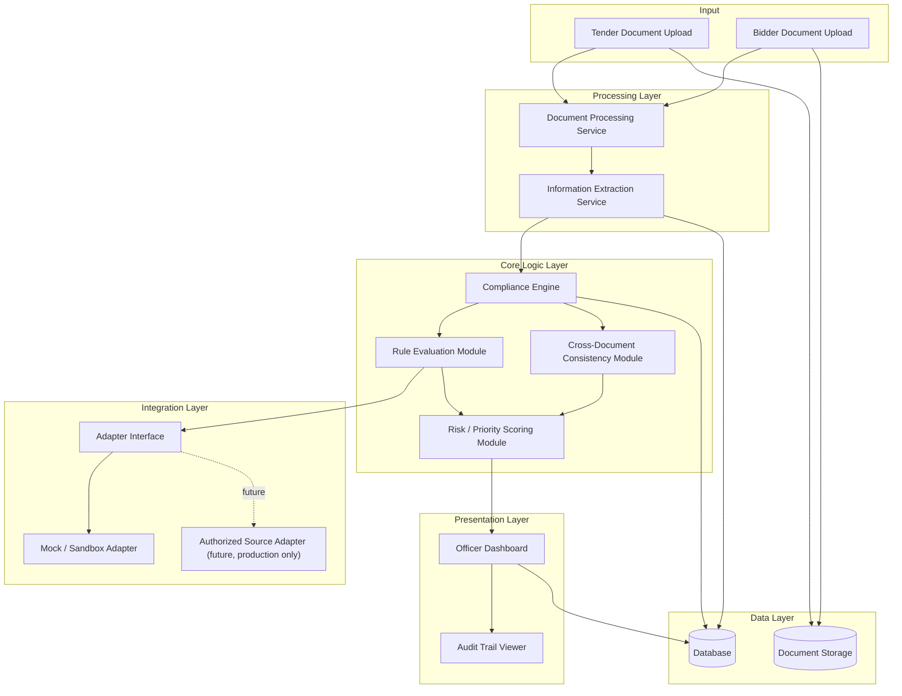

# Architecture — BidVerify AI (SIH26100)

> This file explains **how the system is built** — its components, how they talk to each other, and what technology each part uses. For *why* the system exists, see [`info.md`](./info.md). For the step-by-step process flows, see [`flow-diagram.md`](./flow-diagram.md).

---

## 1. Design Philosophy

Three ideas shape every architecture decision here:

1. **Separate "understanding" from "deciding."** AI models are used to *read and extract* information from documents. A separate, predictable **rule engine** is used to *check* that information against requirements. This keeps the actual compliance logic transparent and explainable — not hidden inside an AI's black-box reasoning.
2. **Never hard-code a fake integration.** Any connection to an external government verification source is built behind an **adapter interface**, so the prototype can use clearly labeled mock/sandbox data today, and a real, authorized integration can be swapped in later without rewriting the whole system.
3. **Keep a human checkpoint at the end of every path.** No matter what the AI or rule engine concludes, the architecture always routes the final result to an **Officer Dashboard** for human review — the system never auto-finalizes a decision.

---

## 2. High-Level Component Diagram

---

## 3. Component Descriptions (Plain-English)

### 3.1 Document Processing Service
**What it does:** Takes raw uploaded files (PDFs, scanned images) and turns them into readable text.
**Why it's separate:** Documents come in messy, inconsistent formats. Isolating this step means the rest of the system only ever deals with clean text, not raw files.
**Core tasks:**
- Detects file type and quality (native text PDF vs. scanned image).
- Runs OCR (Optical Character Recognition) on scanned documents.
- Cleans up extracted text (removing noise, fixing obvious formatting issues).

### 3.2 Information Extraction Service
**What it does:** Reads the cleaned text and pulls out specific, structured facts — e.g., "turnover: ₹7 Crore," "GST number: XXXXX," "certificate expiry: 12 Mar 2027."
**Why it's separate:** Extraction (finding facts) is a different job from evaluation (checking those facts against rules). Keeping them apart makes each part easier to test and improve independently.
**Core tasks:**
- Classifies each document (e.g., "this is a GST certificate," "this is a financial statement").
- Uses NLP (Natural Language Processing) techniques to locate and extract relevant fields.
- Links every extracted fact back to its source document and location (the "evidence").

### 3.3 Compliance Engine
**What it does:** The central brain of the system — it takes structured tender requirements and structured bidder facts and figures out compliance status for each requirement.
**Core tasks:**
- Passes each requirement/fact pair to the **Rule Evaluation Module**.
- Passes bidder documents to the **Cross-Document Consistency Module**.
- Combines both outputs into an overall compliance report.

### 3.4 Rule Evaluation Module
**What it does:** Applies clear, deterministic rules (e.g., "turnover ≥ ₹5 Crore?") to bidder facts.
**Why deterministic (not just AI-based):** A rule like a turnover threshold should give the *same, predictable* answer every time — this builds trust and makes results auditable, rather than relying on an AI's probabilistic judgment for simple numeric/logical checks.
**Output:** PASS / FAIL / REVIEW for each requirement, each with a plain-language explanation.

### 3.5 Cross-Document Consistency Module
**What it does:** Compares identifying details (company name, registration numbers, dates, addresses) across all of a bidder's documents to catch mismatches.
**Output:** A list of consistent / inconsistent findings, each pointing to the specific documents involved.

### 3.6 Risk / Priority Scoring Module
**What it does:** Combines the results from rule evaluation and consistency checking into a simple overall risk indicator (e.g., Low / Medium / High attention needed), to help the officer decide which bids to review first.
**Important:** This is a **prioritization aid**, not a qualify/disqualify verdict.

### 3.7 Integration Adapter Layer
**What it does:** Provides a single, consistent interface that the Compliance Engine uses to request external verification — without needing to know or care whether the actual data is coming from a mock file or a real, authorized government system.
**Prototype behavior:** Uses a **Mock/Sandbox Adapter** with clearly labeled sample data.
**Future/production behavior:** Additional adapters could be built for specific authorized sources — **only once appropriate access, credentials, and agreements are in place.** No such access is assumed or claimed by this project today.

### 3.8 Officer Dashboard
**What it does:** The main interface where a procurement officer views tender/bid details, compliance results, evidence, risk indicators, and makes the final decision.
**Core tasks:**
- Displays structured results in a clear, scannable format.
- Lets the officer drill down into the evidence behind any result.
- Records the officer's final decision.

### 3.9 Audit Trail Viewer
**What it does:** Shows the full history of what was checked, what evidence was used, and what decisions were made, for any given bid — supporting later review or audit.

### 3.10 Database
**What it does:** Stores all structured data — tenders, requirements, bidders, extracted facts, compliance results, and audit records. See [`database.md`](./database.md) for the full schema.

### 3.11 Document Storage
**What it does:** Stores the original uploaded files (PDFs, images) separately from the structured database, since documents are large, unstructured, binary files.

---

## 4. Technology Stack

| Layer | Suggested Technology | Why This Choice |
|---|---|---|
| Frontend (Officer Dashboard) | React + a component library (e.g., Tailwind CSS) | Widely used, fast to build a clean, responsive dashboard for a hackathon timeline. |
| Backend / API | Python + FastAPI (or Node.js + Express) | FastAPI is well suited to AI/ML-heavy backends and has built-in support for clear API documentation. |
| Document Text Extraction | PyMuPDF / pdfplumber | Reliable, well-documented libraries for pulling text out of native-text PDFs. |
| OCR (Scanned Documents) | Tesseract OCR | A mature, free, open-source OCR engine, suitable for a prototype. |
| Information Extraction (NLP) | spaCy or a HuggingFace Transformers model | Well-established tools for identifying and extracting structured fields from text. |
| Rule Evaluation | Custom Python rule engine (e.g., simple JSON-based rule definitions) or a lightweight rules library | Keeps compliance logic transparent, testable, and easy to explain to judges — avoids "black box" AI decisions for simple threshold checks. |
| Cross-Document Matching | Fuzzy string matching (e.g., RapidFuzz) + basic entity comparison | Effective, lightweight way to catch near-duplicate/mismatched entity names across documents. |
| Database | PostgreSQL | A reliable, structured, relational database well suited to the tender/requirement/bidder/result data model (see `database.md`). |
| Document Storage | Local file storage for the prototype (e.g., a structured folder or object storage emulator) | Keeps the prototype simple; a production system could use secure cloud object storage instead. |
| Integration Adapter Layer | Python interface/abstract classes with a Mock Adapter implementation | Demonstrates a clean, extensible integration pattern without claiming real government-system access. |
| Authentication (if included) | JWT-based authentication for officer login | Standard, simple approach suitable for a prototype demo. |
| Deployment (for demo) | Docker Compose (frontend + backend + database together) | Makes the whole system easy to spin up consistently for a live demo. |

> **Note:** These are *suggested* technologies appropriate for a hackathon prototype timeline — the team should adjust based on actual skill strengths (e.g., swapping FastAPI for Node.js/Express is equally valid if the team is stronger in JavaScript).

---

## 5. Why an Adapter Pattern for External Verification?

The **Adapter Pattern** is a standard software design approach where a system talks to a single, consistent internal interface, while the actual underlying implementation can be swapped out.

**Analogy:** Think of a universal travel power adapter. Your laptop charger always plugs into the *same* adapter socket — but the adapter itself can be swapped depending on whether you're in India, the UK, or the US. Your laptop charger doesn't need to know or care which country's socket is actually being used underneath.

In this project:
- The **Compliance Engine** always calls the same adapter interface, e.g., `verify_gst(gst_number)`.
- Today, that interface is implemented by a **Mock Adapter**, which returns realistic, clearly-labeled sample data.
- In a real, authorized deployment, that same interface could be implemented by a **real adapter** connecting to an approved, authorized government data source — without changing anything else in the Compliance Engine.

This is what allows the team to **honestly demonstrate the full architecture and workflow** in a hackathon setting, without falsely claiming access to restricted government systems.

---

## 6. Security and Privacy Considerations

- Bidder documents often contain sensitive financial and business information — access to uploaded documents and extracted data should be restricted to authorized officer accounts.
- All actions (uploads, checks, decisions) should be logged for the audit trail (see `database.md`), which also supports accountability and traceability.
- In a production system, data-at-rest encryption and secure credential management for any real external integrations would be required — this is noted as a **future/production consideration**, not something the hackathon prototype needs to fully implement.
- Mock/sandbox data used in the prototype must be clearly fictional and must not resemble any real company's actual registration details.

---

## 7. What the Prototype Will Demonstrate vs. What Requires Real Government Access

| Capability | Prototype (Hackathon) | Real Production Deployment |
|---|---|---|
| Reading tender/bid PDFs and extracting text | ✅ Fully functional | ✅ Same |
| OCR on scanned documents | ✅ Fully functional | ✅ Same |
| Rule-based compliance checking | ✅ Fully functional, using sample rules | ✅ Same, with officially approved rule sets |
| Cross-document consistency checking | ✅ Fully functional | ✅ Same |
| Officer dashboard and audit trail | ✅ Fully functional | ✅ Same, with production-grade access control |
| GST / Udyam / PAN / EPFO / MCA21 / DigiLocker verification | ⚠️ Simulated via Mock Adapter with labeled sample data | ❌ Requires official authorization, credentials, and approved integration agreements |
| Blacklisting/debarment checks | ⚠️ Simulated via Mock Adapter with labeled sample data | ❌ Requires access to an authoritative, approved blacklist source |
