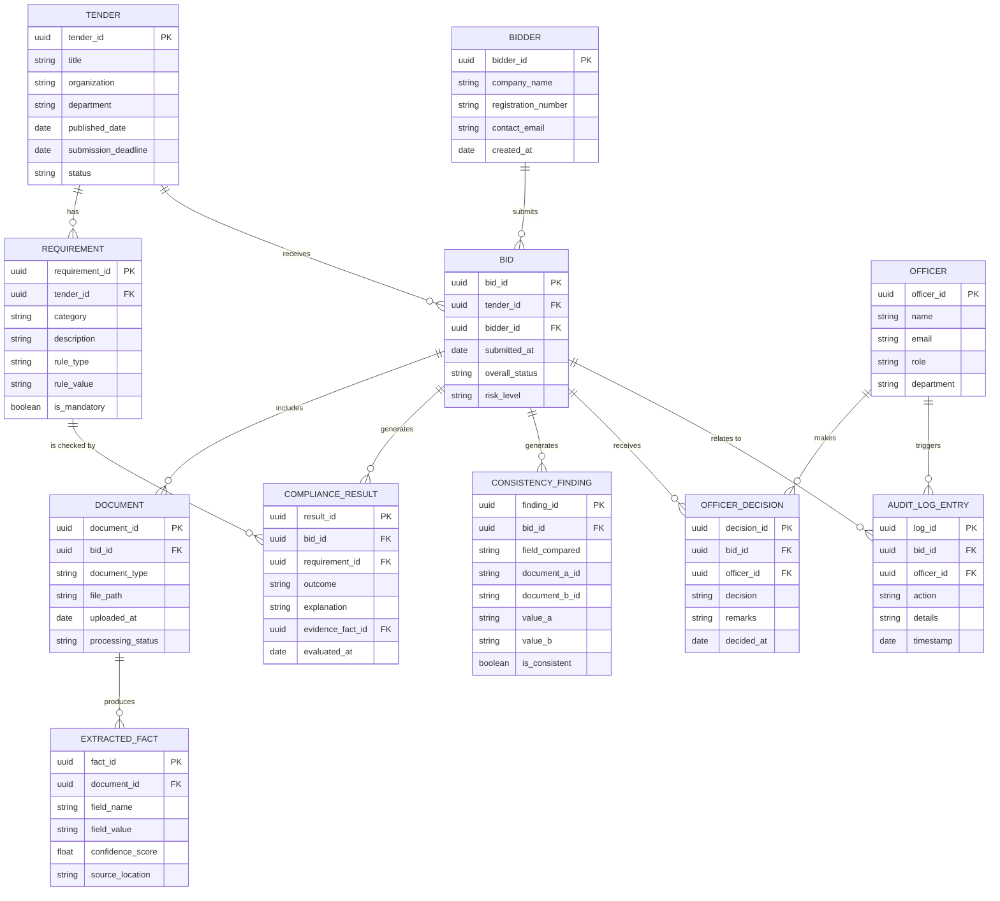

# Database Design — BidVerify AI (SIH26100)

> This file explains **what data the system stores and how it's organized.** For the components that read/write this data, see [`architecture.md`](./architecture.md). For the domain concepts behind these tables (e.g., what a "tender" or "requirement" is), see [`info.md`](./info.md).

We use a **relational database (PostgreSQL)** because the data here has clear, structured relationships — a tender *has* requirements, a bidder *has* documents, a document *has* extracted facts — which relational tables represent naturally and reliably.

---

## 1. Entity Overview (Plain-English)

Before the technical schema, here's what each entity means in simple terms:

- **Tender** — the government's published request describing what it wants to buy and what rules apply.
- **Requirement** — one individual rule extracted from a tender (e.g., "minimum turnover ₹5 Crore").
- **Bidder** — a company that submits a bid for a tender.
- **Bid** — a specific bidder's submission for a specific tender.
- **Document** — an individual uploaded file (a tender PDF, or one of a bidder's certificates).
- **Extracted Fact** — a specific piece of structured information pulled out of a document (e.g., "turnover = ₹7 Crore," found in this specific document).
- **Compliance Result** — the PASS/FAIL/REVIEW outcome for one requirement, for one bid.
- **Consistency Finding** — a record of a cross-document match or mismatch found for a bidder.
- **Officer** — a procurement officer using the system.
- **Officer Decision** — the officer's final action on a bid.
- **Audit Log Entry** — a record of any significant event in the system, for traceability.

---

## 2. Entity-Relationship Diagram

---

## 3. Table-by-Table Explanation

### 3.1 `TENDER`
Stores the basic details of each published tender.

| Column | Type | Meaning |
|---|---|---|
| `tender_id` | UUID (Primary Key) | Unique ID for the tender. |
| `title` | Text | The tender's name, e.g., "Supply of Industrial Pumps." |
| `organization` | Text | The buying organization, e.g., "CPCL." |
| `department` | Text | The specific department raising the tender. |
| `published_date` | Date | When the tender was published. |
| `submission_deadline` | Date | Last date to submit a bid. |
| `status` | Text | e.g., "Open," "Closed," "Awarded." |

### 3.2 `REQUIREMENT`
Stores each individual rule extracted from a tender. One tender has many requirements.

| Column | Type | Meaning |
|---|---|---|
| `requirement_id` | UUID (Primary Key) | Unique ID for the requirement. |
| `tender_id` | UUID (Foreign Key → TENDER) | Which tender this requirement belongs to. |
| `category` | Text | e.g., "Financial," "Technical," "Statutory," "Document." |
| `description` | Text | Plain-language description, e.g., "Minimum annual turnover ₹5 Crore." |
| `rule_type` | Text | How the rule should be checked, e.g., "numeric_minimum," "document_present," "date_not_expired." |
| `rule_value` | Text | The threshold or expected value, e.g., "50000000" (for ₹5 Crore). |
| `is_mandatory` | Boolean | Whether failing this requirement should be treated as disqualifying, subject to officer review. |

### 3.3 `BIDDER`
Stores basic details of each company that has ever submitted a bid.

| Column | Type | Meaning |
|---|---|---|
| `bidder_id` | UUID (Primary Key) | Unique ID for the bidder company. |
| `company_name` | Text | The company's registered name. |
| `registration_number` | Text | A company registration identifier (used for basic identity matching). |
| `contact_email` | Text | Contact details. |
| `created_at` | Date | When this bidder record was first created in the system. |

### 3.4 `BID`
Links a specific bidder to a specific tender — represents one bid submission.

| Column | Type | Meaning |
|---|---|---|
| `bid_id` | UUID (Primary Key) | Unique ID for this bid submission. |
| `tender_id` | UUID (Foreign Key → TENDER) | Which tender this bid was submitted for. |
| `bidder_id` | UUID (Foreign Key → BIDDER) | Which company submitted this bid. |
| `submitted_at` | Date | When the bid was submitted. |
| `overall_status` | Text | e.g., "Under Review," "Compliant," "Non-Compliant," "Needs Review." |
| `risk_level` | Text | e.g., "Low," "Medium," "High" — from the Risk/Priority Scoring Module. |

### 3.5 `DOCUMENT`
Stores metadata about each uploaded file for a bid (the actual file lives in Document Storage; this table just tracks it).

| Column | Type | Meaning |
|---|---|---|
| `document_id` | UUID (Primary Key) | Unique ID for the document. |
| `bid_id` | UUID (Foreign Key → BID) | Which bid this document was submitted with. |
| `document_type` | Text | e.g., "GST Certificate," "Financial Statement," "OEM Authorization." |
| `file_path` | Text | Where the actual file is stored. |
| `uploaded_at` | Date | When the document was uploaded. |
| `processing_status` | Text | e.g., "Pending," "Processed," "Failed." |

### 3.6 `EXTRACTED_FACT`
Stores each individual structured fact pulled out of a document, along with where it was found.

| Column | Type | Meaning |
|---|---|---|
| `fact_id` | UUID (Primary Key) | Unique ID for this extracted fact. |
| `document_id` | UUID (Foreign Key → DOCUMENT) | Which document this fact was extracted from. |
| `field_name` | Text | e.g., "annual_turnover," "gst_number," "certificate_expiry_date." |
| `field_value` | Text | The extracted value, e.g., "70000000," "22AAAAA0000A1Z5," "2027-03-12." |
| `confidence_score` | Float | How confident the extraction process is in this value (0.0 to 1.0) — useful for flagging low-confidence extractions for review. |
| `source_location` | Text | e.g., page number or approximate location in the document, so the officer can find it quickly. |

### 3.7 `COMPLIANCE_RESULT`
Stores the outcome of checking one requirement against one bid.

| Column | Type | Meaning |
|---|---|---|
| `result_id` | UUID (Primary Key) | Unique ID for this result. |
| `bid_id` | UUID (Foreign Key → BID) | Which bid this result belongs to. |
| `requirement_id` | UUID (Foreign Key → REQUIREMENT) | Which requirement was checked. |
| `outcome` | Text | "PASS," "FAIL," or "REVIEW." |
| `explanation` | Text | A plain-language reason for the outcome. |
| `evidence_fact_id` | UUID (Foreign Key → EXTRACTED_FACT) | Which extracted fact was used as evidence for this outcome. |
| `evaluated_at` | Date | When this check was run. |

### 3.8 `CONSISTENCY_FINDING`
Stores the result of comparing a field across two of a bidder's documents.

| Column | Type | Meaning |
|---|---|---|
| `finding_id` | UUID (Primary Key) | Unique ID for this finding. |
| `bid_id` | UUID (Foreign Key → BID) | Which bid this finding belongs to. |
| `field_compared` | Text | e.g., "company_name," "registration_number." |
| `document_a_id` / `document_b_id` | Text | The two documents being compared. |
| `value_a` / `value_b` | Text | The value found in each document. |
| `is_consistent` | Boolean | Whether the two values were judged to match. |

### 3.9 `OFFICER`
Stores basic details of procurement officers using the system.

| Column | Type | Meaning |
|---|---|---|
| `officer_id` | UUID (Primary Key) | Unique ID for the officer. |
| `name` | Text | Officer's name. |
| `email` | Text | Login/contact email. |
| `role` | Text | e.g., "Procurement Officer," "Evaluation Committee Member." |
| `department` | Text | The officer's department. |

### 3.10 `OFFICER_DECISION`
Stores the officer's final decision on a bid — the most important accountability record in the system.

| Column | Type | Meaning |
|---|---|---|
| `decision_id` | UUID (Primary Key) | Unique ID for this decision. |
| `bid_id` | UUID (Foreign Key → BID) | Which bid this decision applies to. |
| `officer_id` | UUID (Foreign Key → OFFICER) | Which officer made the decision. |
| `decision` | Text | e.g., "Qualified," "Disqualified," "Sent Back for Clarification." |
| `remarks` | Text | Any notes the officer adds explaining their reasoning. |
| `decided_at` | Date | When the decision was made. |

### 3.11 `AUDIT_LOG_ENTRY`
Stores a record of every significant action in the system, supporting the audit trail described in `flow-diagram.md` (Section 8).

| Column | Type | Meaning |
|---|---|---|
| `log_id` | UUID (Primary Key) | Unique ID for the log entry. |
| `bid_id` | UUID (Foreign Key → BID) | Which bid this action relates to (if applicable). |
| `officer_id` | UUID (Foreign Key → OFFICER) | Which officer performed the action (if applicable — some actions are system-generated). |
| `action` | Text | e.g., "Document Uploaded," "Compliance Check Run," "Decision Made." |
| `details` | Text | Additional context about the action. |
| `timestamp` | Date/Time | When the action occurred. |

---

## 4. Design Notes

- **UUIDs instead of simple auto-incrementing numbers** are used as primary keys to avoid predictable IDs and to make it easier to merge data from different environments (e.g., demo data vs. later real data) without ID clashes.
- **Every compliance result links back to an `EXTRACTED_FACT`**, which itself links back to a `DOCUMENT` — this chain is what makes the system's explainability principle (see `info.md`, Section 15) actually work at the data level: you can always trace a result back to its original evidence.
- **`confidence_score` on extracted facts** is included specifically so that low-confidence AI extractions can be surfaced for officer review, rather than treated with the same certainty as a clearly-read value.
- **The schema does not include any table for storing raw external-government-verification data as if it were authoritative** — this reflects the project's honesty principle from `architecture.md` (Section 7): the prototype does not pretend to have a trusted pipeline of real government data.
- **`OFFICER_DECISION` is intentionally separate from `COMPLIANCE_RESULT`**, to make it structurally clear that the AI/rule-engine's findings (`COMPLIANCE_RESULT`) and the human's final call (`OFFICER_DECISION`) are two distinct things — reinforcing the human-in-the-loop principle throughout the actual data model, not just in the UI.

---

## 5. Sample Data Flow Through the Schema

1. A `TENDER` row is created when a tender is published; its `REQUIREMENT` rows are created from extracted tender rules.
2. A `BIDDER` row is created (or reused, if the company has bid before) and a `BID` row links that bidder to the tender.
3. Each uploaded file becomes a `DOCUMENT` row linked to the `BID`.
4. Processing each `DOCUMENT` produces one or more `EXTRACTED_FACT` rows.
5. The Compliance Engine compares `REQUIREMENT` rows against `EXTRACTED_FACT` rows and writes one `COMPLIANCE_RESULT` row per requirement.
6. The Cross-Document Consistency Module writes `CONSISTENCY_FINDING` rows where applicable.
7. The officer reviews everything on the dashboard and their final call is written as an `OFFICER_DECISION` row.
8. Every step along the way writes one or more `AUDIT_LOG_ENTRY` rows.
