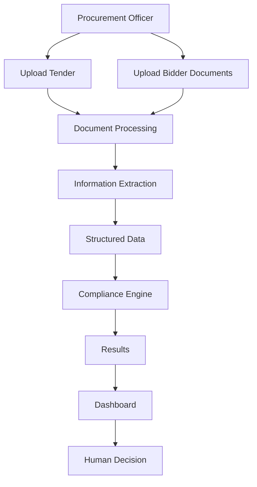
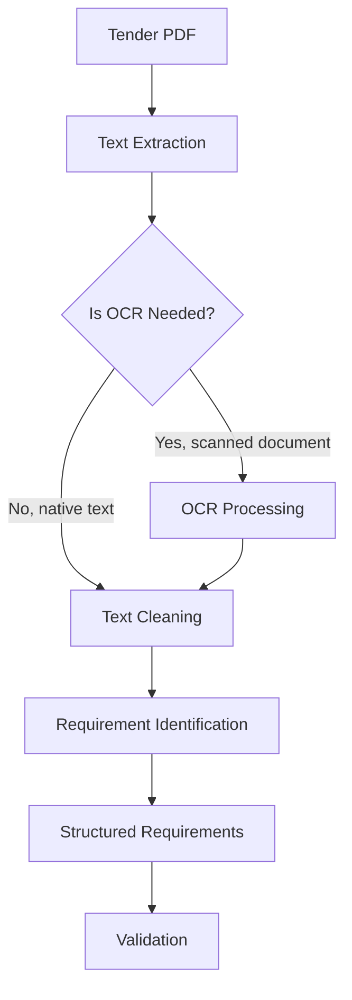
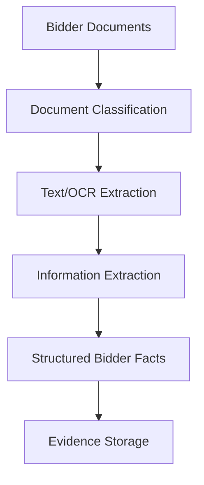
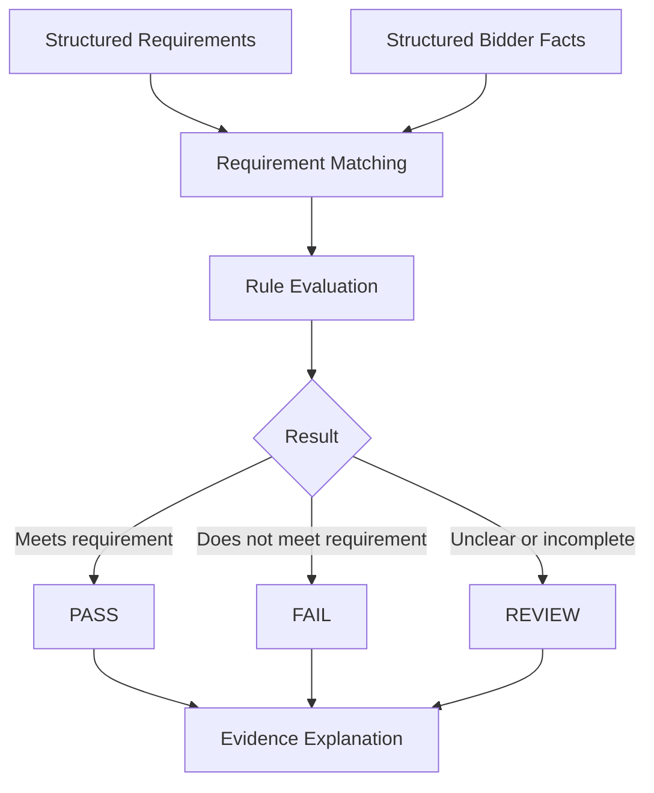
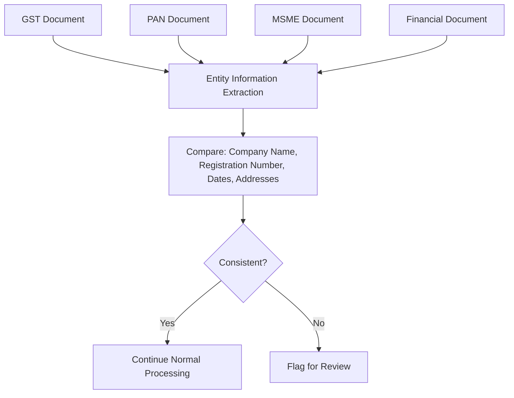
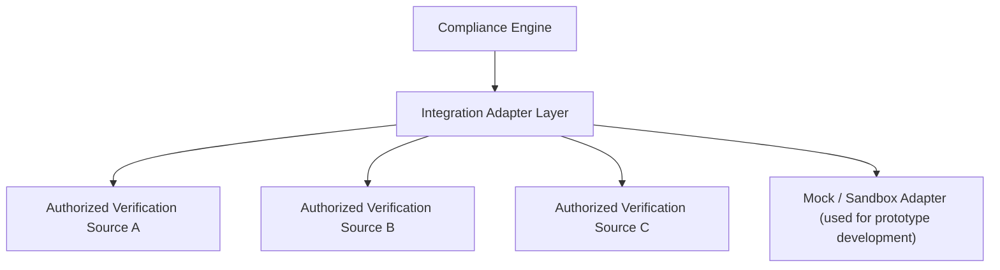
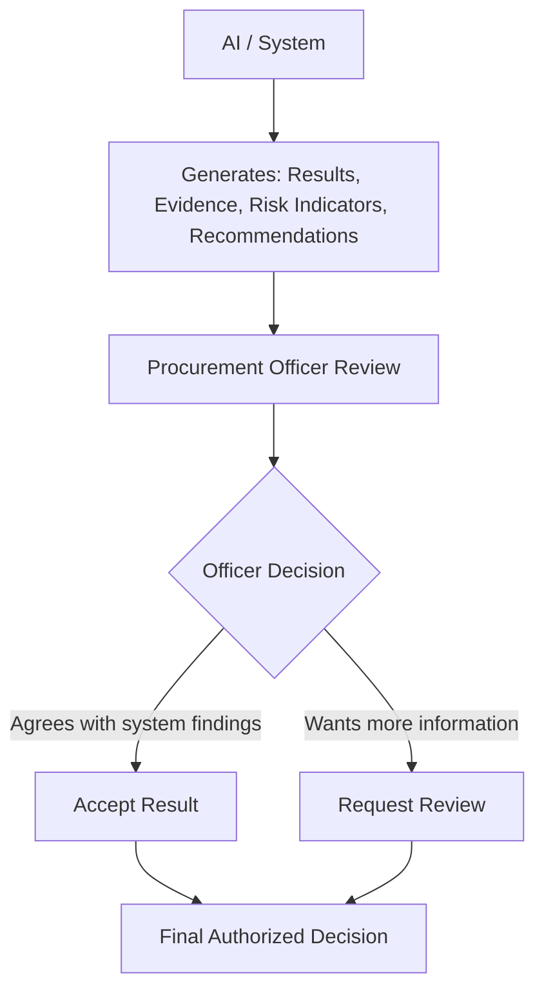
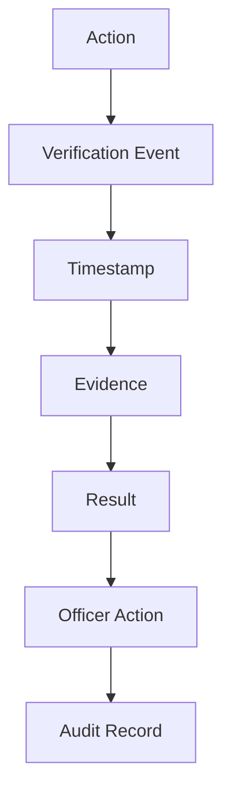

# Flow Diagrams — BidVerify AI (SIH26100)

This file contains only workflow explanations and diagrams. For domain background, see [`info.md`](./info.md). For system components and tech stack, see [`architecture.md`](./architecture.md).

---

## Section 1: High-Level Project Flow

This is the overall journey from the officer uploading documents to a final decision being made.

**In plain words:** The officer uploads the tender and the bidder's documents. The system reads and processes them, pulls out the useful structured information, checks it against the rules, and shows the results on a dashboard. The officer looks at this and makes the final decision.

---

## Section 2: Tender Requirement Extraction Flow

This shows how the system turns a tender PDF into a clean, structured list of requirements.

**In plain words:** First, the system tries to pull text directly from the PDF. If the tender is a scanned image instead of typed text, OCR (Optical Character Recognition) is used to "read" the image into text. The text is cleaned up, requirements are identified within it (e.g., "minimum turnover ₹5 Crore"), and turned into a structured, checkable format. A validation step checks that nothing looks obviously broken or incomplete.

---

## Section 3: Bidder Document Processing Flow

This shows how the system processes the pile of documents a bidder submits.

**In plain words:** The system first figures out what *type* of document each file is (e.g., "this looks like a GST certificate," "this looks like a financial statement") — this is document classification. Then it extracts the text (using OCR where needed), pulls out the useful facts (e.g., turnover figure, GST number, certificate expiry date), and stores both the structured facts and the original evidence (the source document/field) together, so every fact can be traced back to where it came from.

---

## Section 4: Compliance Verification Flow

This is the core matching step — comparing what the tender requires against what the bidder has actually provided.

**In plain words:** Each requirement from the tender is matched against the relevant fact from the bidder's documents, and a rule is applied (e.g., "is turnover ≥ ₹5 Crore?"). The outcome is always one of three things — PASS, FAIL, or REVIEW (when something is unclear, like a blurry scan or a missing field) — and every outcome comes with an explanation pointing back to the specific evidence used.

---

## Section 5: Cross-Document Verification Flow

This checks whether a bidder's own documents agree with each other.

**In plain words:** Key identifying details (company name, registration numbers, dates, addresses) are pulled from each of the bidder's documents and compared against each other. If everything lines up, processing continues normally. If something doesn't match — like a slightly different company name on two documents — it's flagged for the officer to review, rather than silently ignored or silently rejected.

---

## Section 6: External Verification Integration Concept

> **Important: This section is a "Conceptual Production Integration" design.** It describes how the system *could* connect to authorized external verification sources in a real, approved production deployment. **It is not a claim that our hackathon prototype has live access to these systems.** For the prototype, a mock/sandbox adapter is used instead — see the disclaimer in `README.md`.

**In plain words:** The Compliance Engine never talks directly to an external government system. Instead, it goes through an "Adapter Layer" — a flexible middle layer where each external source (GST, Udyam, EPFO, etc.) has its own dedicated adapter. This means that in a real deployment, official adapters can be added later (once proper authorization exists) without having to redesign the whole system. For the hackathon prototype, a **mock/sandbox adapter** stands in for real government systems, using sample data clearly labeled as such.

---

## Section 7: Human-in-the-Loop Decision Flow

This shows how the system's output is always filtered through human judgment before anything becomes final.

**In plain words:** The system never issues a final verdict on its own. It generates results, evidence, risk indicators, and a recommendation — all of which the officer reviews. The officer can either accept the system's findings or request further review (e.g., ask the bidder for a clearer document). Either way, the **final authorized decision** is always made by the human officer.

---

## Section 8: Audit Trail Flow

This shows how every action in the system gets recorded for later review.

**In plain words:** Every meaningful action in the system — a document being processed, a rule being checked, an officer making a decision — is captured as an event, stamped with the time it happened, linked to its supporting evidence and result, and finally combined with any officer action into a permanent audit record. This is what makes it possible to later answer the question: "why was this bidder approved or rejected?"
