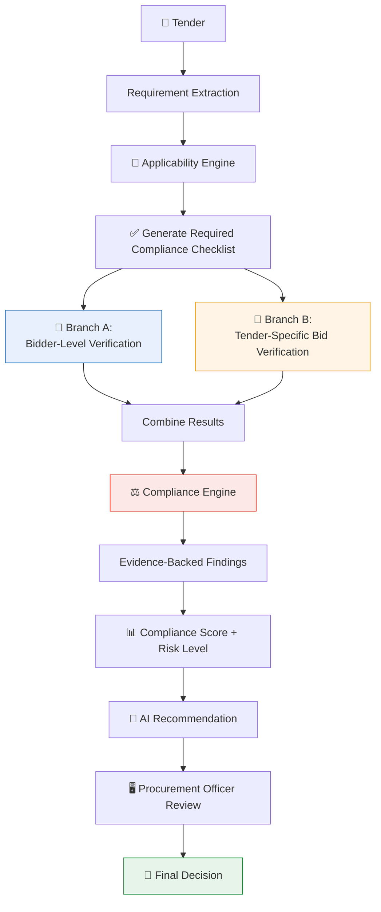
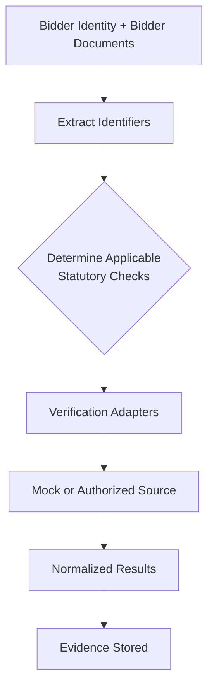
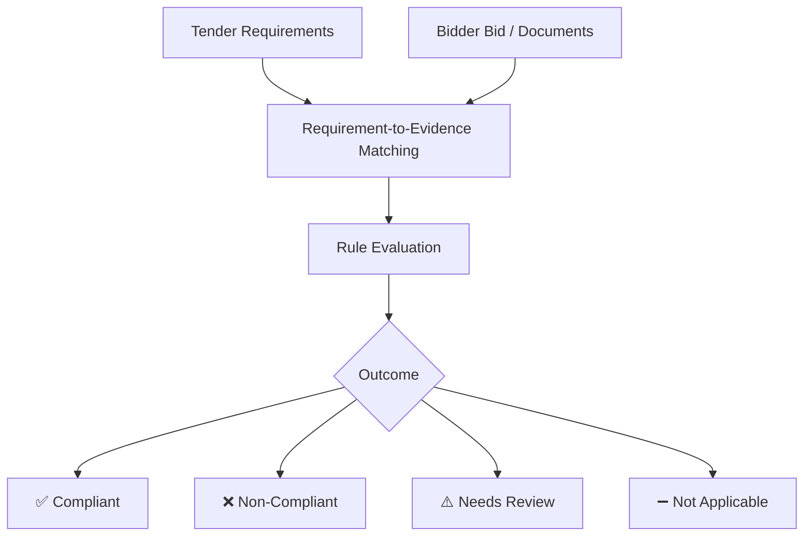
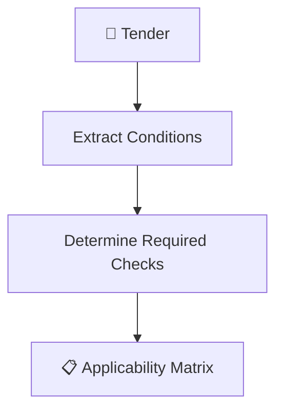
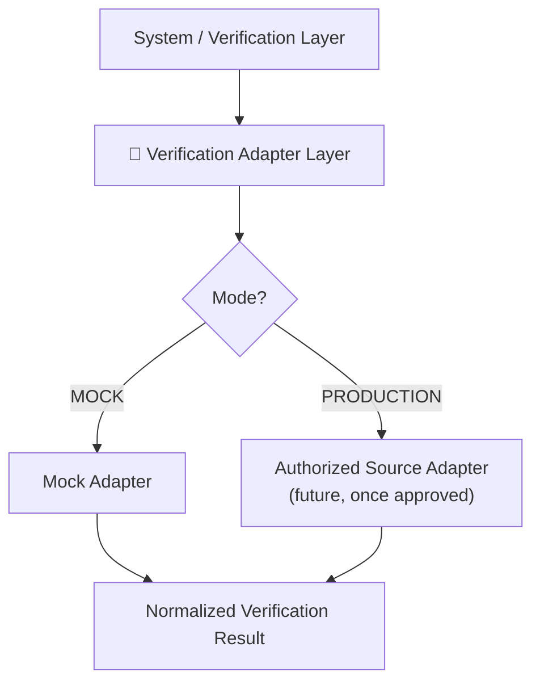
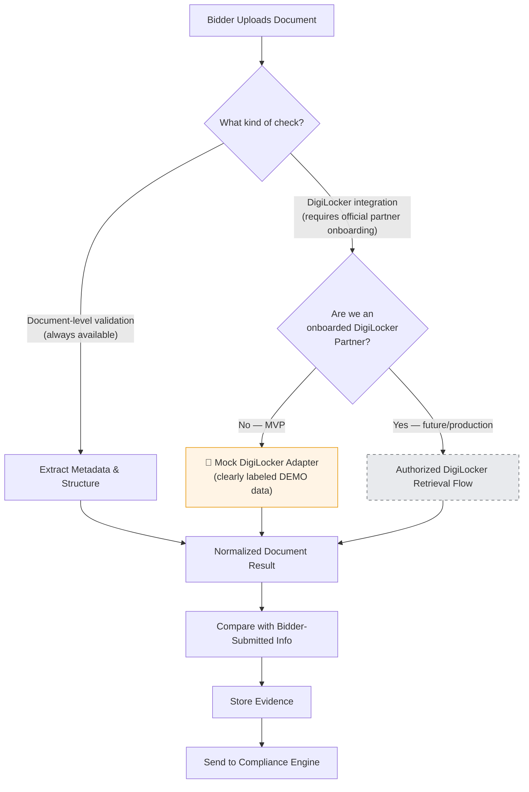
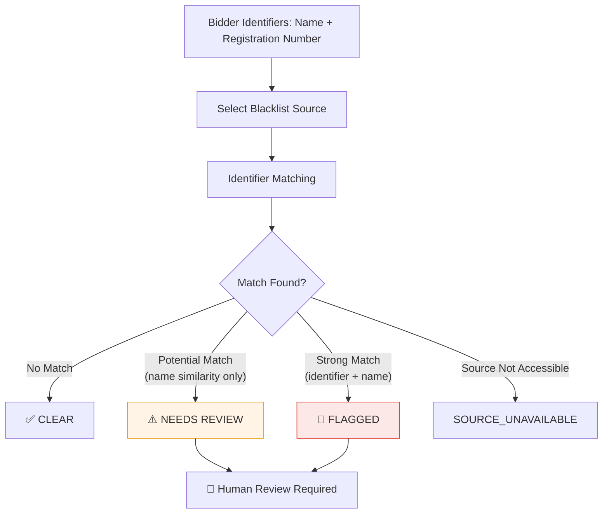
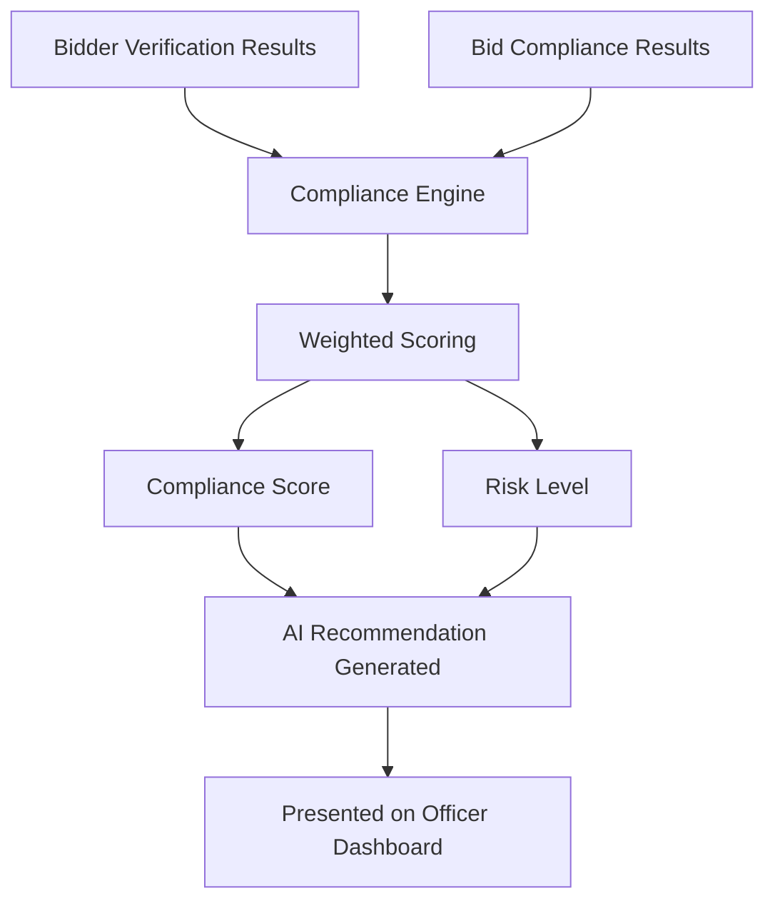
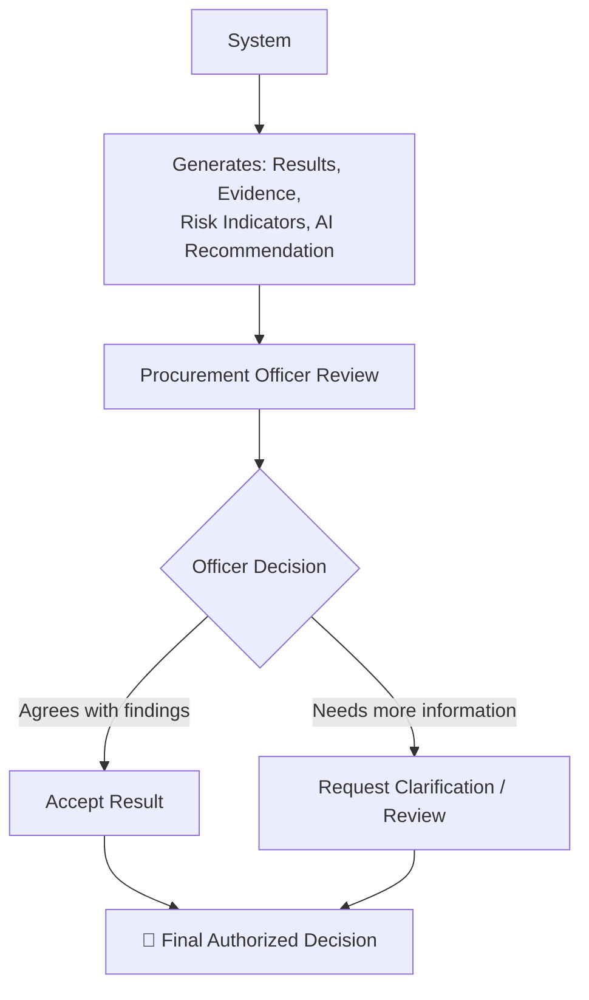
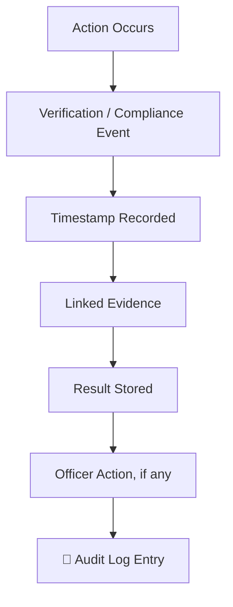

# 🔀 Flow Diagrams — BidVerify AI
### Two-Branch Verification Workflows

 

> 💡 For domain background see [`info.md`](./info.md); for component details see [`architecture.md`](./architecture.md); for the data model see [`database.md`](./database.md).

 

## 📑 Diagrams in This File

1. [Complete End-to-End Workflow](#1-complete-end-to-end-workflow)
2. [Bidder-Level Verification Flow (Branch A)](#2-bidder-level-verification-flow-branch-a)
3. [Tender-Specific Compliance Flow (Branch B)](#3-tender-specific-compliance-flow-branch-b)
4. [Applicability Engine Flow](#4-applicability-engine-flow)
5. [Multi-Portal Verification Flow](#5-multi-portal-verification-flow)
6. [DigiLocker / Document Verification Flow](#6-digilocker--document-verification-flow)
7. [Blacklisting / Debarment Verification Flow](#7-blacklisting--debarment-verification-flow)
8. [Compliance Decision Flow](#8-compliance-decision-flow)
9. [Human-in-the-Loop Flow](#9-human-in-the-loop-flow)
10. [Audit Trail Flow](#10-audit-trail-flow)

 

---

## 1. Complete End-to-End Workflow

This is the full journey, showing the **two parallel verification branches** clearly — the most important structural correction versus earlier versions of this document.

**In plain words:** The tender is read and its requirements extracted. The Applicability Engine decides which checks actually matter for *this* tender, producing a checklist. That checklist then drives **two branches at once** — checking the bidder's general statutory standing, and checking whether this specific bid meets this specific tender's requirements. Both sets of results are combined by the Compliance Engine into evidence-backed findings, scored and risk-rated, summarized by an AI recommendation, and finally reviewed by the Procurement Officer, who makes the actual decision.

 

---

## 2. Bidder-Level Verification Flow (Branch A)

**In plain words:** Starting from the bidder's identity and documents, the system extracts identifiers (GSTIN, PAN, Udyam number, etc.). Based on the Applicability Matrix, it determines which statutory checks are relevant to this bidder, then routes each one through the appropriate Verification Adapter — which may return a mock (prototype) or authorized (future production) result. Results are normalized into a standard format and stored with evidence.

 

---

## 3. Tender-Specific Compliance Flow (Branch B)

**In plain words:** This branch takes the tender's specific requirements and matches each one against the evidence found in the bidder's bid documents. Each requirement is evaluated and lands in one of four states — not just pass/fail — because some requirements may simply not apply to this bidder, and some may need more evidence before a clean answer is possible.

 

---

## 4. Applicability Engine Flow

**In plain words:** The tender is scanned for its stated conditions. From these, the system determines exactly which checks are required for this tender — producing the Applicability Matrix that both Branch A and Branch B rely on. This is what prevents the system from blindly running every possible verification on every bid.

 

---

## 5. Multi-Portal Verification Flow

**In plain words:** Whether a verification check is being simulated (mock, for the hackathon prototype) or performed against a real authorized government source (future production, once access is granted), the request goes through the same Adapter Layer and comes back as the same standardized result shape. This is what lets the rest of the system stay identical across both modes.

 

---

## 6. DigiLocker / Document Verification Flow

> ⚠️ This diagram deliberately shows **two distinct paths** — document-level validation vs. actual DigiLocker integration — since conflating them is a common mistake. See [`info.md` → Section 11-K](./info.md#k-digilocker--document-verification) for the full explanation.

**In plain words:** Every uploaded document always gets basic document-level validation (checking its structure and extracted metadata). *Separately*, true DigiLocker integration — retrieving or confirming a document at the source — is only possible for an officially onboarded DigiLocker partner organization. Since the hackathon prototype is not such a partner, it uses a clearly-labeled mock adapter instead. Both paths converge into the same normalized result format, which is compared against the bidder's claims, stored as evidence, and passed to the Compliance Engine.

 

---

## 7. Blacklisting / Debarment Verification Flow

**In plain words:** The system checks the bidder's identifiers against whatever blacklist/debarment source is applicable (remembering there's no single unified national database — see `info.md` Section 11-L). Because company names alone can be ambiguous (two unrelated companies can share a name), a name-only match is treated as `NEEDS_REVIEW` rather than an automatic flag — only a match on both name *and* a hard identifier (like registration number) is treated as a strong `FLAGGED` result. Either way, human review is required before this affects the final decision.

 

---

## 8. Compliance Decision Flow

**In plain words:** Once both branches' results are in, the Compliance Engine applies weighted scoring (mandatory requirements count more) to produce a Compliance Score and Risk Level. These feed an AI-generated recommendation, all of which is presented together on the officer's dashboard — as inputs to their decision, not as the decision itself.

 

---

## 9. Human-in-the-Loop Flow

**In plain words:** The system never issues a final verdict on its own — it generates results, evidence, and a recommendation, all reviewed by the officer. The officer can accept the findings or request further clarification (e.g., from the bidder). Either way, the final authorized decision is always recorded as the officer's own action.

 

---

## 10. Audit Trail Flow

**In plain words:** Every meaningful action — a document processed, a check run, a decision made — is captured as an event, timestamped, linked to its evidence and result, and combined with any officer action into a permanent audit record, answering "why was this bid approved or rejected?" for any later review.

