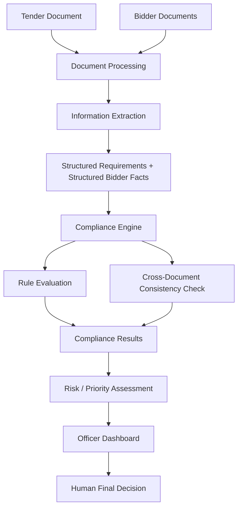

# BidVerify AI — AI-Powered Bid Compliance Verification Platform

**SIH 2026 | Problem Statement ID: SIH26100**
**Organization:** Ministry of Petroleum & Natural Gas | **Department:** Chennai Petroleum Corporation Limited (CPCL)
**Category:** Software | **Theme:** Smart Automation

> A decision-support tool that helps procurement officers verify bid compliance faster, more consistently, and with clear evidence — without taking the final decision out of human hands.

---

## Project Overview

Government procurement involves checking every bid against a long list of eligibility, technical, financial, and statutory requirements — today, done almost entirely by manually reading documents. **BidVerify AI** reads tender and bidder documents, extracts the relevant information, checks it against the tender's requirements, and presents the procurement officer with a clear, evidence-backed compliance summary.

## Problem

Procurement officers currently review large volumes of unstructured documents (PDFs, scans) to check bidder eligibility across statutory, financial, technical, and tender-specific requirements. This is time-consuming, prone to human error, hard to keep consistent across officers, and difficult to audit after the fact. New to this domain? See [`info.md`](./info.md) for a full plain-language explanation.

## Our Solution

BidVerify AI acts as a **decision-support layer** between raw bid documents and the procurement officer:

1. It reads tender documents and extracts structured requirements.
2. It reads bidder documents and extracts structured facts about the bidder.
3. It runs a rule-based **Compliance Engine** to compare the two.
4. It checks documents against each other for inconsistencies (e.g., mismatched company names).
5. It produces a clear compliance summary — with evidence — for the officer to review.
6. The officer makes the final qualify/disqualify decision.

AI is used to *understand documents*, not to *make the final call*.

## Key Features

- AI-assisted document understanding (text extraction + OCR for scans)
- Automated requirement extraction from tender documents
- Automated bidder information extraction from bid documents
- Cross-document consistency checking (e.g., name/date/address mismatches)
- Tender-specific compliance checks, not just a fixed generic checklist
- Missing-document detection
- Evidence linkage — every result traces back to a specific document/field
- Compliance summary with PASS / FAIL / NEEDS REVIEW outcomes
- Risk indicators to help officers prioritize which bids need closer attention
- Human review workflow built into the core design
- Audit trail of every check, result, and officer action

## How It Works

1. The procurement officer uploads the tender document and all bidder documents for a given bid.
2. The system extracts structured requirements from the tender.
3. The system extracts structured facts from the bidder's documents.
4. The Compliance Engine matches bidder facts against tender requirements, rule by rule.
5. A cross-document consistency check looks for mismatches across the bidder's own documents.
6. The system generates a compliance report: PASS / FAIL / NEEDS REVIEW for each requirement, each with supporting evidence.
7. The officer reviews the report on a dashboard and makes the final decision.
8. Every step is logged to an audit trail.

## Example Use Case

> CPCL publishes a tender for industrial pumps requiring: valid GST registration, minimum ₹5 Crore turnover, 3 years of experience, valid OEM authorization, and a current ISO 9001 certificate.
> Company XYZ submits its bid documents. BidVerify AI extracts the requirements from the tender and the facts from XYZ's documents, then reports: GST ✅ PASS, turnover ✅ PASS, experience ❌ FAIL (only 2.5 years found), OEM authorization ⚠️ NEEDS REVIEW (expiry date unclear in scan), certificate ❌ FAIL (expired). The procurement officer reviews this evidence-backed summary and decides how to proceed — including requesting clarification on the OEM document before making a final call.

## System Overview



## Key Principles

- **Human-in-the-loop** — the officer always makes the final call.
- **Explainability** — every result comes with clear supporting evidence.
- **Evidence-first verification** — no unexplained "black box" verdicts.
- **Modular integration architecture** — external verification sources are added through adapters, without redesigning the system.
- **Privacy-aware design** — sensitive bidder data is handled carefully and only for its intended purpose.

## Project Structure

```
project-root/
│
├── frontend/        # Officer-facing dashboard (React)
├── backend/         # API server, document processing, compliance engine
├── docs/            # Project documentation (this file, info.md, architecture.md, etc.)
├── data/            # Sample/mock tender and bidder documents for demo purposes
├── tests/           # Automated tests
└── README.md
```

## Documentation

- [`info.md`](./info.md) — full plain-language domain and problem explanation
- [`flow-diagram.md`](./flow-diagram.md) — detailed workflow diagrams
- [`architecture.md`](./architecture.md) — system architecture and tech stack
- [`database.md`](./database.md) — database schema design

## Stakeholders

Procurement officers, government buyer organizations (e.g., CPCL), bid evaluation teams, bidders/sellers (including MSMEs and OEMs), and oversight/audit functions.

## Expected Benefits

- Reduced manual document-review effort for procurement officers.
- Faster, more consistent initial compliance verification.
- Clearer evidence trail for every compliance decision.
- Earlier detection of missing or inconsistent bidder information.
- A foundation that can scale to more tenders, departments, and compliance sources over time.

## Development Status

**Hackathon Prototype / Concept Stage.**
Core document-processing and rule-based compliance checking are demonstrated using sample/mock data. External government-system integrations are represented conceptually through an adapter architecture (see `architecture.md`), not connected to live production systems.

## Important Disclaimer

This project is a prototype built for SIH26100. It is **not** an officially deployed or government-authorized system.

Any production integration with government portals or databases (e.g., GST, Udyam, EPFO, MCA21, DigiLocker, or GeM's internal systems) would require appropriate **authorization, credentials, security controls, and approved integration mechanisms** from the relevant authorities. This prototype does not claim, and must not be presented as having, real-time access to any such restricted government database.

The system is designed to **support** procurement officers with faster, evidence-backed information. **Final qualification/disqualification decisions remain with the authorized human decision-maker** at all times.

## Future Scope

See [`info.md` Section 20](./info.md#20-potential-future-scope) for the full list, including authorized government integrations, multilingual document support, and cross-tender analytics.

## Team

*[Add your team name and member details here]*

## License

*[Add your chosen license here, e.g., MIT — to be decided by the team]*
