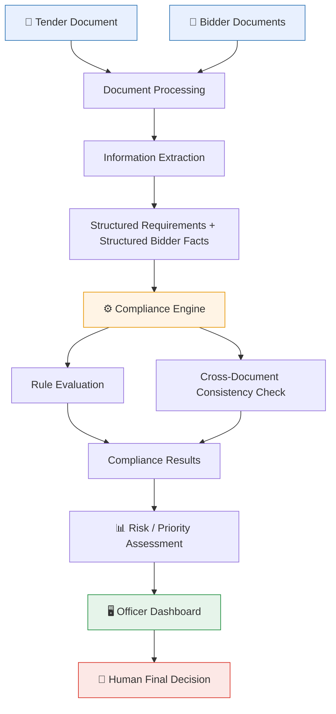

<div align="center">

# 🛡️ BidVerify AI
### AI-Powered Bid Compliance Verification Platform

**Smart India Hackathon 2026**

[](https://sih.gov.in)
[]()
[]()
[](./LICENSE.md)

**Organization:** Ministry of Petroleum & Natural Gas &nbsp;|&nbsp; **Department:** Chennai Petroleum Corporation Limited (CPCL)
**Category:** Software &nbsp;|&nbsp; **Theme:** Smart Automation

*A decision-support tool that helps procurement officers verify bid compliance faster, more consistently, and with clear evidence — without taking the final decision out of human hands.*

</div>

<br>

## 📑 Table of Contents

- [Project Overview](#-project-overview)
- [The Problem](#-the-problem)
- [Our Solution](#-our-solution)
- [Key Features](#-key-features)
- [How It Works](#-how-it-works)
- [Example Use Case](#-example-use-case)
- [System Overview](#-system-overview)
- [Key Principles](#-key-principles)
- [Project Structure](#-project-structure)
- [Documentation](#-documentation)
- [Stakeholders](#-stakeholders)
- [Expected Benefits](#-expected-benefits)
- [Development Status](#-development-status)
- [Important Disclaimer](#️-important-disclaimer)
- [Future Scope](#-future-scope)
- [Team](#-team)
- [License](#-license)

<br>

## 🎯 Project Overview

> Government procurement involves checking every bid against a long list of eligibility, technical, financial, and statutory requirements — today, done almost entirely by manually reading documents.

**BidVerify AI** reads tender and bidder documents, extracts the relevant information, checks it against the tender's requirements, and presents the procurement officer with a clear, evidence-backed compliance summary.

<br>

## ❗ The Problem

Procurement officers currently review large volumes of unstructured documents (PDFs, scans) to check bidder eligibility across statutory, financial, technical, and tender-specific requirements.

| Pain Point | Impact |
|:---|:---|
| 📄 Large volumes of unstructured documents | Slow, tiring manual review |
| 🔁 Manual cross-checking across sources | Inconsistent results between officers |
| ⏱️ Time-consuming verification | Delayed procurement cycles |
| 🧾 Hard to reconstruct "why" later | Difficult to audit after the fact |

> 🆕 **New to this domain?** See [`info.md`](./info.md) for a full plain-language explanation — no prior procurement knowledge assumed.

<br>

## 💡 Our Solution

BidVerify AI acts as a **decision-support layer** between raw bid documents and the procurement officer:

```
 1️⃣  Read tender documents        →  extract structured requirements
 2️⃣  Read bidder documents        →  extract structured facts
 3️⃣  Run the Compliance Engine    →  compare requirements vs. facts
 4️⃣  Cross-check documents        →  catch inconsistencies (e.g. mismatched names)
 5️⃣  Generate compliance summary  →  clear results, backed by evidence
 6️⃣  Officer makes final call     →  qualify / disqualify / request clarification
```

> 🧠 **AI is used to *understand documents* — not to *make the final call*.**

<br>

## ✨ Key Features

<table>
<tr>
<td width="50%" valign="top">

**Document Intelligence**
- 🔍 AI-assisted document understanding (text + OCR)
- 📋 Automated requirement extraction from tenders
- 🏢 Automated bidder information extraction
- 🔗 Cross-document consistency checking
- 🎯 Tender-specific compliance checks
- 🚫 Missing-document detection

</td>
<td width="50%" valign="top">

**Trust & Oversight**
- 🧷 Evidence linkage on every result
- ✅ PASS / ❌ FAIL / ⚠️ NEEDS REVIEW outcomes
- 📊 Risk indicators for prioritization
- 👤 Human review workflow by design
- 📜 Full audit trail of checks & decisions

</td>
</tr>
</table>

<br>

## ⚙️ How It Works

| Step | Action |
|:---:|:---|
| 1 | Officer uploads the tender document and all bidder documents for a bid |
| 2 | System extracts structured **requirements** from the tender |
| 3 | System extracts structured **facts** from the bidder's documents |
| 4 | Compliance Engine matches facts against requirements, rule by rule |
| 5 | Cross-document consistency check scans for mismatches |
| 6 | System generates a report — PASS / FAIL / NEEDS REVIEW, each with evidence |
| 7 | Officer reviews the dashboard and makes the final decision |
| 8 | Every step is logged to the audit trail |

<br>

## 📘 Example Use Case

> **Tender:** CPCL publishes a tender for industrial pumps requiring valid GST registration, minimum ₹5 Crore turnover, 3 years of experience, valid OEM authorization, and a current ISO 9001 certificate.
>
> **Bid:** Company XYZ submits its documents. BidVerify AI reports:

| Requirement | Result |
|:---|:---:|
| GST Registration | ✅ PASS |
| Annual Turnover ≥ ₹5 Crore | ✅ PASS |
| 3 Years Experience | ❌ FAIL *(only 2.5 years found)* |
| OEM Authorization | ⚠️ NEEDS REVIEW *(expiry unclear in scan)* |
| ISO 9001 Certificate | ❌ FAIL *(expired)* |

> The procurement officer reviews this evidence-backed summary and decides how to proceed — including requesting clarification on the OEM document before making a final call.

<br>

## 🏗️ System Overview



<br>

## 🧭 Key Principles

| Principle | What It Means |
|:---|:---|
| 👤 **Human-in-the-loop** | The officer always makes the final call |
| 🔍 **Explainability** | Every result comes with clear supporting evidence |
| 🧾 **Evidence-first verification** | No unexplained "black box" verdicts |
| 🧩 **Modular integration architecture** | External sources plug in via adapters — no redesign needed |
| 🔒 **Privacy-aware design** | Sensitive bidder data handled carefully, for its intended purpose only |

<br>

## 📂 Project Structure

```
project-root/
│
├── frontend/        # Officer-facing dashboard (React)
├── backend/         # API server, document processing, compliance engine
├── docs/            # Project documentation (this file, info.md, architecture.md, etc.)
├── data/            # Sample/mock tender and bidder documents for demo purposes
├── tests/           # Automated tests
└── README.md
```

<br>

## 📚 Documentation

| File | Contents |
|:---|:---|
| [`info.md`](./info.md) | Full plain-language domain and problem explanation |
| [`flow-diagram.md`](./flow-diagram.md) | Detailed workflow diagrams |
| [`architecture.md`](./architecture.md) | System architecture and tech stack |
| [`database.md`](./database.md) | Database schema design |

<br>

## 👥 Stakeholders

`Procurement Officers` &nbsp;·&nbsp; `Government Buyer Organizations (e.g. CPCL)` &nbsp;·&nbsp; `Bid Evaluation Teams` &nbsp;·&nbsp; `Bidders / Sellers (incl. MSMEs & OEMs)` &nbsp;·&nbsp; `Oversight / Audit Functions`

<br>

## 🌟 Expected Benefits

- ⏳ Reduced manual document-review effort for procurement officers
- 🎯 Faster, more consistent initial compliance verification
- 🧾 Clearer evidence trail for every compliance decision
- 🚩 Earlier detection of missing or inconsistent bidder information
- 📈 A foundation that scales to more tenders, departments, and compliance sources over time

<br>

## 🚧 Development Status

> **Hackathon Prototype / Concept Stage**

Core document-processing and rule-based compliance checking are demonstrated using sample/mock data. External government-system integrations are represented conceptually through an adapter architecture (see [`architecture.md`](./architecture.md)), not connected to live production systems.

<br>

## ⚠️ Important Disclaimer

> This project is a prototype built for **SIH26100**. It is **not** an officially deployed or government-authorized system.
>
> Any production integration with government portals or databases (e.g., GST, Udyam, EPFO, MCA21, DigiLocker, or GeM's internal systems) would require appropriate **authorization, credentials, security controls, and approved integration mechanisms** from the relevant authorities. This prototype does not claim, and must not be presented as having, real-time access to any such restricted government database.
>
> The system is designed to **support** procurement officers with faster, evidence-backed information. **Final qualification/disqualification decisions remain with the authorized human decision-maker** at all times.

<br>

## 🔭 Future Scope

- 🔐 Authorized government portal integrations
- 🌐 Multilingual document support
- 📊 Cross-tender analytics

See [`info.md` → Section 20](./info.md#20-potential-future-scope) for the full list.

<br>

## 🤝 Team

*[Add your team name and member details here]*

<br>

## 📄 License

Licensed under the [MIT License](./LICENSE.md).

<br>

<div align="center">

**Built for Smart India Hackathon 2026** 🇮🇳

</div>
