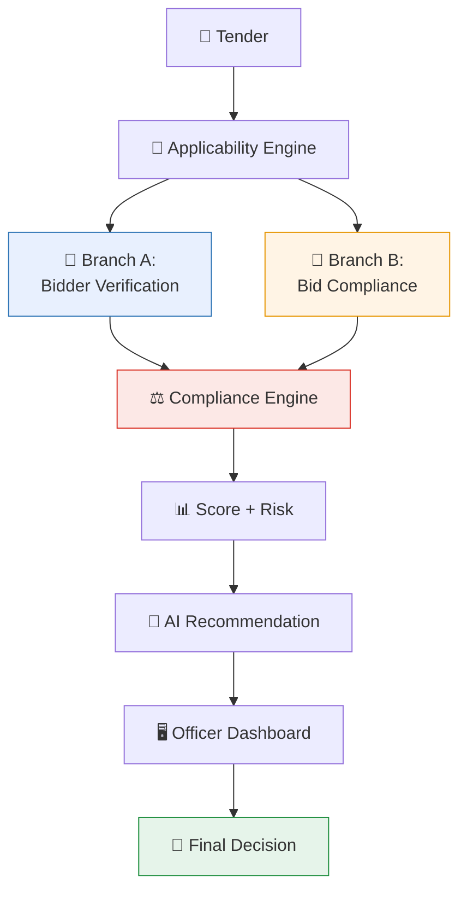

<div align="center">

# 🛡️ BidVerify AI
### AI-Powered Bidder Verification & Bid Compliance Platform

**Smart India Hackathon 2026**

[](https://sih.gov.in)
[]()
[]()
[](./LICENSE.md)

**Organization:** Ministry of Petroleum & Natural Gas &nbsp;|&nbsp; **Department:** Chennai Petroleum Corporation Limited (CPCL)
**Category:** Software &nbsp;|&nbsp; **Theme:** Smart Automation

*A decision-support platform that verifies both who a bidder is and whether their bid meets a specific tender's requirements — with full evidence, without taking the final decision out of human hands.*

</div>

<br>

## 📑 Table of Contents

- [Problem](#-problem)
- [Our Solution](#-our-solution)
- [Key Features](#-key-features)
- [Architecture Overview](#-architecture-overview)
- [Verification Categories](#-verification-categories)
- [How It Works](#-how-it-works)
- [Example Use Case](#-example-use-case)
- [MVP Scope](#-mvp-scope)
- [Project Structure](#-project-structure)
- [Documentation](#-documentation)
- [Important Disclaimer](#️-important-disclaimer)
- [Development Status](#-development-status)
- [Team](#-team) · [License](#-license)

<br>

## ❗ Problem

Government procurement officers must verify **two different things** for every bid, and today do both almost entirely by hand:

1. **The bidder/company's applicable statutory status** — is this a genuine, compliant company? (GST, PAN, Udyam/MSME, EPFO/ESIC, blacklisting, etc.)
2. **Whether the submitted bid satisfies this specific tender's requirements** — turnover, experience, OEM authorization, certificates, local content, and so on.

This is slow, inconsistent across officers, and hard to audit later. 🆕 New to this domain? See [`info.md`](./info.md).

<br>

## 💡 Our Solution

The core principle:

```
Tender requirements determine applicable checks
                    ↓
     Verify bidder/company information (Branch A)
                    +
   Verify tender-specific bid requirements (Branch B)
                    ↓
              Combine evidence
                    ↓
           Compliance assessment
                    ↓
         AI-assisted recommendation
                    ↓
            Human final decision
```

An **Applicability Engine** first reads the tender and determines which checks are actually relevant — not every bidder needs every verification. It then drives **two parallel branches**: one verifying the bidder's general statutory standing, one verifying this specific bid against this specific tender. Both feed a single **Compliance Engine**, which produces evidence-backed findings, a compliance score, a risk level, and an AI-generated recommendation — all reviewed by the Procurement Officer, who makes the actual decision.

<br>

## ✨ Key Features

<table>
<tr>
<td width="50%" valign="top">

**Verification**
- 🎯 Applicability Engine (not every check applies to every bid)
- 🏢 Bidder-level statutory verification (Branch A)
- 📄 Tender-specific bid compliance checking (Branch B)
- 🔌 Modular Verification Adapters (mock today, real when authorized)
- 🔗 Cross-document consistency checking

</td>
<td width="50%" valign="top">

**Decision Support**
- 🧷 Evidence linkage on every result
- ⚖️ Five-state outcomes (not just pass/fail)
- 📊 Compliance Score + Risk Level
- 🤖 AI-generated, evidence-backed recommendation
- 📜 Full audit trail
- 👤 Officer always makes the final call

</td>
</tr>
</table>

<br>

## 🏗️ Architecture Overview



Full breakdown of all 14 architecture layers (Tender Understanding → Security & Privacy) in [`architecture.md`](./architecture.md). Class/sequence diagrams for implementation in [`uml-diagram.md`](./uml-diagram.md).

<br>

## 🧾 Verification Categories

| Branch A — Bidder-Level | Branch B — Tender-Specific |
|:---|:---|
| Udyam/MSME status | Required documents present |
| GST registration + return filing | OEM authorization (this product/tender) |
| PAN / Income Tax compliance | Turnover threshold |
| EPFO / ESIC compliance | Years of experience |
| Startup India / NSIC | Local content / Make in India % |
| Blacklisting / debarment | Technical certifications |
| MCA21 company identity | Other tender-specific conditions |

> ⚠️ Realistic access notes for each source — what's genuinely public vs. what needs authorization — are in [`info.md` → Section 11](./info.md#11-verification-source-and-data-acquisition-guide). We do **not** claim open access to every source.

<br>

## ⚙️ How It Works

| Step | Action |
|:---:|:---|
| 1 | Officer uploads the tender document |
| 2 | System extracts tender requirements and generates an **Applicability Checklist** |
| 3 | Officer uploads bidder/bid documents |
| 4 | **Branch A** verifies bidder-level statutory status via modular adapters |
| 5 | **Branch B** matches bid evidence against tender-specific requirements |
| 6 | Compliance Engine combines both branches into evidence-backed findings |
| 7 | System computes a Compliance Score and Risk Level |
| 8 | AI Recommendation Layer generates a plain-language summary |
| 9 | Officer reviews everything on the dashboard and records the final decision |
| 10 | Every step is logged to the audit trail |

<br>

## 📘 Example Use Case

> CPCL publishes a tender for industrial pumps requiring: valid GST registration, minimum ₹5 Crore turnover, 3 years of experience, valid OEM authorization, and a current ISO 9001 certificate.

**Branch A (Bidder-Level):**

| Check | Result |
|:---|:---:|
| GST Registration | ✅ VERIFIED |
| Blacklisting Check | ✅ CLEAR |

**Branch B (Tender-Specific, for this bid):**

| Requirement | Result |
|:---|:---:|
| Turnover ≥ ₹5 Crore | ✅ COMPLIANT *(₹7 Crore shown)* |
| 3 Years Experience | ❌ NON_COMPLIANT *(only 2.5 years found)* |
| OEM Authorization | ⚠️ NEEDS_REVIEW *(expiry unclear in scan)* |
| ISO 9001 Certificate | ❌ NON_COMPLIANT *(expired)* |

> Both branches combine into one compliance package. The officer reviews the evidence-backed summary and decides how to proceed — including requesting clarification on the OEM document before making a final call.

<br>

## 🧪 MVP Scope

A realistic hackathon prototype demonstrates: tender upload & requirement extraction → applicability checklist generation → bidder document upload & extraction → verification against **synthetic/mock datasets** → a handful of working modular adapters (GST-like, Udyam/MSME-like, PAN consistency, OEM document validation, blacklist demo) → requirement-vs-evidence comparison → detection of missing/mismatched/expired evidence → compliance score, risk level, and AI recommendation → evidence display → audit logging → officer final review.

> 🚫 The MVP does **not** claim unrestricted real-time access to any live government database. Full scope details in [`info.md` → Section 23](./info.md#23-mvp-scope).

<br>

## 📂 Project Structure

```
project-root/
│
├── frontend/        # Officer-facing dashboard (React)
├── backend/         # API server
│   ├── tender/           # Tender Understanding Layer
│   ├── applicability/    # Applicability Engine
│   ├── bidder_verify/    # Bidder Verification Layer (Branch A)
│   ├── bid_compliance/   # Bid & Document Verification Layer (Branch B)
│   ├── document_intel/   # OCR, extraction, classification
│   ├── adapters/          # Verification Adapter Layer (mock + real)
│   ├── compliance_engine/ # Combines Branch A + B
│   └── risk_ai/           # Scoring + AI Recommendation
├── docs/            # This documentation set
├── data/            # Synthetic/mock tender & bidder datasets (DEMO DATA)
├── tests/
└── README.md
```

<br>

## 📚 Documentation

| File | Contents |
|:---|:---|
| [`info.md`](./info.md) | Full domain knowledge — problem, 14 requirements explained, Verification Source Guide, MVP/production scope |
| [`flow-diagram.md`](./flow-diagram.md) | 10 detailed workflow diagrams (two-branch model, DigiLocker, blacklisting, etc.) |
| [`architecture.md`](./architecture.md) | 14-layer system architecture, adapter pattern, tech stack |
| [`database.md`](./database.md) | Full schema — including the critical VerificationResult vs. ComplianceResult split |
| [`uml-diagram.md`](./uml-diagram.md) | Class diagrams and sequence diagrams for implementation |

<br>

## ⚠️ Important Disclaimer

> This platform is a **decision-support and verification system**, built as a prototype for SIH26100 using dummy/synthetic tender and bidder datasets, as explicitly permitted by the problem statement.
>
> **AI-generated findings and recommendations do not replace the authority or judgment of the Procurement Officer.** The final qualification/disqualification decision always remains with the authorized human decision-maker.
>
> Any production integration with government portals or databases (GST, Udyam, EPFO, ESIC, DigiLocker, MCA21, or others) would require official authorization, credentials, agreements, and approved integration mechanisms from the relevant authorities. **This prototype does not claim, and must not be presented as having, real-time access to any restricted government database.** See [`info.md` → Section 11](./info.md#11-verification-source-and-data-acquisition-guide) for a source-by-source breakdown of what's realistically available today.

<br>

## 🚧 Development Status

**Hackathon Prototype / Concept Stage.** Core document processing, the Applicability Engine, both verification branches, and the Compliance Engine are demonstrated using synthetic/mock data through the Verification Adapter Layer. Real government-system integrations are represented conceptually and can be added later without redesigning the Compliance Engine — see [`architecture.md` → Section 17](./architecture.md#17-mock--production-switching).

<br>

## 🤝 Team

*[Add your team name and member details here]*

## 📄 License

Licensed under the [MIT License](./LICENSE.md).

<br>

<div align="center">

---

**Built for Smart India Hackathon 2026** 🇮🇳

</div>
