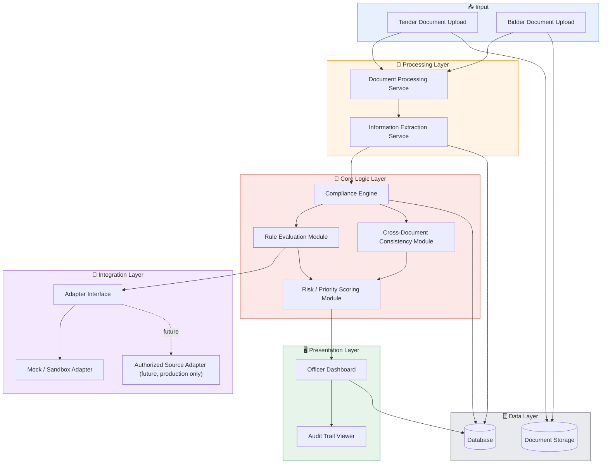
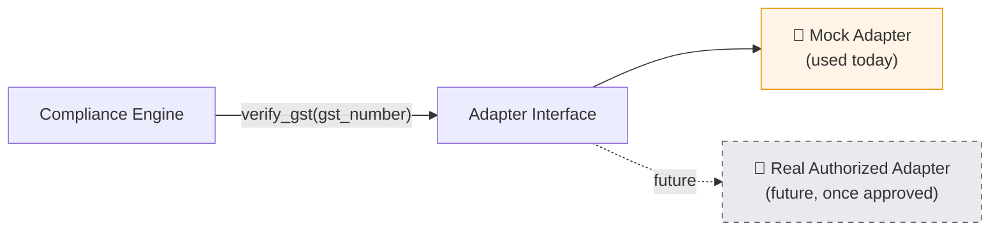

# ⚙️ Architecture — BidVerify AI
### System Design & Technology Stack

*Explains how the system is built — its components, how they talk to each other, and what technology powers each part.*

 

> 💡 **How to use this file:** This is the *engineering* document. For the *why* behind the problem, see [`info.md`](./info.md). For step-by-step process flows, see [`flow-diagram.md`](./flow-diagram.md). For the data model, see [`database.md`](./database.md).

 

## 📑 Table of Contents

- [Design Philosophy](#1-design-philosophy)
- [High-Level Component Diagram](#2-high-level-component-diagram)
- [Component Descriptions](#3-component-descriptions-plain-english)
- [Technology Stack](#4-technology-stack)
- [Why an Adapter Pattern?](#5-why-an-adapter-pattern-for-external-verification)
- [Security & Privacy](#6-security-and-privacy-considerations)
- [Prototype vs Production](#7-what-the-prototype-will-demonstrate-vs-what-requires-real-government-access)

 

---

## 1. Design Philosophy

Three ideas shape every architecture decision here:

<table>
<tr>
<td width="33%" valign="top">

### 🧠 1️⃣ Separate Understanding from Deciding
AI models are used to *read and extract* information from documents. A separate, predictable **rule engine** is used to *check* that information against requirements. This keeps compliance logic transparent — not hidden inside an AI's black-box reasoning.

</td>
<td width="33%" valign="top">

### 🔌 2️⃣ Never Fake an Integration
Any connection to an external government source is built behind an **adapter interface**, so the prototype uses clearly labeled mock/sandbox data today, and a real, authorized integration can be swapped in later — no rewrite needed.

</td>
<td width="33%" valign="top">

### 👤 3️⃣ Always Keep a Human Checkpoint
No matter what the AI or rule engine concludes, the architecture always routes the final result to an **Officer Dashboard** for human review — the system never auto-finalizes a decision.

</td>
</tr>
</table>

 

---

## 2. High-Level Component Diagram

 

---

## 3. Component Descriptions (Plain-English)

<table>
<tr>
<td width="4%">📥</td>
<td width="26%"><b>Document Processing Service</b></td>
<td>Takes raw uploaded files (PDFs, scanned images) and turns them into readable text. Isolating this step means the rest of the system only ever deals with clean text, not raw files.</td>
</tr>
<tr>
<td>🔍</td>
<td><b>Information Extraction Service</b></td>
<td>Reads cleaned text and pulls out specific, structured facts — e.g., "turnover: ₹7 Crore." Extraction (finding facts) is a different job from evaluation (checking facts), so they're kept separate and independently testable.</td>
</tr>
<tr>
<td>🧠</td>
<td><b>Compliance Engine</b></td>
<td>The central brain — takes structured tender requirements and structured bidder facts, and figures out compliance status for each requirement.</td>
</tr>
<tr>
<td>📏</td>
<td><b>Rule Evaluation Module</b></td>
<td>Applies clear, deterministic rules (e.g., "turnover ≥ ₹5 Crore?"). Gives the <i>same, predictable</i> answer every time — building trust and auditability, rather than relying on AI judgment for simple checks.</td>
</tr>
<tr>
<td>🔗</td>
<td><b>Cross-Document Consistency Module</b></td>
<td>Compares identifying details (company name, registration numbers, dates, addresses) across all of a bidder's documents to catch mismatches.</td>
</tr>
<tr>
<td>📊</td>
<td><b>Risk / Priority Scoring Module</b></td>
<td>Combines rule evaluation + consistency results into a simple risk indicator (Low/Medium/High) to help officers prioritize. A <i>prioritization aid</i>, not a qualify/disqualify verdict.</td>
</tr>
<tr>
<td>🔌</td>
<td><b>Integration Adapter Layer</b></td>
<td>A single, consistent interface the Compliance Engine uses to request external verification — without caring whether data comes from a mock file or a real, authorized system.</td>
</tr>
<tr>
<td>🖥️</td>
<td><b>Officer Dashboard</b></td>
<td>The main interface where an officer views results, evidence, and risk indicators, and records the final decision.</td>
</tr>
<tr>
<td>📜</td>
<td><b>Audit Trail Viewer</b></td>
<td>Shows the full history of what was checked, what evidence was used, and what decisions were made, for any given bid.</td>
</tr>
<tr>
<td>🗄️</td>
<td><b>Database</b></td>
<td>Stores all structured data — tenders, requirements, bidders, facts, results, audit records. Full schema in <a href="./database.md"><code>database.md</code></a>.</td>
</tr>
<tr>
<td>📁</td>
<td><b>Document Storage</b></td>
<td>Stores original uploaded files separately from the structured database, since documents are large, unstructured, binary files.</td>
</tr>
</table>

 

---

## 4. Technology Stack

| Layer | Suggested Technology | Why This Choice |
|:---|:---|:---|
| 🖥️ **Frontend** (Officer Dashboard) | React + Tailwind CSS | Widely used, fast to build a clean, responsive dashboard for a hackathon timeline |
| ⚙️ **Backend / API** | Python + FastAPI *(or Node.js + Express)* | Well suited to AI/ML-heavy backends, with built-in API documentation |
| 📄 **Document Text Extraction** | PyMuPDF / pdfplumber | Reliable, well-documented libraries for native-text PDFs |
| 🔠 **OCR** (Scanned Documents) | Tesseract OCR | A mature, free, open-source OCR engine, suitable for a prototype |
| 🧬 **Information Extraction (NLP)** | spaCy or HuggingFace Transformers | Well-established tools for identifying and extracting structured fields |
| 📏 **Rule Evaluation** | Custom Python rule engine (JSON-based rules) | Keeps compliance logic transparent, testable, and explainable to judges |
| 🔗 **Cross-Document Matching** | RapidFuzz (fuzzy string matching) | Effective, lightweight way to catch near-duplicate/mismatched entity names |
| 🗄️ **Database** | PostgreSQL | Reliable, structured, relational — fits the tender/requirement/bidder data model |
| 📁 **Document Storage** | Local file storage (prototype) | Keeps the prototype simple; production could use secure cloud object storage |
| 🔌 **Integration Adapter Layer** | Python interface/abstract classes + Mock Adapter | Demonstrates a clean, extensible pattern without claiming real government access |
| 🔐 **Authentication** | JWT-based officer login | Standard, simple approach suitable for a prototype demo |
| 🐳 **Deployment (demo)** | Docker Compose | Makes the whole system easy to spin up consistently for a live demo |

> 📝 **Note:** These are *suggested* technologies appropriate for a hackathon timeline — adjust based on actual team skill strengths (e.g., swapping FastAPI for Node.js/Express is equally valid).

 

---

## 5. Why an Adapter Pattern for External Verification?

The **Adapter Pattern** is a standard software design approach where a system talks to a single, consistent internal interface, while the actual underlying implementation can be swapped out.

> 🔌 **Analogy:** Think of a universal travel power adapter. Your laptop charger always plugs into the *same* adapter socket — but the adapter itself can be swapped depending on whether you're in India, the UK, or the US. Your laptop charger doesn't need to know or care which country's socket is actually being used underneath.

**In this project:**

- The **Compliance Engine** always calls the same adapter interface, e.g., `verify_gst(gst_number)`.
- Today, that interface is implemented by a **Mock Adapter**, which returns realistic, clearly-labeled sample data.
- In a real, authorized deployment, that same interface could be implemented by a **real adapter** connecting to an approved, authorized government data source — without changing anything else in the Compliance Engine.

This is what allows the team to **honestly demonstrate the full architecture and workflow** in a hackathon setting, without falsely claiming access to restricted government systems.

 

---

## 6. Security and Privacy Considerations

| Consideration | Approach |
|:---|:---|
| 🔒 **Sensitive data access** | Uploaded documents & extracted data restricted to authorized officer accounts |
| 📜 **Traceability** | All actions (uploads, checks, decisions) logged for the audit trail (see [`database.md`](./database.md)) |
| 🔐 **Data-at-rest & credentials** | Encryption and secure credential management noted as a **future/production consideration**, not required for the hackathon prototype |
| 🧪 **Mock data hygiene** | Sandbox data must be clearly fictional and must not resemble any real company's actual registration details |

 

---

## 7. What the Prototype Will Demonstrate vs. What Requires Real Government Access

| Capability | 🧪 Prototype (Hackathon) | 🏛️ Real Production Deployment |
|:---|:---:|:---:|
| Reading tender/bid PDFs and extracting text | ✅ Fully functional | ✅ Same |
| OCR on scanned documents | ✅ Fully functional | ✅ Same |
| Rule-based compliance checking | ✅ Functional, sample rules | ✅ Same, with officially approved rule sets |
| Cross-document consistency checking | ✅ Fully functional | ✅ Same |
| Officer dashboard and audit trail | ✅ Fully functional | ✅ Same, with production-grade access control |
| GST / Udyam / PAN / EPFO / MCA21 / DigiLocker verification | ⚠️ Simulated via Mock Adapter | ❌ Requires official authorization & approved integration agreements |
| Blacklisting/debarment checks | ⚠️ Simulated via Mock Adapter | ❌ Requires access to an authoritative, approved blacklist source |

 

---

**Next:** Continue to [`database.md`](./database.md) to see the data model behind all of this 🗄️

