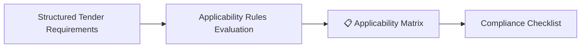
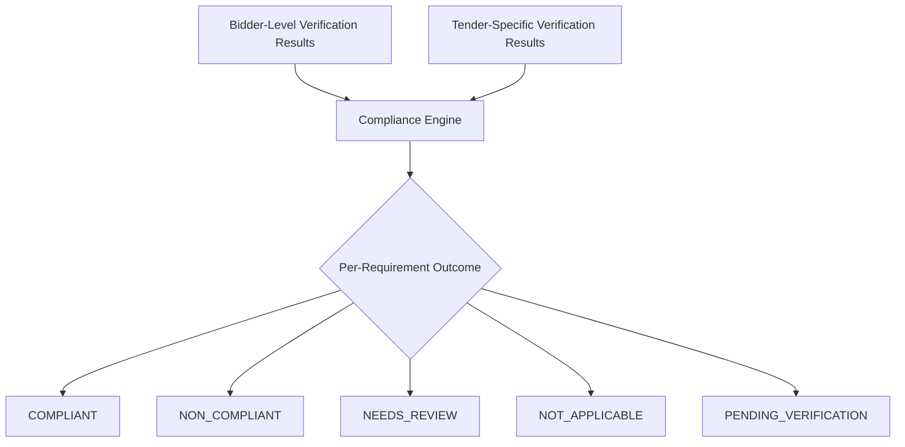
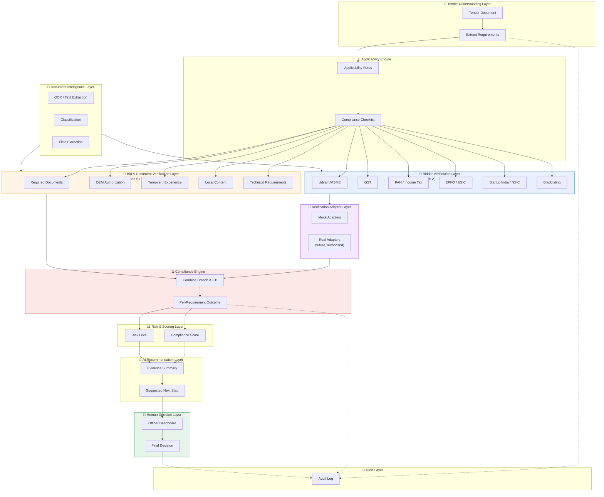
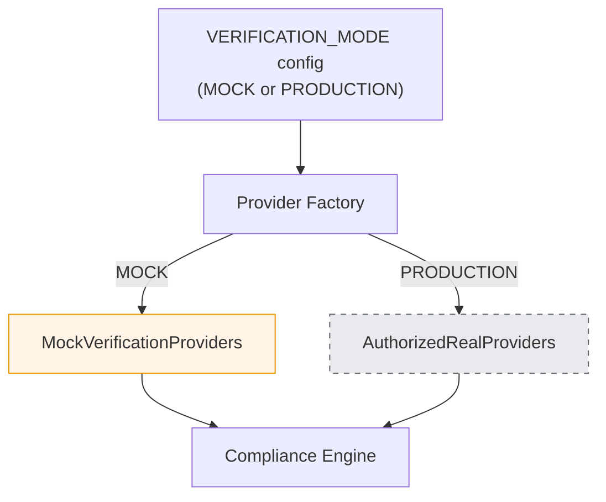

<div align="center">

# ⚙️ Architecture — BidVerify AI
### System Design & Technology Stack (Two-Branch Model)

[]()
[]()
[]()

</div>

<br>

> ⚠️ **This replaces the earlier architecture.** The system now has a dedicated **Bidder Verification Layer** and **Bid/Document Verification Layer** as two separate, first-class components — not one merged "compliance check" step. See [`info.md` → Section 9](./info.md#9-the-two-types-of-verification) for why this split matters conceptually.

<br>

## 📑 Table of Contents

1. [Design Philosophy](#1-design-philosophy)
2. [Tender Understanding Layer](#2-tender-understanding-layer)
3. [Applicability Engine](#3-applicability-engine)
4. [Bidder Verification Layer](#4-bidder-verification-layer)
5. [Bid & Document Verification Layer](#5-bid-and-document-verification-layer)
6. [Document Intelligence Layer](#6-document-intelligence-layer)
7. [Verification Adapter Layer](#7-verification-adapter-layer)
8. [Compliance Engine](#8-compliance-engine)
9. [Risk & Scoring Layer](#9-risk-and-scoring-layer)
10. [AI Recommendation Layer](#10-ai-recommendation-layer)
11. [Evidence & Explainability Layer](#11-evidence-and-explainability-layer)
12. [Audit Layer](#12-audit-layer)
13. [Human Decision Layer](#13-human-decision-layer)
14. [Security & Privacy Layer](#14-security-and-privacy-layer)
15. [Full Architecture Diagram](#15-full-architecture-diagram)
16. [Technology Stack](#16-technology-stack)
17. [MOCK ↔ PRODUCTION Switching](#17-mock--production-switching)

<br>

---

## 1. Design Philosophy

<table>
<tr>
<td width="25%" valign="top">

### 🧩 1️⃣ Two Branches, One Engine
Bidder-level checks (Branch A) and tender-specific checks (Branch B) run as **separate components** and only combine at the Compliance Engine — reflecting that they answer genuinely different questions.

</td>
<td width="25%" valign="top">

### 🔌 2️⃣ Adapters, Never Fakes
Every external verification source — real or not-yet-authorized — is accessed through the **same adapter interface**. Mock and real implementations are interchangeable.

</td>
<td width="25%" valign="top">

### 🎯 3️⃣ Applicability First
The system never blindly runs every possible check. The **Applicability Engine** decides what's relevant per tender, *before* any verification branch runs.

</td>
<td width="25%" valign="top">

### 👤 4️⃣ Human Checkpoint, Always
No matter how confident the AI/rule outputs are, the **Officer Dashboard** is the only place a final decision can be recorded.

</td>
</tr>
</table>

<br>

---

## 2. Tender Understanding Layer

**Responsible for:** Reading the tender document, identifying its stated requirements, and extracting eligibility conditions into a structured form.

| Input | Output |
|:---|:---|
| Tender PDF | Structured list of `TenderRequirements` (see [`database.md`](./database.md)) |

Uses the same document-processing pipeline as bidder documents (see [Section 6](#6-document-intelligence-layer)), but applied to the tender itself.

<br>

---

## 3. Applicability Engine

**Responsible for:** Determining *which* checks actually apply to this tender and (where relevant) this bidder — and producing the **Applicability Matrix / Compliance Checklist** that everything downstream depends on.



**Why this exists as its own layer:** Without it, the system would either (a) run every possible verification on every bid — wasteful and confusing — or (b) require hardcoded, tender-type-specific logic scattered throughout the codebase. Centralizing this decision in one place keeps the rest of the system generic.

<br>

---

## 4. Bidder Verification Layer

> 🆕 **New component, not present in the earlier architecture.**

**Responsible for:** Everything under **Branch A** — checks about the *bidder/company itself*, independent of any specific tender.

**Handles:** Udyam/MSME · GST (registration + filing) · PAN · Income Tax compliance · EPFO · ESIC · Startup India · NSIC · Blacklisting/debarment · MCA21 identity · other statutory checks flagged as applicable.

**How it works:** For each applicable check (per the Applicability Matrix), this layer calls the relevant [Verification Adapter](#7-verification-adapter-layer), collects the normalized result, and stores it against the **bidder**, not the specific bid — since a bidder's statutory standing can be reused/referenced across multiple tenders they bid on.

<br>

---

## 5. Bid and Document Verification Layer

> 🆕 **New component, kept explicitly separate from Section 4.**

**Responsible for:** Everything under **Branch B** — checks about whether *this specific bid* satisfies *this specific tender*.

**Handles:** Required document presence · OEM authorization (tender-specific) · turnover threshold · years of experience · technical requirements · local-content declarations · other tender-specific conditions.

**How it works:** For each applicable tender-specific requirement, this layer matches the requirement against extracted bid-document evidence, using the [Rule Evaluation Module](#8-compliance-engine) for deterministic checks (numeric thresholds) and document-comparison logic for qualitative ones (e.g., OEM letter consistency).

<br>

---

## 6. Document Intelligence Layer

**Responsible for:** Turning raw uploaded files into clean, structured, extracted information — shared infrastructure used by both verification branches and the Tender Understanding Layer.

| Sub-component | Job |
|:---|:---|
| Text Extraction | Pull text from native-text PDFs |
| OCR | Read scanned/image-based documents |
| Document Classification | Identify document type (e.g., "GST Certificate") |
| Information Extraction (NLP) | Pull structured fields (e.g., turnover, GSTIN, dates) |
| Evidence Linking | Tie every extracted field back to its source document/location |

<br>

---

## 7. Verification Adapter Layer

**Responsible for:** Providing one consistent interface the Bidder Verification and Bid Verification layers can call, regardless of whether the underlying implementation is mock or real.

> ⚠️ **These are internal software interfaces — not claims that official APIs already exist for every source.** See [`info.md` → Section 11](./info.md#11-verification-source-and-data-acquisition-guide) for what's realistically available per source.

**Conceptual adapter interface:**

```
VerificationProvider
    verify(identifier, context) → StandardizedVerificationResult
```

**Example adapters (conceptual, not asserting real endpoints):**

| Adapter | MVP Implementation | Future Production Implementation |
|:---|:---|:---|
| `UdyamVerificationAdapter` | `MockUdyamProvider` | `RealUdyamProvider` (if/when authorized access exists) |
| `GSTVerificationAdapter` | `MockGSTProvider` | `RealGSTProvider` (via authorized GSP integration) |
| `PANVerificationAdapter` | `MockPANProvider` | `RealPANProvider` (if authorized access exists) |
| `TaxComplianceAdapter` | `MockTaxProvider` | `RealTaxProvider` (requires official authorization) |
| `EPFOAdapter` | `MockEPFOProvider` | `RealEPFOProvider` (requires official authorization) |
| `ESICAdapter` | `MockESICProvider` | `RealESICProvider` (requires official authorization) |
| `StartupIndiaAdapter` | `MockStartupIndiaProvider` | `RealStartupIndiaProvider` |
| `NSICAdapter` | `MockNSICProvider` | `RealNSICProvider` |
| `DigiLockerAdapter` | `MockDigiLockerProvider` | `RealDigiLockerProvider` (requires official partner onboarding) |
| `BlacklistAdapter` | `MockBlacklistProvider` | Org-specific `RealBlacklistProvider(s)` (no single universal source) |
| `MCAAdapter` | `MockMCAProvider` | `RealMCAProvider` (if authorized access exists) |
| `BISAdapter` | `MockBISProvider` | `RealBISProvider` (where relevant/available) |

Every adapter conceptually also supports a **Manual Review Adapter** fallback — for cases where no automated source exists and a human simply records a manual check result.

**Standardized verification result (every adapter returns this same shape):**

```json
{
  "verification_id": "string",
  "source": "string",
  "check_type": "string",
  "identifier": "string",
  "status": "VERIFIED | NOT_VERIFIED | NON_COMPLIANT | NEEDS_REVIEW | NOT_APPLICABLE | SOURCE_UNAVAILABLE | PENDING",
  "confidence": "float",
  "evidence": "string",
  "checked_at": "timestamp",
  "remarks": "string"
}
```

> 🔒 Adapters must not expose sensitive information unnecessarily — only the fields needed for the compliance decision are stored (see [Section 14](#14-security-and-privacy-layer)).

<br>

---

## 8. Compliance Engine

**Responsible for:** Combining results from **both** the Bidder Verification Layer and the Bid/Document Verification Layer into evidence-backed compliance findings.



**Important:** Outcomes are **not** oversimplified to just compliant/non-compliant. Five states are used because reality includes cases like "not yet checked" (`PENDING_VERIFICATION`) and "doesn't apply to this tender" (`NOT_APPLICABLE`) — collapsing these into a binary would lose important nuance for the officer.

<br>

---

## 9. Risk and Scoring Layer

Combines all per-requirement outcomes into:
- **Compliance Score** — a weighted summary (mandatory requirements count more than optional ones).
- **Risk Level** — Low / Medium / High, meant to help an officer triage which bids need the closest attention first.

Both are **decision-support indicators** — see [`info.md` → Section 15](./info.md#15-compliance-score-and-risk-level).

<br>

---

## 10. AI Recommendation Layer

Generates a plain-language summary of findings and a suggested next step (e.g., "recommend requesting clarification on OEM authorization before proceeding") — always evidence-linked, always phrased as a **recommendation**, never as a decision.

<br>

---

## 11. Evidence and Explainability Layer

Ensures every result at every layer — bidder verification, bid verification, compliance outcome, risk score, AI recommendation — carries a traceable link back to its supporting document/field/source response. This is enforced structurally through the data model (see [`database.md`](./database.md) `Evidence` table), not just as a UI nicety.

<br>

---

## 12. Audit Layer

Logs every meaningful action across the system — uploads, verification checks, compliance evaluations, officer actions — with a timestamp, to a queryable `AuditLogs` table. Supports later reconstruction of "why was this decision made?"

<br>

---

## 13. Human Decision Layer

The Officer Dashboard where a Procurement Officer reviews all outputs (evidence, compliance results, score, risk, AI recommendation) and records the **final, authoritative decision**. This layer is architecturally guaranteed to be the last step — no automated component can write a final decision on its own.

<br>

---

## 14. Security and Privacy Layer

| Consideration | Approach |
|:---|:---|
| 🔒 Access control | Documents and extracted data restricted to authorized officer accounts |
| 🗜️ Data minimization | Adapters store only fields necessary for the compliance decision, not entire raw responses |
| 🔐 Sensitive identifiers | PAN/GSTIN-style identifiers should be masked/tokenized/encrypted where feasible, even in the MVP |
| 🧪 Demo data hygiene | All mock data must be clearly synthetic, never resembling a real company's actual registration details |
| 🔮 Production considerations | Data-at-rest encryption and formal credential management are noted as future/production requirements, not required for the hackathon prototype |

<br>

---

## 15. Full Architecture Diagram



<br>

---

## 16. Technology Stack

| Layer | Suggested Technology | Why |
|:---|:---|:---|
| 🖥️ Frontend (Officer Dashboard) | React + Tailwind CSS | Fast to build a clean dashboard within a hackathon timeline |
| ⚙️ Backend / API | Python + FastAPI *(or Node.js + Express)* | Well suited to AI/ML-heavy backends |
| 📄 Document Text Extraction | PyMuPDF / pdfplumber | Reliable for native-text PDFs |
| 🔠 OCR | Tesseract OCR | Free, mature, offline-capable |
| 🧬 NLP / Extraction | spaCy or HuggingFace Transformers | Established structured-field extraction |
| ⚖️ Rule Evaluation | Custom Python rule engine (JSON-based rules per tender) | Transparent, testable, avoids AI black-box for deterministic checks |
| 🔗 Cross-Document Matching | RapidFuzz | Lightweight fuzzy-matching for name/identifier mismatches |
| 🗄️ Database | PostgreSQL | Fits the relational, multi-entity data model (see `database.md`) |
| 📁 Document Storage | Local file storage (prototype) | Simple for a hackathon; production could use secure object storage |
| 🔌 Adapter Layer | Python abstract classes/interfaces + factory pattern | Enables clean mock ↔ real provider swapping |
| 🔐 Authentication | JWT-based officer login | Standard, simple for a prototype |
| 🐳 Deployment (demo) | Docker Compose | Consistent, easy live-demo setup |

<br>

---

## 17. MOCK ↔ PRODUCTION Switching

The architecture uses **configuration-based provider selection**, not scattered hardcoded logic.



A single configuration value (conceptually `VERIFICATION_MODE = MOCK` or `VERIFICATION_MODE = PRODUCTION`) determines, through a **Provider Factory** (dependency-injection style), which set of adapters gets wired in. **The Compliance Engine, Risk Engine, Scoring Logic, AI Recommendation Engine, and Dashboard never change** between the two modes — only the data source underneath the adapter interface changes. This is the architectural guarantee that makes the "dummy datasets now, real integration later" model actually work without a redesign.

<br>

<div align="center">

---

**Next:** Continue to [`database.md`](./database.md) to see the data model that supports this two-branch design 🗄️

</div>
