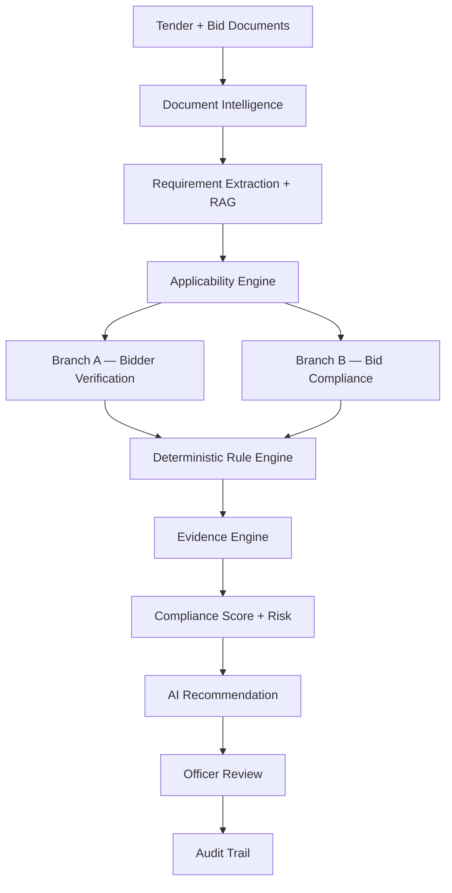
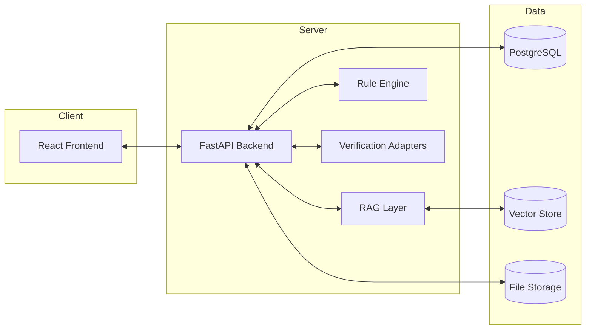
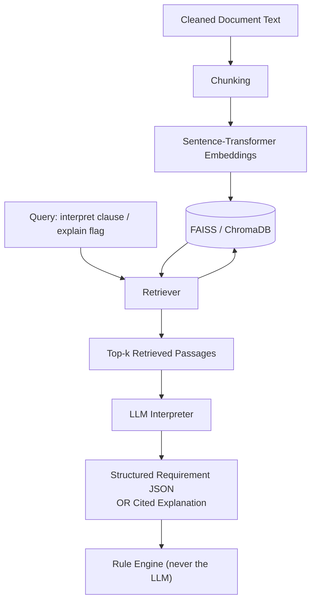
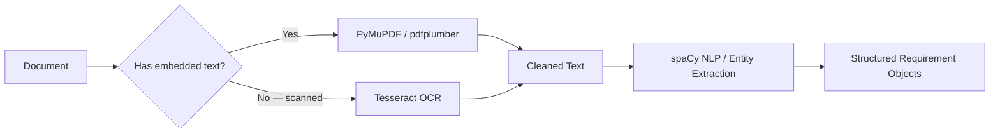
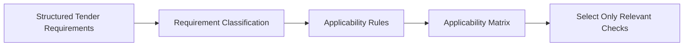
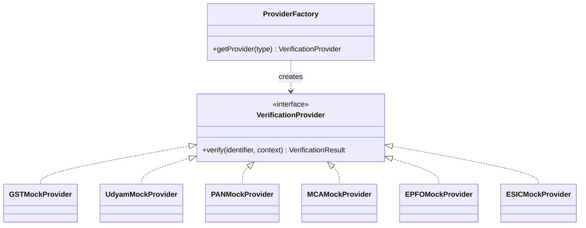
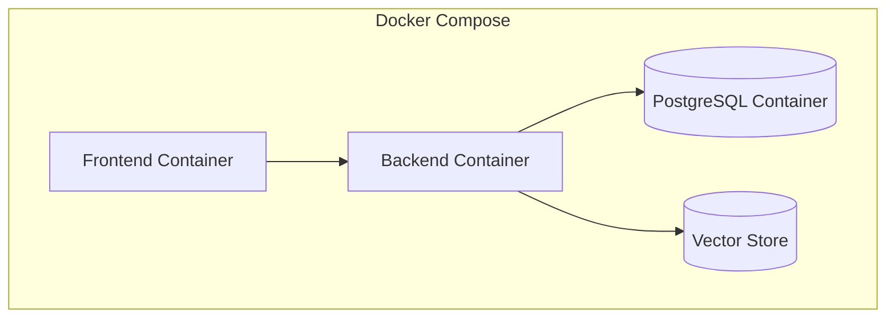
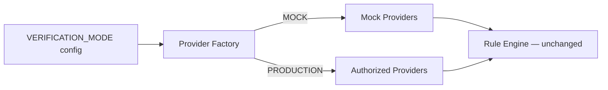

# Architecture.md — System Architecture
## BidVerify AI

> Companion docs: `PRD.md` (why) · `flowchart.md` (process flows) · `uml_diagram.md` (class/sequence detail) · `database.md` (data model) · `mock_api.md` (verification provider detail)

---

## 1. Architecture Overview

BidVerify AI is built around one non-negotiable rule: **AI assists, deterministic rules evaluate, the officer decides.** Every layer below exists to keep that boundary structurally enforced, not just documented.



---

## 2. High-Level Architecture



---

## 3. Component Architecture

| Component | Responsibility |
|:---|:---|
| Frontend (React) | Officer Dashboard, evidence viewer, review workflow |
| API Gateway (FastAPI) | Auth, routing, orchestration between modules |
| Document Intelligence | Text extraction, OCR, chunking, classification |
| Requirement Extraction (RAG-assisted) | Turns tender text into structured requirements |
| Applicability Engine | Decides which checks apply to this tender/bid |
| Verification Adapters | Bidder-level checks via mock/authorized providers |
| Rule Engine | Deterministic Branch A + Branch B evaluation |
| Evidence Engine | Links every finding to source document/page/text |
| Risk & Scoring | Computes Compliance Score (0–100) and Risk Level |
| AI Recommendation | RAG-cited plain-language summary — never a decision |
| Audit Service | Logs every action, result, and officer decision |

---

## 4. Frontend Architecture

**Core stack:** React, Redux/Redux Toolkit, Tailwind CSS.

**Structure (Recommended Implementation):**
```
frontend/
├── src/
│   ├── features/        # Redux slices per domain (tenders, bids, verification, evidence, audit)
│   ├── pages/            # Route-level screens
│   ├── components/       # Shared UI components
│   ├── api/               # Axios API clients
│   ├── hooks/
│   └── utils/
```

| Supporting Library (Optional) | Purpose | Where Used |
|:---|:---|:---|
| React Router | Client-side routing | Page navigation |
| Axios | HTTP client | All API calls |
| React Hook Form + Zod | Form state + validation | Tender/bid upload forms |
| TanStack Table | Data-grid tables | Tenders list, bids list, requirement tables |
| Recharts | Charts | Dashboard score/risk visualizations |
| Lucide React | Icon set | Sidebar, badges, status icons |
| date-fns | Date formatting | Timestamps across audit/evidence views |
| shadcn/ui | Pre-built accessible components | Buttons, modals, dropdowns (built on Tailwind) |

> These are optional and additive — the **core stack is React + Redux + Tailwind** as specified.

---

## 5. Backend Architecture

**Core stack:** FastAPI, Pydantic, SQLAlchemy, PostgreSQL, JWT, RBAC.

**Module structure:**
```
backend/
├── auth/
├── users/
├── tenders/
├── bids/
├── documents/
├── extraction/
├── requirements/
├── applicability/
├── verification/
├── compliance/
├── evidence/
├── rag/
├── recommendations/
├── audit/
└── reports/
```

Each module follows a **service/repository pattern**:
- `router.py` — FastAPI endpoints (thin, delegates to service)
- `service.py` — business logic
- `repository.py` — SQLAlchemy queries
- `schemas.py` — Pydantic request/response models
- `models.py` — SQLAlchemy ORM models

---

## 6. AI Architecture



**Hard boundary:** the LLM Interpreter has no method that outputs a compliance verdict. It only produces `StructuredRequirementJSON` (input to the Applicability Engine and Rule Engine) or `CitedExplanation` (input to Evidence/Recommendation). See `uml_diagram.md` § Class Diagram for the enforced structural separation.

---

## 7. Document Intelligence Pipeline

| Input Type | Tool Used | Why |
|:---|:---|:---|
| Digital/native-text PDF | PyMuPDF / pdfplumber | Fast, accurate text extraction, no OCR needed |
| Scanned PDF / image | Tesseract OCR | Converts image to text when no embedded text layer exists |
| Extracted raw text | spaCy | Entity extraction (dates, amounts, org names) |
| Complex language understanding | HuggingFace Transformers | Deeper NLP tasks (classification, embeddings) where spaCy alone is insufficient |



---

## 8. RAG Architecture

See Section 6 above. **Components:** `DocumentChunker`, `VectorStore` (FAISS/ChromaDB), `RAGRetriever`, `LLMInterpreter`. Full class-level detail in `uml_diagram.md`.

---

## 9. Applicability Engine



**Example:** If a tender does not mention OEM authorization, the OEM check is never executed for that tender — not run-and-marked-N/A, but simply not scheduled at all, saving processing and avoiding noise in the officer's view.

---

## 10. Rule Engine (Deterministic Compliance)

- Input: `StructuredRequirementJSON` (from RAG/Applicability) + verified bidder/bid facts.
- Logic: plain, testable Python comparisons — numeric thresholds, date validity, presence/absence checks, string/identifier matching.
- Output: one of `COMPLIANT`, `NON_COMPLIANT`, `NEEDS_REVIEW`, `NOT_APPLICABLE`, `PENDING_VERIFICATION`.
- **This is the only component permitted to write a compliance verdict to the database.**

---

## 11. Verification Adapter Architecture



The Rule Engine and Bidder Verification service call `VerificationProvider.verify()` — they never know or care whether `ProviderFactory` returned a Mock or (future) Authorized implementation. Full mock request/response detail in `mock_api.md`.

---

## 12. Evidence Architecture

Every finding follows this exact chain:

```
Requirement → Verification/Compliance Result → Evidence → Source Document → Page → Extracted Text → Explanation
```

Stored so a reviewer never has to trust an unlinked claim — every number and verdict is one click from its source.

---

## 13. Audit Architecture

Every action writes an `AuditLog` row: user, role, tender, bid, action, timestamp, previous result, updated result, decision, evidence reference, verification source, explanation. See `database.md` for schema.

---

## 14. Security Architecture

| Layer | Approach |
|:---|:---|
| Authentication | JWT tokens |
| Authorization | Role-Based Access Control (RBAC) |
| Passwords | Hashed (e.g., bcrypt) — never stored plain |
| File uploads | Type validation, size limits |
| Sensitive identifiers | Masking/tokenization for PAN/GSTIN-style values |
| API | Input validation, parameterized queries (SQLAlchemy ORM — SQL-injection safe by default) |
| Secrets | Environment variables, never hardcoded |
| CORS | Restricted to known frontend origin(s) |
| Rate limiting | Recommended Implementation — not detailed in source PPT |

> No compliance certification (ISO, SOC2, etc.) is claimed — none has been implemented or audited.

---

## 15. Data Flow Summary

`Upload → Document Intelligence → RAG-grounded Requirement Extraction → Applicability Matrix → Branch A + Branch B (parallel) → Rule Engine → Evidence Engine → Score/Risk → AI Recommendation → Officer Decision → Audit Log`

---

## 16. Deployment Architecture



**Stack:** Docker, Docker Compose, GitHub (version control + Actions for CI, Recommended Implementation).

---

## 17. Mock → Production Transition



A single config value switches every adapter. **The Rule Engine, Applicability Engine, Evidence Engine, and Frontend never change** between MVP and production — only what's behind the adapter interface changes.
