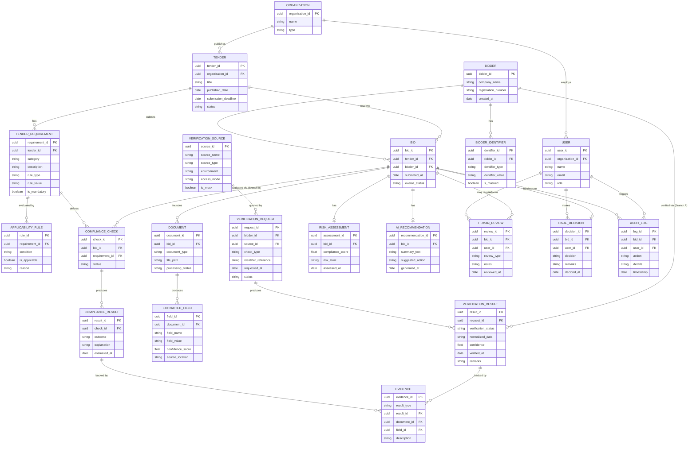

# 🗄️ Database Design — BidVerify AI
### Data Model for the Two-Branch Verification System

 

> ⚠️ **This replaces the earlier schema.** The old design didn't clearly separate *bidder-level verification* from *tender-specific bid compliance*. This version fixes that — **`VerificationResults` (bidder-level) and `ComplianceResults` (bid-level) are now distinct entities**, both linking back to shared `Evidence`. See the worked example in [Section 5](#5-the-most-important-distinction-bidder-verification-vs-bid-compliance).

 

## 📑 Table of Contents

1. [Entity Overview](#1-entity-overview-plain-english)
2. [Entity-Relationship Diagram](#2-entity-relationship-diagram)
3. [Table-by-Table Explanation](#3-table-by-table-explanation)
4. [DataSource, VerificationRequest, VerificationResult (MVP + Production)](#4-datasource-verificationrequest-verificationresult-mvp--production-support)
5. [🔑 The Most Important Distinction](#5-the-most-important-distinction-bidder-verification-vs-bid-compliance)
6. [Design Notes](#6-design-notes)
7. [Sample Data Flow](#7-sample-data-flow-through-the-schema)

 

---

## 1. Entity Overview (Plain-English)

| Entity | Plain-English Meaning |
|:---|:---|
| **Organization** | A government buyer organization (e.g., CPCL) using the platform |
| **User** | Any platform login — includes Procurement Officers |
| **Tender** | The buyer's published purchase request |
| **TenderRequirement** | One individual rule extracted from a tender |
| **ApplicabilityRule** | A rule deciding *whether* a given check applies to a given tender/bidder |
| **Bidder** | A company that has ever submitted a bid |
| **BidderIdentifier** | A specific identifier belonging to a bidder (GSTIN, PAN, Udyam number, etc.) |
| **Bid** | One bidder's submission for one specific tender |
| **Document** | An uploaded file (tender or bid document) |
| **ExtractedField** | A specific structured fact pulled from a document |
| **VerificationSource** | A registry entry describing a verification source (mock or real, e.g. `GST_DEMO`) |
| **VerificationRequest** | A record of one verification check being requested |
| **VerificationResult** | The **bidder-level** outcome of a Branch A check (e.g., "GST: VERIFIED") |
| **ComplianceCheck** | One tender-specific requirement being evaluated for a bid (Branch B) |
| **ComplianceResult** | The outcome of a `ComplianceCheck` (e.g., "Turnover requirement: COMPLIANT") |
| **Evidence** | A shared evidence record linking any result back to its source document/field |
| **RiskAssessment** | The computed risk level for a bid |
| **AIRecommendation** | The AI-generated summary/suggestion for a bid |
| **HumanReview** | A record of an officer requesting/performing manual review on a specific item |
| **FinalDecision** | The officer's authoritative final decision on a bid |
| **AuditLog** | A record of any significant action in the system |

 

---

## 2. Entity-Relationship Diagram

 

---

## 3. Table-by-Table Explanation

### 3.1 `Organization` & `User`
`Organization` represents a buyer entity (e.g., CPCL). `User` represents any platform login, with a `role` (e.g., "Procurement Officer") and links to their `Organization`.

### 3.2 `Tender` & `TenderRequirement`
`Tender` is the published purchase request. `TenderRequirement` is one individual extracted rule (category, description, rule type, mandatory flag) — a tender has many requirements.

### 3.3 `ApplicabilityRule`
**New table.** For each `TenderRequirement`, records *whether* it actually applies (some requirements might be conditional, e.g., "EPFO check applies only if bidder has 20+ employees") and *why* — this is what the Applicability Engine writes to.

### 3.4 `Bidder` & `BidderIdentifier`
`Bidder` is the company. `BidderIdentifier` is a **new, separate table** for each identifier the bidder holds (GSTIN, PAN, Udyam number, etc.) — separated out because a bidder can have multiple identifiers, and each may need independent verification and masking treatment.

### 3.5 `Bid`
Links a `Bidder` to a `Tender` for one specific submission.

### 3.6 `Document` & `ExtractedField`
`Document` is an uploaded file tied to a `Bid`. `ExtractedField` is a specific structured fact pulled from that document (with a confidence score and source location) — unchanged in concept from the earlier schema.

### 3.7 `VerificationSource`
**New table**, directly supporting the MOCK/PRODUCTION switching described in `architecture.md`.

| Field | Meaning |
|:---|:---|
| `source_id` | Unique ID |
| `source_name` | e.g., `GST_DEMO`, `GST_PRODUCTION`, `UDYAM_DEMO`, `DIGILOCKER_DEMO` |
| `source_type` | e.g., `GST`, `UDYAM`, `DIGILOCKER`, `BLACKLIST` |
| `environment` | `DEVELOPMENT` \| `SANDBOX` \| `PRODUCTION` |
| `access_mode` | `MOCK` \| `AUTHORIZED_API` \| `DATABASE` \| `MANUAL` |
| `is_mock` | Boolean flag for quick filtering |

### 3.8 `VerificationRequest` & `VerificationResult` — **Branch A (Bidder-Level)**
`VerificationRequest` records that a specific check was requested for a specific `Bidder` against a specific `VerificationSource`. `VerificationResult` records the outcome. **These are tied to the `Bidder`, not to a specific `Bid`** — because bidder-level facts (like "GST is active") are properties of the company, reusable across multiple tenders it bids on.

### 3.9 `ComplianceCheck` & `ComplianceResult` — **Branch B (Tender-Specific)**
`ComplianceCheck` records that a specific `TenderRequirement` is being evaluated for a specific `Bid`. `ComplianceResult` records the outcome. **These are tied to the `Bid`**, not the bidder in general — because tender-specific compliance (like "meets this tender's turnover requirement") only makes sense in the context of one particular bid.

> 🔑 This VerificationResult vs. ComplianceResult split **is** the fix for the earlier documentation's conceptual gap — see [Section 5](#5-the-most-important-distinction-bidder-verification-vs-bid-compliance) for a worked example.

### 3.10 `Evidence`
A shared table that **either** a `VerificationResult` **or** a `ComplianceResult` can point to (via `result_type` + `result_id`), linking back to the specific `Document`/`ExtractedField` that supports it. This is what makes every outcome in the system explainable and traceable.

### 3.11 `RiskAssessment` & `AIRecommendation`
One row per `Bid`, storing the computed compliance score/risk level and the AI-generated recommendation text, respectively.

### 3.12 `HumanReview`
Records any manual review action an officer takes on a specific item (a flagged document, an uncertain match, etc.) — distinct from the final decision, since an officer might request multiple reviews before deciding.

### 3.13 `FinalDecision`
The officer's authoritative, final call on the `Bid`. Intentionally separate from both `VerificationResult` and `ComplianceResult`, to keep the system's findings and the human's decision structurally distinct.

### 3.14 `AuditLog`
One row per significant action across the system, linked to the relevant `Bid` and `User` where applicable.

 

---

## 4. DataSource, VerificationRequest, VerificationResult (MVP + Production Support)

To directly support the MVP/Production switching described in `architecture.md`, the schema uses these conventions:

**Example `VerificationSource` rows:**

| source_id | source_name | source_type | environment | access_mode | is_mock |
|:---|:---|:---|:---|:---|:---:|
| `src_001` | `GST_DEMO` | GST | DEVELOPMENT | MOCK | true |
| `src_002` | `GST_PRODUCTION` | GST | PRODUCTION | AUTHORIZED_API | false |
| `src_003` | `UDYAM_DEMO` | UDYAM | DEVELOPMENT | MOCK | true |
| `src_004` | `UDYAM_PRODUCTION` | UDYAM | PRODUCTION | AUTHORIZED_API | false |
| `src_005` | `DIGILOCKER_DEMO` | DIGILOCKER | DEVELOPMENT | MOCK | true |
| `src_006` | `DIGILOCKER_PRODUCTION` | DIGILOCKER | PRODUCTION | AUTHORIZED_API | false |
| `src_007` | `BLACKLIST_DEMO` | BLACKLIST | DEVELOPMENT | MOCK | true |

Switching `VERIFICATION_MODE` in the application config simply changes which `VerificationSource` row a `VerificationRequest` points to — **no schema change is needed to move from MVP to production.**

 

---

## 5. The Most Important Distinction: Bidder Verification vs. Bid Compliance

> This is the single most important modeling decision in this schema. Getting it wrong is what caused the earlier documentation to describe an incomplete workflow.

**Bidder Verification (Branch A → `VerificationResult`)**
> **Check:** GST Registration
> **Result:** `VERIFIED`
> *(This is a fact about the company. It doesn't depend on which tender they're bidding for.)*

**Bid Compliance (Branch B → `ComplianceResult`)**
> **Requirement (from this tender):** Valid GST registration required
> **Result:** `COMPLIANT`
> *(This is a fact about whether the bid satisfies the tender. It references the bidder-level fact above as evidence, but is a distinct record, scoped to this specific bid.)*

In the schema, a `ComplianceCheck` for a "GST required" `TenderRequirement` would typically **reference the relevant `VerificationResult`** (via `Evidence`) as its supporting proof — so Branch A's output becomes an *input* to Branch B's evaluation, without the two being the same table or the same concept.

 

---

## 6. Design Notes

- **UUIDs as primary keys**, avoiding predictable/sequential IDs and easing merges between demo and (eventually) real environments.
- **`VerificationResult` is bidder-scoped; `ComplianceResult` is bid-scoped** — this is the core fix described above.
- **`Evidence` is a shared, polymorphic-style table** (via `result_type`) so both branches funnel into one explainability mechanism, rather than duplicating evidence-linking logic per branch.
- **`ApplicabilityRule` is a first-class table**, not just application logic — so *why* a check was or wasn't required is itself auditable.
- **`VerificationSource.is_mock`** makes it trivial to filter/report on which findings came from mock vs. real sources — important for demo transparency and for a real production rollout audit.
- **`FinalDecision` is structurally separate from both result types**, reinforcing human-in-the-loop at the data-model level, not just the UI level.
- **Sensitive identifiers** (`BidderIdentifier.identifier_value`) should be masked/encrypted at rest, with `is_masked` flagging whether a given stored value is already masked.

 

---

## 7. Sample Data Flow Through the Schema

1. `Tender` is created; `TenderRequirement` rows are extracted from it.
2. `ApplicabilityRule` rows are generated, marking which requirements actually apply.
3. A `Bidder` submits a `Bid` for the `Tender`; `BidderIdentifier` rows capture their GSTIN/PAN/Udyam number/etc.
4. **Branch A:** For each applicable statutory check, a `VerificationRequest` is created against a `VerificationSource`, producing a `VerificationResult` (scoped to the `Bidder`).
5. **Branch B:** For each applicable tender-specific requirement, a `ComplianceCheck` is created against the `Bid`, producing a `ComplianceResult` — often citing a Branch A `VerificationResult` as supporting `Evidence`.
6. `RiskAssessment` and `AIRecommendation` rows are generated from the combined Branch A + B results.
7. The officer performs any needed `HumanReview`, then records a `FinalDecision`.
8. Every step above writes one or more `AuditLog` rows.

