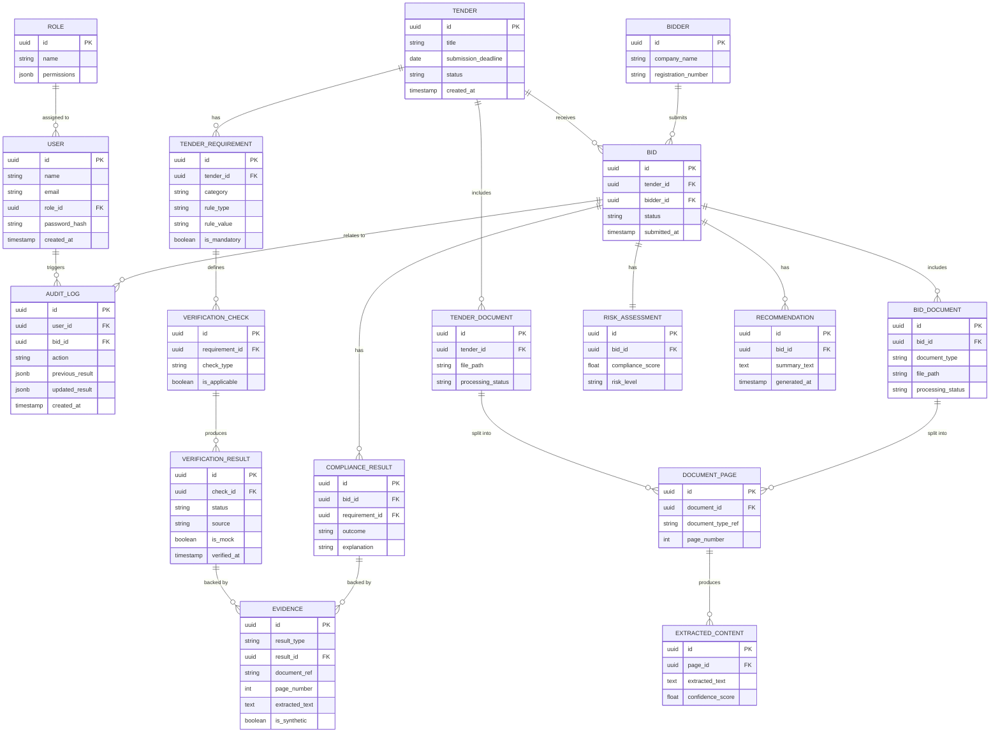

# database.md — Database Documentation
## BidVerify AI (PostgreSQL)

## 1. ER Diagram



## 2. Table Reference

### `users`
| Column | Type | Constraints |
|:---|:---|:---|
| id | UUID | PK |
| name | VARCHAR(255) | NOT NULL |
| email | VARCHAR(255) | UNIQUE, NOT NULL |
| role_id | UUID | FK → roles.id |
| password_hash | VARCHAR(255) | NOT NULL |
| created_at | TIMESTAMP | DEFAULT now() |

Index: `idx_users_email` on `email`.

### `roles`
| Column | Type | Constraints |
|:---|:---|:---|
| id | UUID | PK |
| name | VARCHAR(100) | UNIQUE (e.g., `procurement_officer`, `admin`) |
| permissions | JSONB | — |

### `tenders`
| Column | Type | Constraints |
|:---|:---|:---|
| id | UUID | PK |
| title | VARCHAR(500) | NOT NULL |
| submission_deadline | DATE | |
| status | VARCHAR(50) | e.g., `OPEN`, `CLOSED`, `AWARDED` |
| created_at | TIMESTAMP | DEFAULT now() |

### `tender_requirements`
| Column | Type | Constraints |
|:---|:---|:---|
| id | UUID | PK |
| tender_id | UUID | FK → tenders.id, ON DELETE CASCADE |
| category | VARCHAR(100) | e.g., `financial`, `statutory`, `technical` |
| rule_type | VARCHAR(100) | e.g., `numeric_minimum`, `document_present` |
| rule_value | VARCHAR(255) | |
| is_mandatory | BOOLEAN | DEFAULT true |

Index: `idx_requirements_tender` on `tender_id`.

### `bidders`
| Column | Type | Constraints |
|:---|:---|:---|
| id | UUID | PK |
| company_name | VARCHAR(500) | NOT NULL |
| registration_number | VARCHAR(100) | |

### `bids`
| Column | Type | Constraints |
|:---|:---|:---|
| id | UUID | PK |
| tender_id | UUID | FK → tenders.id |
| bidder_id | UUID | FK → bidders.id |
| status | VARCHAR(50) | e.g., `PENDING`, `UNDER_REVIEW`, `DECIDED` |
| submitted_at | TIMESTAMP | |

Index: `idx_bids_tender_bidder` on `(tender_id, bidder_id)`.

### `tender_documents` / `bid_documents`
Store file metadata; the actual file lives in local/cloud file storage, **not** the database (see § 6).

| Column | Type | Constraints |
|:---|:---|:---|
| id | UUID | PK |
| tender_id / bid_id | UUID | FK |
| document_type | VARCHAR(100) | e.g., `GST_CERTIFICATE`, `TENDER_PDF` |
| file_path | VARCHAR(1000) | |
| processing_status | VARCHAR(50) | `PENDING`, `PROCESSED`, `FAILED` |

### `document_pages` & `extracted_content`
Chunked/paged representation used by both OCR pipeline and RAG chunking.

| Column | Type | Notes |
|:---|:---|:---|
| document_pages.page_number | INT | 1-indexed |
| extracted_content.extracted_text | TEXT | |
| extracted_content.confidence_score | FLOAT | Used to flag low-confidence extractions for review |

### `verification_checks` & `verification_results`
`verification_checks` records *which* checks the Applicability Engine selected (`is_applicable`). `verification_results` records the *outcome* of running a check — bidder-scoped (Branch A).

| Column (verification_results) | Type | Notes |
|:---|:---|:---|
| status | VARCHAR(50) | `VERIFIED`, `NOT_VERIFIED`, `NEEDS_REVIEW`, `SOURCE_UNAVAILABLE` |
| source | VARCHAR(100) | e.g., `GST_MOCK`, `GST_AUTHORIZED` |
| is_mock | BOOLEAN | **Never nullable — always explicit** |

### `compliance_results`
Bid-scoped (Branch B). Kept structurally separate from `verification_results` — see § 5.

| Column | Type | Notes |
|:---|:---|:---|
| outcome | VARCHAR(50) | `COMPLIANT`, `NON_COMPLIANT`, `NEEDS_REVIEW`, `NOT_APPLICABLE`, `PENDING_VERIFICATION` |
| explanation | TEXT | Plain-language reason |

### `evidence`
Shared table — `result_type` = `'verification'` or `'compliance'`, `result_id` points to the relevant row.

| Column | Type | Notes |
|:---|:---|:---|
| is_synthetic | BOOLEAN | **Must be `true`** for any MVP/mock-derived evidence — never omitted |

### `risk_assessments`
One row per bid: `compliance_score` (0–100 FLOAT), `risk_level` (`LOW`/`MEDIUM`/`HIGH`/`CRITICAL`).

### `recommendations`
AI-generated summaries, one-to-many per bid (an officer may request regeneration).

### `audit_logs`
| Column | Type | Notes |
|:---|:---|:---|
| previous_result / updated_result | JSONB | Snapshot before/after the action |
| action | VARCHAR(255) | e.g., `BID_APPROVED`, `VERIFICATION_RUN`, `DOCUMENT_UPLOADED` |

Index: `idx_audit_bid_created` on `(bid_id, created_at)`.

## 3. Relationships & Normalization

Schema is normalized to 3NF: no repeating groups (documents/pages/extracted content are separate tables, not JSON blobs inside `bids`), and every result type traces to exactly one owning entity (`verification_results` → bidder-scoped; `compliance_results` → bid-scoped) — this split is deliberate, not an oversight (see § 5).

## 4. Example Records

```json
// tender_requirements
{ "id": "...", "tender_id": "...", "category": "financial", "rule_type": "numeric_minimum", "rule_value": "10000000", "is_mandatory": true }

// verification_results (Branch A)
{ "id": "...", "check_id": "...", "status": "VERIFIED", "source": "GST_MOCK", "is_mock": true, "verified_at": "2026-01-01T10:00:00Z" }

// compliance_results (Branch B)
{ "id": "...", "bid_id": "...", "requirement_id": "...", "outcome": "COMPLIANT", "explanation": "Turnover ₹12Cr meets minimum ₹10Cr requirement." }

// evidence
{ "id": "...", "result_type": "compliance", "result_id": "...", "document_ref": "financial_statement.pdf", "page_number": 7, "extracted_text": "Annual turnover: ₹12,00,00,000", "is_synthetic": true }
```

## 5. PostgreSQL vs. File Storage vs. Vector DB

| Data Type | Where It Lives | Why |
|:---|:---|:---|
| Structured records (tenders, bids, results, audit) | PostgreSQL | Relational integrity, transactional guarantees |
| Raw uploaded PDFs/images | Local file storage (MVP) → cloud object storage (future) | Large binary files don't belong in a relational DB |
| Document chunk embeddings | Vector store (FAISS/ChromaDB) | Similarity search is not PostgreSQL's job; joined to Postgres via `chunk_id`/`document_ref` |

## 6. Data Lifecycle

1. Document uploaded → file stored → metadata row created (`processing_status = PENDING`).
2. Processing pipeline runs → pages/extracted content created → `processing_status = PROCESSED`.
3. Verification/compliance checks run → results + evidence written.
4. Officer decides → `bids.status = DECIDED`, `AuditLog` written.
5. Records are retained indefinitely for audit purposes (Recommended Implementation: define a retention policy before production use).

## 7. Audit Data

Every write to `verification_results`, `compliance_results`, `risk_assessments`, and `bids.status` should have a corresponding `audit_logs` entry — enforced at the service layer (see `Architecture.md` § 5), not solely relied upon at the database layer.
