# flowchart.md — Process Flowcharts
## BidVerify AI

## 1. Complete System Flow

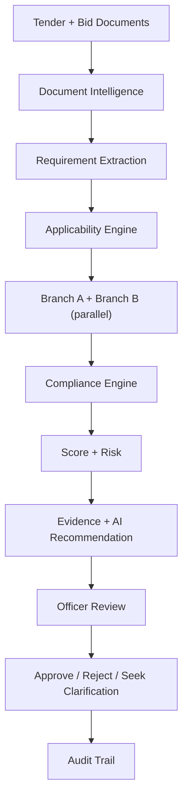

## 2. Tender Processing Flow

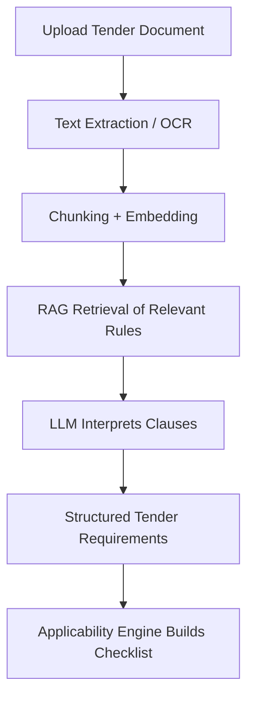

## 3. Bid Processing Flow

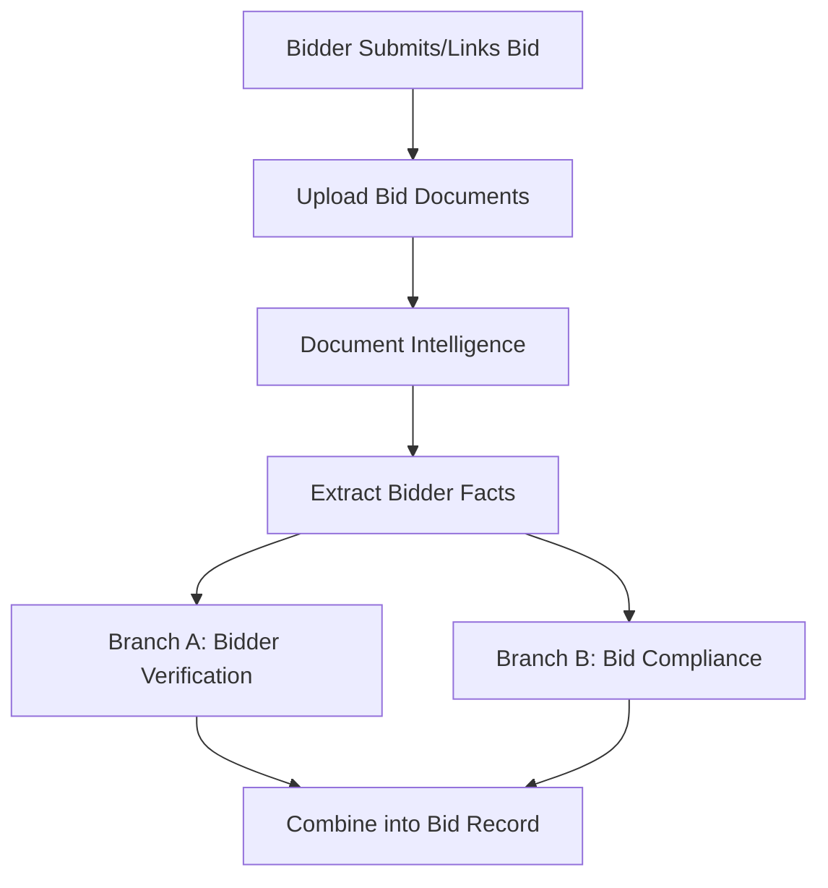

## 4. Document Intelligence Flow

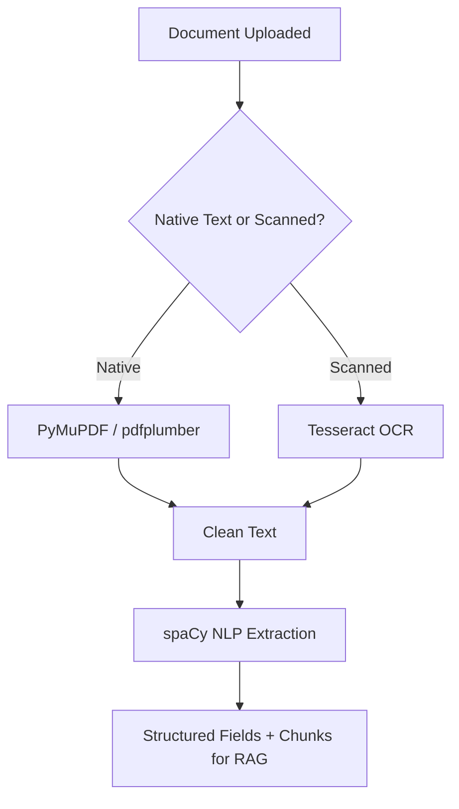

## 5. Applicability Flow

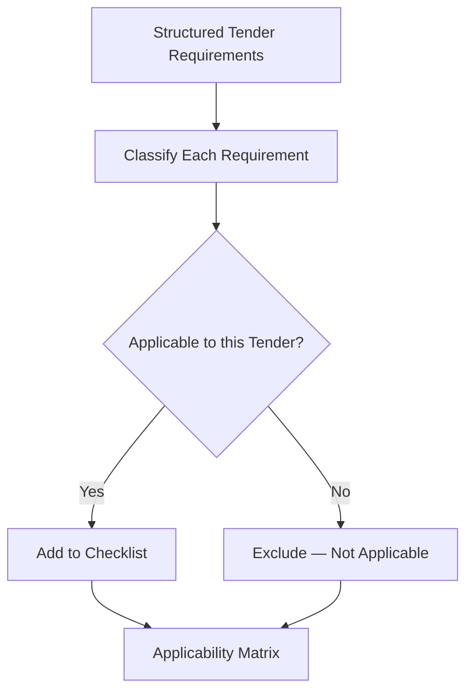

## 6. Branch A — Bidder Verification Flow

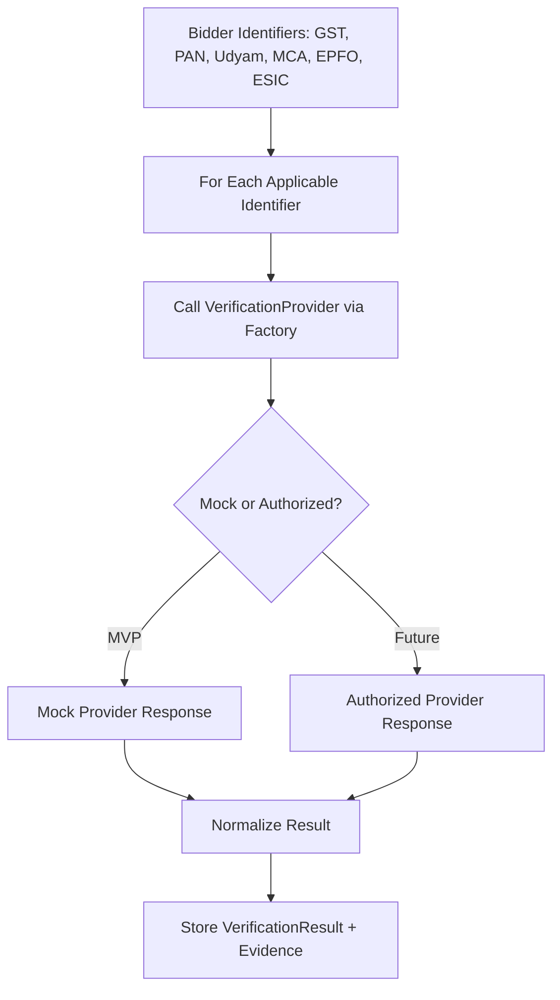

## 7. Branch B — Bid Compliance Flow

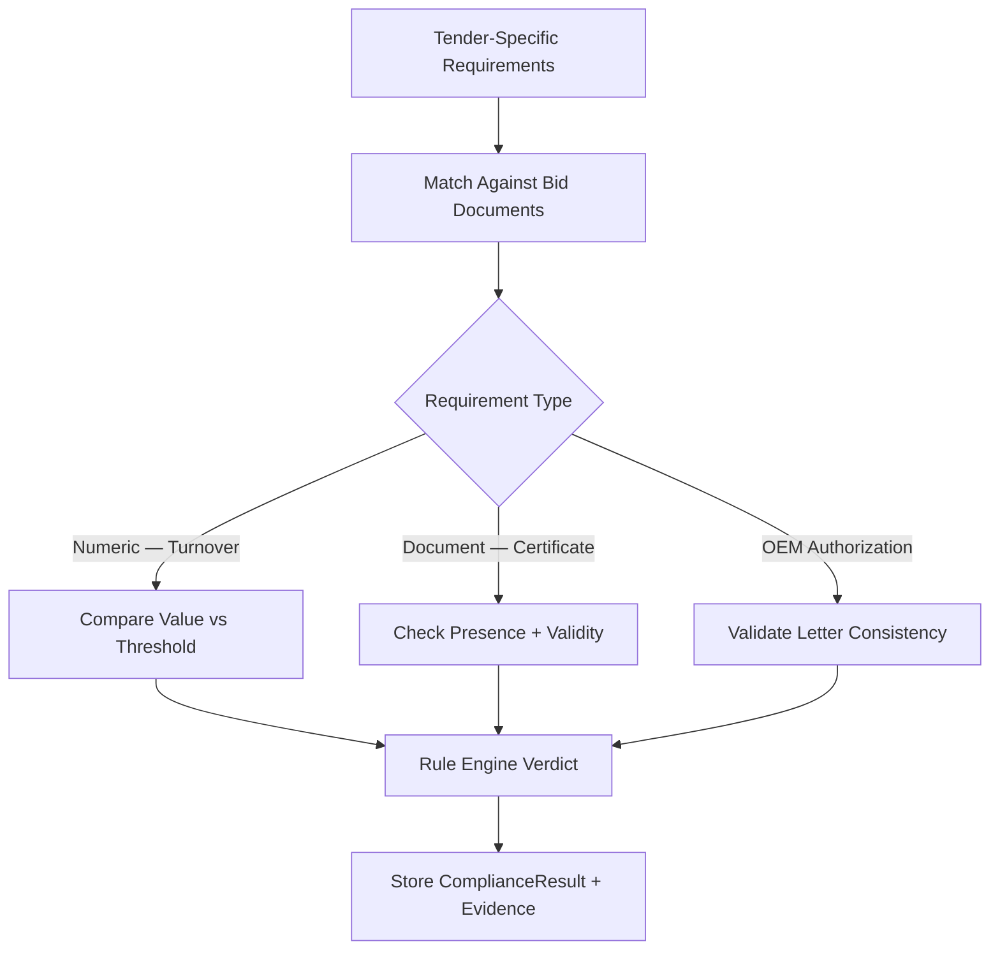

## 8. Compliance Scoring Flow

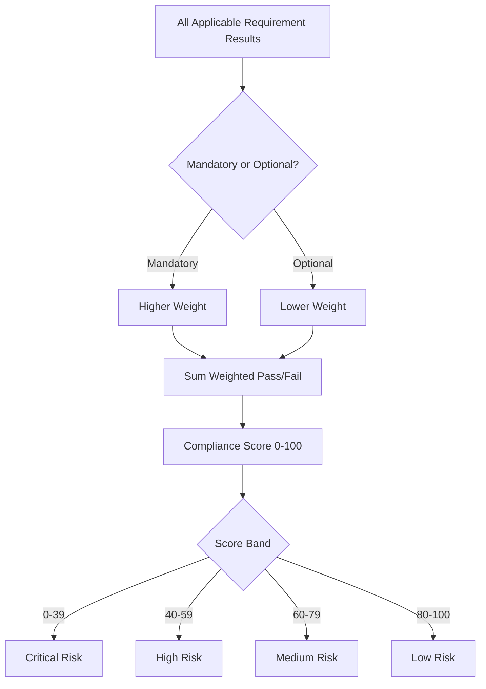

## 9. Evidence Generation Flow

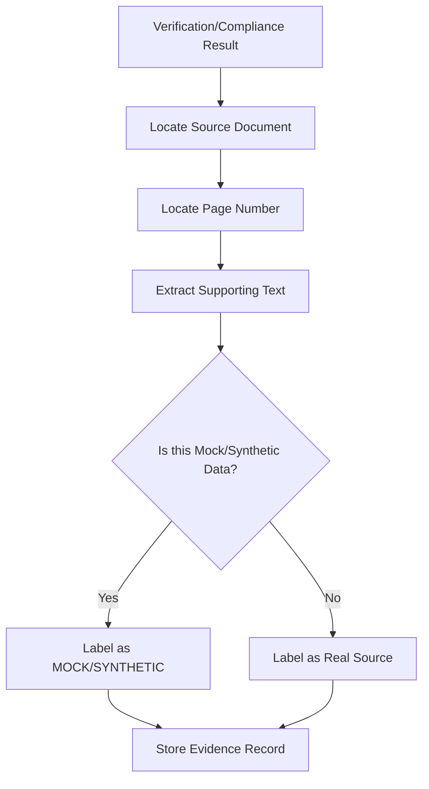

## 10. RAG Recommendation Flow

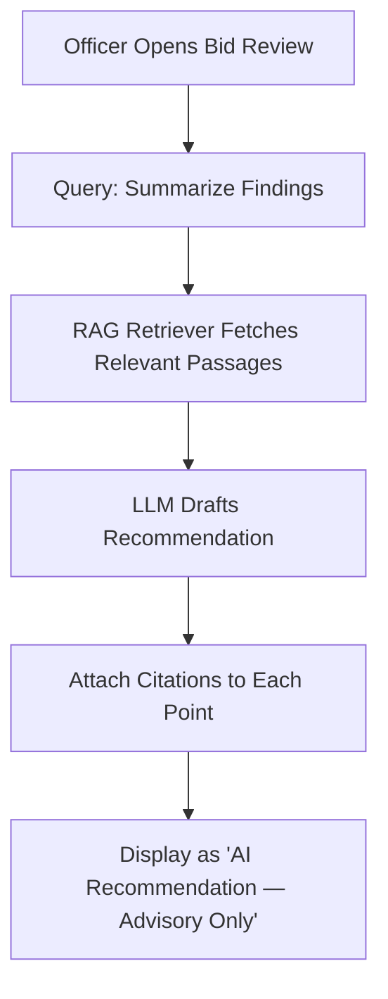

## 11. Officer Decision Flow

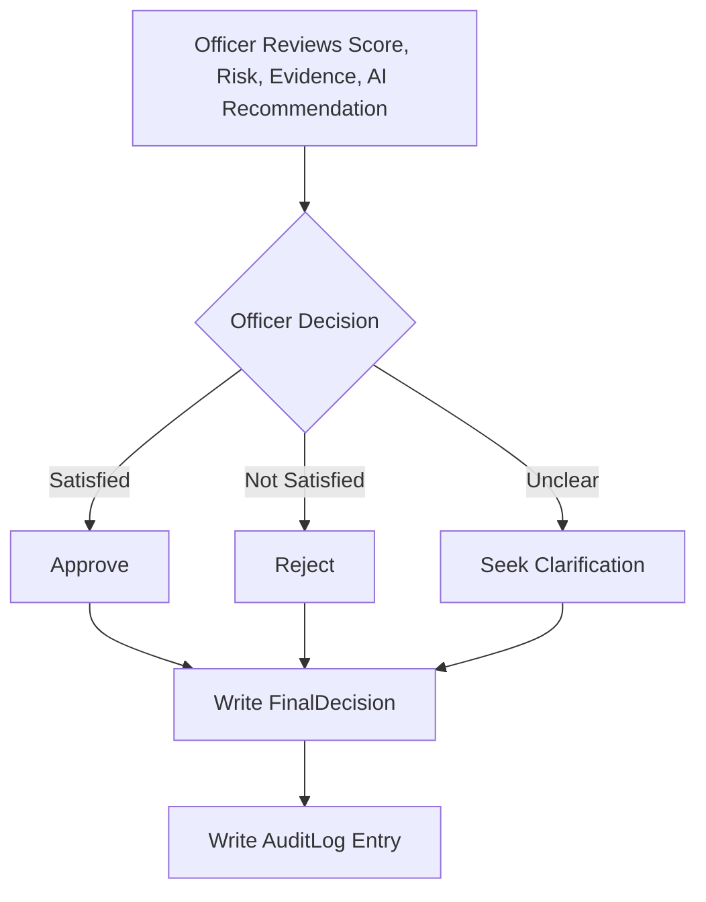

## 12. Mock Provider Flow

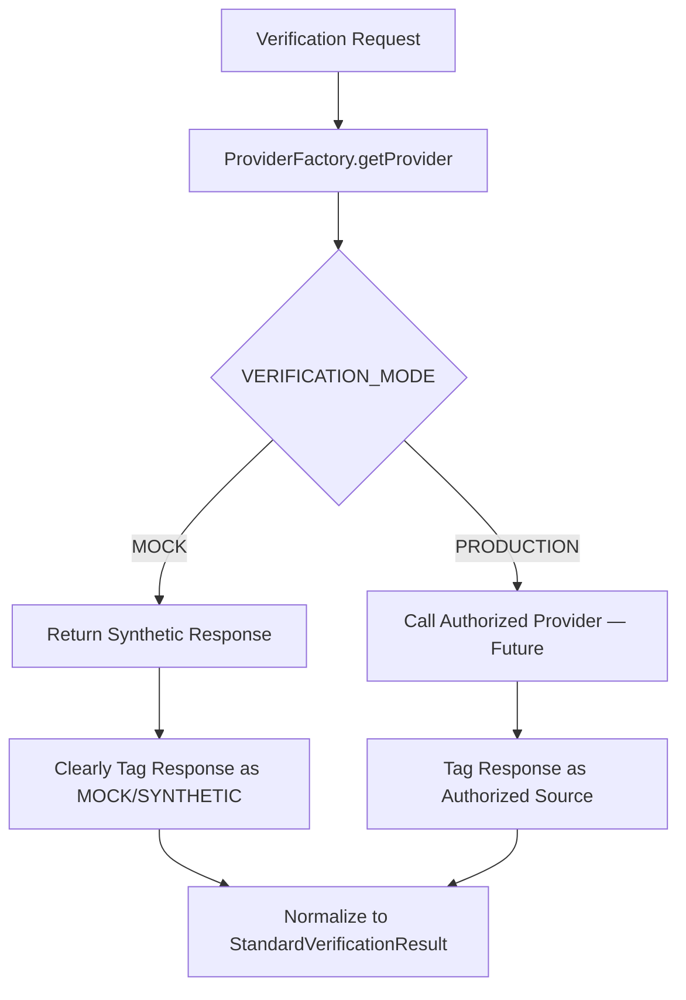
