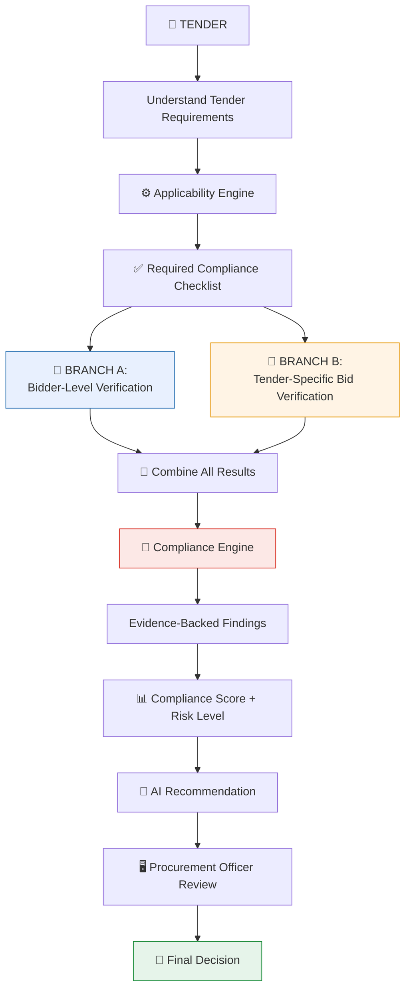
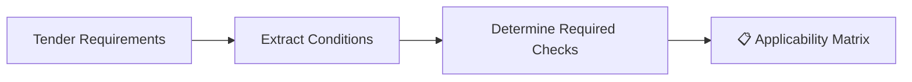

<div align="center">

# 📖 SIH26100 — Complete Project Knowledge Document
### BidVerify AI — Bidder Verification & Bid Compliance Platform for GeM Procurement

[]()
[]()
[]()

</div>

<br>

> ⚠️ **Read this first.** This version replaces the earlier `info.md`. The most important correction: verification is **not one linear checklist**. It splits into **two connected branches** — checking the *bidder/company itself*, and checking whether *this specific bid* satisfies *this specific tender*. Both feed into one Compliance Engine. See [Section 9](#9-the-two-types-of-verification) for the core model.

<br>

## 📑 Table of Contents

<table>
<tr><td valign="top" width="25%">

**Foundations**
1. [Problem Overview](#1-problem-statement-overview)
2. [Background](#2-background)
3. [What is GeM?](#3-what-is-gem)
4. [Tender, Bid, Bidder, Officer](#4-tender-bid-bidder-and-procurement-officer)
5. [Why Manual Verification is Hard](#5-why-manual-verification-is-difficult)
6. [The Core Problem](#6-the-core-problem)

</td><td valign="top" width="25%">

**The Solution Model**
7. [Official Expected Solution](#7-official-expected-solution-14-requirements-explained)
8. [Two Types of Verification](#9-the-two-types-of-verification)
9. [Applicability Engine](#10-applicability-engine)
10. [🔑 Verification Source Guide](#11-verification-source-and-data-acquisition-guide)
11. [Where We Get Data](#12-where-do-we-get-the-dataset)

</td><td valign="top" width="25%">

**How It Works**
12. [AI Document Verification](#13-ai-document-verification)
13. [Compliance Engine](#14-automated-compliance-engine)
14. [Score & Risk](#15-compliance-score-and-risk-level)
15. [AI Recommendation](#16-ai-recommendation-engine)
16. [Evidence & Explainability](#17-evidence-and-explainability)
17. [Audit Trail](#18-audit-trail)

</td><td valign="top" width="25%">

**Scope & Reference**
18. [Stakeholders](#19-stakeholders)
19. [Key Capabilities](#20-key-capabilities)
20. [Expected Impact](#21-expected-impact)
21. [Challenges & Limitations](#22-challenges-and-limitations)
22. [MVP Scope](#23-mvp-scope)
23. [Future Scope](#24-production--future-scope)
24. [Glossary](#25-glossary)
25. [References](#26-references)

</td></tr>
</table>

<br>

---

## 1. Problem Statement Overview

<table>
<tr><td><b>Problem Statement ID</b></td><td>SIH26100</td></tr>
<tr><td><b>Full Title</b></td><td>AI-Powered Integrated Bid Compliance Verification Platform for GeM Procurement</td></tr>
<tr><td><b>Organization</b></td><td>Ministry of Petroleum & Natural Gas</td></tr>
<tr><td><b>Department</b></td><td>Chennai Petroleum Corporation Limited (CPCL)</td></tr>
<tr><td><b>Category</b></td><td>Software</td></tr>
<tr><td><b>Theme</b></td><td>Smart Automation</td></tr>
</table>

> 🎯 **One-line explanation:** Build an AI-assisted platform that verifies both *who a bidder is* (their statutory/legal standing) and *whether their bid meets this tender's specific requirements* — presenting evidence-backed findings so a Procurement Officer can decide faster and more consistently.

> 📌 **Official note on data:** The problem statement explicitly permits: *"Dummy bidder and tender datasets may be used for development and testing."* This document treats that as a first-class design requirement, not an afterthought — see [Section 23](#23-mvp-scope).

<br>

---

## 2. Background

Government e-Marketplace (GeM) is India's official online procurement platform, used by ministries, departments, and CPSEs (like CPCL) to buy goods and services. Every bid submitted on GeM must satisfy a mix of:

- **Statutory requirements** that apply to the *company itself*, regardless of which tender it's bidding on (e.g., is its GST registration active?).
- **Tender-specific requirements** that apply only to *this bid* (e.g., does it have 3 years of experience, as this particular tender demands?).

Today, checking both of these is a manual, document-heavy process. This project proposes an AI-assisted, evidence-first platform to speed this up — while keeping the Procurement Officer as the final decision-maker at every step.

<br>

---

## 3. What is GeM?

**GeM (Government e-Marketplace)** is the Government of India's centralized online platform for public procurement.

| Role | Who They Are |
|:---|:---|
| 🛒 **Buyers** | Government ministries, departments, PSUs/CPSEs (e.g., CPCL) |
| 🏭 **Sellers/Bidders** | Companies registered on GeM to sell goods/services to government buyers |

**Simplified workflow:** `Buyer publishes need` → `Sellers submit bids` → `Buyer's team evaluates against requirements` → `Winner selected & awarded`

> ⚠️ This document describes GeM conceptually. It does **not** claim access to any specific GeM internal API or database.

<br>

---

## 4. Tender, Bid, Bidder, and Procurement Officer

| Term | Meaning |
|:---|:---|
| 📢 **Tender** | The buyer's published document describing what it wants and what rules apply |
| 📦 **Bid** | A specific bidder's submission for a specific tender (offer + supporting documents) |
| 🏢 **Bidder** | The company submitting the bid |
| 👤 **Procurement Officer** | The person who reviews bids and makes the final qualify/disqualify decision |

<br>

---

## 5. Why Manual Verification is Difficult

| Pain Point | Why It's Hard |
|:---|:---|
| 📄 Document overload | Each bid brings many documents; a tender can attract many bidders |
| 🗂️ Fragmented sources | Statutory checks (GST, PAN, Udyam...) live in different systems |
| 🔀 Cross-document mismatches | e.g., "ABC Technologies Pvt Ltd" vs "ABC Technology Pvt Ltd" |
| 📅 Expired documents | A certificate can look valid at a glance but have actually lapsed |
| 🎯 Tender-specific variation | Every tender can demand a different combination of checks |
| ⏱️ Time pressure | Manual review at volume is slow and tiring |
| 🧾 Weak audit trail | Hard to reconstruct "why was this decision made?" later |

<br>

---

## 6. The Core Problem

> Procurement officers must simultaneously verify **two different things** — the bidder's general statutory standing, and this specific bid's fit against this specific tender — using scattered, unstructured documents and partially-accessible external sources, under time pressure, while keeping a defensible audit trail.

<br>

---

## 7. Official Expected Solution (14 Requirements, Explained)

Each requirement below is explained the same way: **what it means → why it's needed → data involved → what's conceptually verified → output → what the MVP can realistically show.**

<details>
<summary><b>1. Integrate with relevant Government portals/databases for automated verification</b></summary>

- **Means:** The platform should be architected to connect to authoritative sources for verification.
- **Why:** Manual lookup across many portals doesn't scale.
- **Data involved:** Bidder identifiers (GSTIN, PAN, Udyam number, etc.)
- **What's verified:** Whether the identifier is valid/active according to the source.
- **Output:** A normalized verification result (see [Section 11](#11-verification-source-and-data-acquisition-guide)).
- **MVP reality:** Most sources require authorization for live integration (see the guide below). The MVP demonstrates the **integration pattern** using mock/sandbox adapters, not live production access.
</details>

<details>
<summary><b>2. Verify Udyam/MSME status and other applicable statutory registrations</b></summary>

- **Means:** Check whether a bidder claiming MSME status actually holds a valid Udyam Registration.
- **Why:** MSME status can carry procurement preferences under applicable policy.
- **Data involved:** Udyam Registration Number, enterprise name.
- **What's verified:** Number format validity + (where possible) certificate consistency.
- **Output:** VERIFIED / NOT_VERIFIED / NEEDS_REVIEW.
- **MVP reality:** Udyam's official portal provides a public certificate print/verify lookup by registration number; there is no confirmed open bulk API for third-party automated integration. See [Section 11-A](#a-udyam--msme-verification).
</details>

<details>
<summary><b>3. Verify GST registration and return filing status</b></summary>

- **Means:** Two separate checks — (a) is the GSTIN valid/active, (b) has the bidder been filing returns regularly.
- **Why:** Both are common eligibility signals in tenders.
- **Data involved:** GSTIN (15-digit number).
- **What's verified:** GSTIN format + status (a); filing history/regularity (b).
- **Output:** VERIFIED / NON_COMPLIANT / NEEDS_REVIEW.
- **MVP reality:** Basic GSTIN status lookup has public search options; **return filing status is not open data** — it requires GSP (GST Suvidha Provider) authorization. The MVP simulates (b). See [Section 11-B](#b-gst-verification).
</details>

<details>
<summary><b>4. Verify PAN and Income Tax compliance</b></summary>

- **Means:** Confirm PAN validity and, separately, general tax-compliance standing.
- **Why:** Identity and financial-standing verification.
- **Data involved:** PAN (10-character alphanumeric).
- **What's verified:** Format validity, cross-document consistency; tax compliance is largely out of reach for a public prototype.
- **Output:** VERIFIED / NEEDS_REVIEW.
- **MVP reality:** No public API for real-time PAN verification is assumed here; format + consistency checks only, using synthetic/masked PAN examples. See [Section 11-C](#c-pan-verification) and [11-D](#d-income-tax-compliance).
</details>

<details>
<summary><b>5. Check Make in India/local content requirements</b></summary>

- **Means:** Compare a bidder's declared local-content percentage against the tender's minimum requirement.
- **Why:** Policy-driven preference in many tenders.
- **Data involved:** Bidder's local-content declaration; tender's minimum threshold.
- **What's verified:** Declared % ≥ required %.
- **Output:** COMPLIANT / NON_COMPLIANT / NEEDS_REVIEW (self-declaration, so REVIEW is common).
- **MVP reality:** Fully demonstrable — this is a document-comparison task, not an external API dependency.
</details>

<details>
<summary><b>6. Verify EPFO/ESIC compliance wherever applicable</b></summary>

- **Means:** Check employer compliance with provident fund / state insurance obligations, where the tender requires it.
- **Why:** Some tenders (especially labor-intensive services) require this.
- **Data involved:** EPFO/ESIC establishment codes.
- **What's verified:** Compliance status, where accessible.
- **Output:** VERIFIED / NOT_APPLICABLE / NEEDS_REVIEW.
- **MVP reality:** No general public API for third-party compliance lookup; mock adapter only. See [11-F](#f-epfo-verification) / [11-G](#g-esic-verification).
</details>

<details>
<summary><b>7. Verify Startup India, NSIC and OEM authorization requirements</b></summary>

- **Means:** Three distinct checks — startup recognition, NSIC registration, and OEM authorization letters.
- **Why:** Each can carry specific eligibility/preference implications.
- **Data involved:** DPIIT recognition number; NSIC registration number; OEM authorization letter.
- **What's verified:** Recognition/registration validity; authorization letter consistency (issuer, bidder name, product, validity dates).
- **Output:** VERIFIED / NEEDS_REVIEW / NOT_APPLICABLE.
- **MVP reality:** Startup India has a public recognition search; NSIC/OEM checks are largely document-level in the MVP. See [11-H](#h-startup-india-verification), [11-I](#i-nsic-verification), [11-J](#j-oem-authorization-verification).
</details>

<details>
<summary><b>8. Perform DigiLocker/document verification</b></summary>

- **Means:** Verify document authenticity/metadata, ideally cross-checked against DigiLocker-issued records where legitimately possible.
- **Why:** Reduces reliance on manually-uploaded, potentially altered documents.
- **What's verified:** Document metadata consistency; (in production, with authorization) DigiLocker-confirmed issuance.
- **Output:** VERIFIED / NEEDS_REVIEW.
- **MVP reality:** DigiLocker APIs are restricted to onboarded "Requester" partner organizations — not open to unregistered projects. The MVP uses a mock DigiLocker adapter with clearly labeled synthetic data. See [11-K](#k-digilocker--document-verification) — read this one carefully.
</details>

<details>
<summary><b>9. Identify blacklisting and debarment status</b></summary>

- **Means:** Check whether the bidder appears on a relevant blacklist/debarment record.
- **Why:** Legally ineligible bidders must be flagged.
- **Data involved:** Company name, registration number.
- **What's verified:** Name/identifier match against available blacklist sources.
- **Output:** CLEAR / FLAGGED / NEEDS_REVIEW / SOURCE_UNAVAILABLE.
- **MVP reality:** No single unified national blacklist database is assumed; demo dataset only, with name-matching ambiguity explicitly handled. See [11-L](#l-blacklisting-and-debarment-verification) — read this one carefully too.
</details>

<details>
<summary><b>10. Check other applicable statutory and tender-specific compliance requirements</b></summary>

- **Means:** A catch-all for anything a specific tender adds beyond the standard categories (e.g., BIS certification, DPIIT criteria, sector-specific licenses).
- **Why:** Tenders vary; the system can't hardcode every possible rule.
- **MVP reality:** Handled via the **Applicability Engine** ([Section 10](#10-applicability-engine)), which reads what a tender actually asks for.
</details>

<details>
<summary><b>11. Use AI to identify missing, inconsistent or non-compliant information</b></summary>

- **Means:** NLP-based extraction + cross-document comparison to catch gaps and mismatches.
- **Output:** A list of flagged issues, each with evidence.
- **MVP reality:** Fully demonstrable using extraction + fuzzy-matching techniques (see [`architecture.md`](./architecture.md)).
</details>

<details>
<summary><b>12. Generate an overall Compliance Score and Risk Level</b></summary>

- **Means:** Summarize all individual results into one score + risk indicator.
- **Output:** A number/label (e.g., 78/100, Medium Risk) — a **prioritization aid**, not a verdict.
- **MVP reality:** Fully demonstrable with a transparent, documented scoring formula.
</details>

<details>
<summary><b>13. Provide an AI-generated recommendation to the Procurement Officer</b></summary>

- **Means:** A plain-language suggestion (e.g., "Consider for further review — 2 items need clarification") with reasoning shown.
- **Output:** Recommendation text + linked evidence. **Never a final decision.**
- **MVP reality:** Fully demonstrable using a rules-plus-template approach or an LLM prompted to summarize evidence (not to "decide").
</details>

<details>
<summary><b>14. Maintain an auditable record of verification and compliance checks</b></summary>

- **Means:** Every check, result, and officer action is logged with a timestamp.
- **Output:** A queryable audit log per bid.
- **MVP reality:** Fully demonstrable — see [`database.md`](./database.md) `AuditLogs` table.
</details>

> ✅ **Constant across all 14:** The Procurement Officer makes the final qualification/disqualification decision. The platform never auto-awards, auto-qualifies, or auto-disqualifies a bidder.

<br>

---

## 9. The Two Types of Verification

> 🔑 **This is the single most important conceptual correction in this document.** The workflow is not one linear pipeline. It is **two parallel, connected branches**, both feeding one Compliance Engine.



### 🏢 Branch A — Bidder-Level Verification
**Question answered:** *"Is this company, in general, statutorily legitimate and in good standing?"*

Applies regardless of which tender is involved. Examples: Udyam/MSME status, GST registration, PAN, EPFO/ESIC, Startup India recognition, NSIC status, blacklisting/debarment status.

**Inputs:** Bidder identity + bidder documents + (where available) external source verification.

### 📄 Branch B — Tender-Specific Bid Verification
**Question answered:** *"Does this particular bid satisfy this particular tender's requirements?"*

Unique to each tender. Examples: minimum turnover, years of experience, OEM authorization for this product, required technical certificates, local-content percentage.

**Inputs:** Tender requirements + bid documents.

### 🔗 Why Both Matter Together
A bidder can be a perfectly legitimate, compliant company (passes Branch A) and still fail to meet a specific tender's technical requirement (fails Branch B) — or vice versa, a new/smaller company might satisfy a tender's technical ask but have an unresolved statutory flag. **Both branches must be checked, and both feed the same Compliance Engine**, which is why they were previously (incorrectly) merged into a single flat checklist in earlier drafts of this documentation.

<br>

---

## 10. Applicability Engine

> ❗ **Critical principle: NOT EVERY BIDDER NEEDS EVERY VERIFICATION.**

Different tenders require different combinations of checks. Running every possible check on every bid would be wasteful and could even generate confusing "not applicable" noise.



**Example — Applicability Matrix for a fictional tender:**

| Check | Required? | Reason |
|:---|:---:|:---|
| GST Registration | ✅ Yes | Standard eligibility condition |
| MSME/Udyam Status | ❌ No | Not mentioned as a preference in this tender |
| OEM Authorization | ✅ Yes | Product being procured is not manufactured by bidder |
| EPFO/ESIC | ⚠️ Conditional | Applies only if bidder has 20+ employees (tender-specific threshold) |
| Local Content | ✅ Yes | Category falls under Make in India policy scope |
| Blacklisting Check | ✅ Yes | Applied to every bidder as a baseline safety check |

> 💡 Different tenders → different checklists. A tender for IT services might require Startup India/NSIC checks; a tender for industrial equipment might require OEM authorization and technical certification instead. The Applicability Engine reads the tender and builds the right checklist each time.

<br>

---

## 11. Verification Source and Data Acquisition Guide

> 🔬 **This section was built after checking what's realistically, publicly available today** (as of this write-up) for each government verification source. Where live public access exists, it's stated. Where it doesn't, that's stated too — **no APIs, endpoints, or access levels are invented.**

### Quick-Reference Table

| # | Area | What We Verify | Realistic Public/Live Access | MVP Approach |
|:-:|:---|:---|:---|:---|
| A | Udyam/MSME | Registration validity, enterprise details | Public **certificate print/verify lookup** by Udyam number on the official portal; no confirmed open bulk API | Mock adapter + sample Udyam-style records |
| B | GST (registration) | GSTIN validity/status | Basic taxpayer search tools exist publicly | Mock/sample GSTIN dataset |
| B | GST (return filing) | Filing regularity | **Not open data** — requires GSP authorization | Simulated filing-status dataset, clearly labeled |
| C | PAN | Identity/format validity | No assumed open public verification API for third parties | Format + consistency checks on synthetic PAN |
| D | Income Tax compliance | General tax-compliance standing | Sensitive; **not publicly accessible** | Mock verification response only |
| E | Make in India / Local Content | Declared % vs required % | Self-declared by bidder; no external API needed | Direct document comparison — fully real, no mock needed |
| F | EPFO | Employer PF compliance | No general public third-party lookup API assumed | Mock adapter |
| G | ESIC | Employer ESI compliance | No general public third-party lookup API assumed | Mock adapter |
| H | Startup India | DPIIT recognition status | Public recognition search exists on the official portal | Sample recognition dataset |
| I | NSIC | Registration status | Portal exists; no confirmed open bulk API | Sample registration dataset |
| J | OEM Authorization | Letter authenticity/consistency | No universal external registry — inherently document-level | Sample OEM letters, document validation |
| K | DigiLocker | Document metadata/issuance | APIs restricted to **onboarded partner "Requesters"** only | Mock DigiLocker adapter, clearly labeled DEMO |
| L | Blacklisting/Debarment | Match against known debarment records | **No single unified national database** — sources vary by ministry/CPSE | Demo blacklist dataset, explicit false-match handling |
| M | MCA21 / Company Info | Company registration identity | Public company-master search exists on the official portal | Sample company-registry dataset |
| N | BIS/DPIIT & others | Tender-specific certifications | Varies by category; not all sources are centrally searchable | Applicability-driven, adapter added as needed |

<br>

### A. Udyam / MSME Verification

**What is MSME / Udyam Registration?** MSME = Micro, Small & Medium Enterprise, a government classification. Udyam Registration is the official process by which a business gets recognized in this category.

| Question | Answer |
|:---|:---|
| What are we verifying? | That a bidder claiming MSME status holds a genuine, currently-valid Udyam registration |
| Identifier needed | Udyam Registration Number (format: `UDYAM-XX-00-0000000`) |
| Document bidder submits | Udyam Registration Certificate (PDF) |
| What system extracts | Registration number, enterprise name, enterprise type (Micro/Small/Medium), registration date |
| Compare against | Bidder's declared name and MSME claim in the bid |
| Authoritative source | Udyam Registration Portal (Ministry of MSME) |
| Live access reality | A public certificate print/verify lookup exists by registration number; no confirmed open bulk API for automated third-party integration |
| MVP approach | Mock adapter returning realistic sample Udyam-style data, clearly labeled DEMO |

> **Example conceptual result:** `Udyam Registration: VERIFIED` — Evidence: document name + extracted number + mock source result + timestamp.

<br>

### B. GST Verification

Explained as **two separate checks**, as the problem statement specifies.

**B1. GST Registration Verification**
GST = Goods and Services Tax. GSTIN = the unique 15-digit number assigned to a registered business. Registration verification checks whether this number is valid and the taxpayer status is active.

**B2. GST Return Filing Verification**
This checks whether the business has been *regularly filing* its GST returns — a separate, more sensitive signal of ongoing compliance (not just one-time registration).

| Question | Answer |
|:---|:---|
| Identifier needed | GSTIN |
| Document bidder submits | GST Registration Certificate |
| What's public vs restricted | Basic taxpayer/registration lookup tools exist publicly; **detailed return-filing history is not open data** — accessing it in production requires becoming/using an authorized GSP (GST Suvidha Provider) integration |
| MVP approach | Registration check: sample GSTIN dataset. Filing status: simulated/synthetic filing-history dataset, clearly labeled as such |

> 🚫 **We do not claim access to confidential GST return data anywhere in this project.**

<br>

### C. PAN Verification

PAN = Permanent Account Number, a 10-character alphanumeric tax-identity code issued to individuals and companies.

| Question | Answer |
|:---|:---|
| Why relevant | Confirms bidder identity and links to tax records |
| What's extracted | PAN string, holder name, format validity (regex-checkable) |
| Compare against | Company name on other bidder documents |
| Live access reality | No assumed public API for real-time PAN authenticity verification by an unregistered third party |
| MVP approach | Format validation + cross-document name consistency using **synthetic/masked PAN examples** (e.g., `ABCDE1234F` — never a real person's PAN) |

<br>

### D. Income Tax Compliance

> ⚠️ **Explained carefully — this is sensitive territory.**

"Income Tax compliance" conceptually means: has the bidder been meeting its tax filing/payment obligations? This is **financially sensitive taxpayer information**.

- A hackathon team **must not** claim unrestricted access to real taxpayer compliance data — this would require official authorization at a level far beyond a student prototype.
- A real, production integration would conceptually require: official authorization from the Income Tax Department or an approved intermediary, defined data-sharing agreements, and strict access controls.
- **MVP approach:** Use bidder-provided compliance certificates (where such a document type legitimately exists) plus a mock verification response returning a synthetic compliance status. No real taxpayer data is used or claimed.

<br>

### E. Make in India / Local Content

| Question | Answer |
|:---|:---|
| What it means | The tender may require a minimum % of a product's content to be locally manufactured/sourced |
| Applicability | Depends on tender category — not all tenders include this |
| What's compared | Bidder's declared local-content % vs. the tender's minimum requirement |
| Live access reality | This is a **self-declaration + document comparison task** — no external API dependency |

**Example (illustrative numbers only, not from a real tender):**
> Tender requires: Minimum local content = 50%. Bidder declares: Local content = 60%. System compares 60% ≥ 50% → flags as likely compliant, subject to officer/human validation of the underlying declaration's authenticity.

<br>

### F. EPFO Verification

EPFO = Employees' Provident Fund Organisation. EPFO compliance means an employer is correctly registering and contributing to its employees' provident fund accounts.

- **Applicability:** Often relevant only for tenders involving labor-intensive services, or above a certain bidder headcount.
- **Live access reality:** No general, open, third-party lookup API is assumed for detailed employer compliance status.
- **MVP approach:** Mock adapter (`MockEPFOProvider`) returning a synthetic compliance status; real integration would require authorized access, likely through EPFO's own employer-verification channels.

<br>

### G. ESIC Verification

ESIC = Employees' State Insurance Corporation. Similar in spirit to EPFO, but for state insurance contributions for eligible employees.

- **Applicability:** Conditional, similar to EPFO.
- **Live access reality:** Same as EPFO — no assumed open public API for third parties.
- **MVP approach:** Mock adapter, clearly labeled.

<br>

### H. Startup India Verification

Startup India is a government initiative; DPIIT (Department for Promotion of Industry and Internal Trade) grants official "recognized startup" status, which can carry certain procurement benefits (e.g., relaxation of turnover/experience criteria in some tenders).

| Question | Answer |
|:---|:---|
| What's checked | Whether a bidder's claimed DPIIT recognition is genuine |
| Document submitted | Startup India recognition certificate |
| Live access reality | A public recognition-status search tool exists on the official Startup India portal |
| MVP approach | Sample recognition dataset mirroring the certificate's key fields |

<br>

### I. NSIC Verification

NSIC = National Small Industries Corporation, a body that supports MSMEs, including in procurement participation (e.g., through registration schemes that can waive certain eligibility conditions).

- **What's checked:** Whether a bidder's claimed NSIC registration is valid.
- **Live access reality:** An official portal exists; no confirmed open bulk API for automated third-party lookup.
- **MVP approach:** Sample registration dataset.

<br>

### J. OEM Authorization Verification

OEM = Original Equipment Manufacturer. An OEM authorization letter is a document from the actual manufacturer permitting a bidder (often a reseller/dealer) to bid on the manufacturer's behalf for a specific tender.

| What system extracts | OEM name, authorized bidder name, product/category, validity period, tender reference (if mentioned) |
|:---|:---|
| What's verified | Internal consistency (names/dates match across the letter and bid) and whether the validity period covers the tender's submission window |
| Live access reality | **No universal external registry** exists to independently confirm an OEM letter — this is inherently a document-level check unless the manufacturer can be directly contacted (out of scope for the platform) |
| MVP approach | Sample OEM authorization letters; document-level validation and cross-document consistency checking |

<br>

### K. DigiLocker / Document Verification

> ⚠️ **This section needs to be read very clearly — it's a common source of over-claiming in student projects.**

**What DigiLocker is, conceptually:** A Government of India digital document wallet where citizens/organizations can store and share government-issued documents (Aadhaar, PAN, certificates, etc.) in a verified digital form.

**Two very different things, often confused:**
1. **Verifying a document a bidder uploaded** (checking its metadata, structure, and consistency) — this the platform *can* do.
2. **Directly integrating with DigiLocker's services** to pull or confirm documents at the source — this requires the requesting organization to be an **officially onboarded DigiLocker partner ("Requester")**, a formal registration and approval process. A student hackathon project is not assumed to have this status.

**MVP approaches (pick one or combine):**
- **Option 1:** Use sample, DigiLocker-*like* verified document metadata (document ID, type, issuer, holder name, issue date, verification status) — clearly synthetic.
- **Option 2:** Use sample digitally-signed documents and verify document metadata/signature structure only, where technically and legally appropriate — not claiming this equals live DigiLocker confirmation.
- **Option 3:** Build a **mock DigiLocker verification adapter** that returns realistic but synthetic responses, e.g.:

```json
{
  "source": "DIGILOCKER_DEMO",
  "document_id": "DEMO_DOC_001",
  "document_type": "MSME Certificate",
  "issuer": "Demo Issuer",
  "status": "VERIFIED",
  "checked_at": "2026-01-01T10:00:00Z"
}
```

**Prototype flow (still demonstrable end-to-end):**
`Document uploaded` → `Extract metadata` → `Identify document type` → `Send to DigiLocker Verification Adapter (mock)` → `Receive normalized result` → `Compare with bidder information` → `Store evidence` → `Send result to Compliance Engine`

**If official DigiLocker onboarding is obtained in the future**, the production flow would conceptually be: obtain official partner credentials/scopes → bidder provides consent → platform initiates the authorized retrieval/verification flow → DigiLocker returns permitted data → adapter validates & normalizes it → compare against bidder-submitted documents (identifier, holder, issuer, type, dates) → store only necessary evidence → send to Compliance Engine → log to audit trail. This must respect user consent, data minimization, and official DigiLocker policies throughout — no specific endpoints, OAuth flows, or SDK names are asserted here, since those would need to come from DigiLocker's own current official documentation at integration time, not be guessed.

<br>

### L. Blacklisting and Debarment Verification

> ⚠️ **Also read carefully — this is the area most likely to be misrepresented in student projects.**

**Blacklisting/debarment** means a company has been formally barred from participating in government procurement, usually due to prior fraud, non-performance, or misconduct.

**Why this is trickier than it sounds:** There is **no single, universal, publicly-accessible database covering all blacklisting/debarment decisions across every Indian government body.** The authoritative source can depend on:
- The specific procuring organization or ministry
- The CPSE's own internal debarment list
- Sector-specific regulatory bodies
- Applicable procurement rules for that tender

Some organizations (e.g., CVC, certain ministries) publish their own lists or notices; these are **organization-specific**, not a single national registry. This documentation does **not** claim any one source covers all blacklisting information across India.

**MVP design — `BlacklistVerificationAdapter`:**

| Input | Bidder/company identifiers (name, registration number) |
|:---|:---|
| Output | `CLEAR` / `FLAGGED` / `NEEDS_REVIEW` / `SOURCE_UNAVAILABLE` |
| Result must include | Source, date checked, match confidence, evidence/reference, human-review requirement flag |

**The false-match problem:** Company names are not unique. *"ABC Enterprises"* in one city may have no relation to *another* *"ABC Enterprises"* elsewhere. Matching purely on name risks false positives. This is exactly why:
- Matching should use identifiers (registration number) wherever possible, not name alone.
- Any match should be marked `NEEDS_REVIEW`, not auto-flagged as disqualifying.
- Human review is treated as mandatory for any blacklist match, not optional.

**MVP approach:** A clearly labeled `DEMO_BLACKLIST_DATASET` — never presented as, or confused with, an official government blacklist.

<br>

### M. MCA21 / Company Information

MCA21 is the Ministry of Corporate Affairs' e-governance system for company registration data.

| Question | Answer |
|:---|:---|
| What's checked | Basic company registration identity (CIN, registered name, status) |
| Live access reality | A public company-master search/lookup exists on the official portal for basic details |
| MVP approach | Sample company-registry dataset mirroring typical public fields |

<br>

### N. BIS / DPIIT and Other Applicable Sources

Some tenders require product-specific certifications (e.g., a BIS mark for certain goods) or DPIIT-linked policy criteria beyond Startup India. **Not every tender needs these.** The Applicability Engine ([Section 10](#10-applicability-engine)) determines, per tender, whether such a check is even relevant — the architecture is deliberately modular (new adapters can be added) rather than trying to hardcode every possible sectoral requirement up front.

<br>

---

## 12. Where Do We Get the Dataset?

> 📦 We cannot and must not use real, confidential bidder/company data for a hackathon prototype. Every dataset below is either fully synthetic or drawn from legally public, non-sensitive samples.

### 1. Tender Data
**Sources:** Publicly available sample/illustrative tender documents; synthetic tender documents created by the team for testing (recommended: build 3–5 sample tenders with *different* requirement combinations, to exercise the Applicability Engine).

**Suggested structure:**
`Tender ID · Tender Title · Requirement ID · Requirement Type · Requirement Description · Mandatory/Optional · Applicable To · Verification Method`

### 2. Bidder Document Data
Use **only**: fully synthetic documents, or team-created fictional company documents. Do **not** use real people's/companies' sensitive data.

**Suggested fictional companies:** `TechNova Pvt Ltd` · `GreenBuild Industries` · `Alpha Systems Pvt Ltd`

**Suggested fictional documents to generate:** GST certificates, MSME/Udyam-style records, OEM authorization letters, turnover declarations, experience certificates — **all clearly marked `DEMO DATA`.**

### 3. Structured Verification Data
Synthetic JSON/CSV representing mock verification responses.

```json
{
  "company_id": "BIDDER001",
  "source": "UDYAM",
  "identifier": "DEMO-UDYAM-001",
  "verification_status": "VERIFIED",
  "last_verified": "2026-01-01T10:00:00Z",
  "remarks": "Demo response"
}
```

### 4. Compliance Rule Dataset
Rules derived from the sample tenders — **not hardcoded globally**, generated/configured per tender.

`rule_id · tender_id · rule_category · condition · required_value · comparison_operator · applicability_condition · evidence_required`

Examples: `turnover >= required_amount` · `experience_years >= required_years` · `oem_authorization == required` · `gst_registration == required`

### 5. Inconsistency Dataset
Intentionally-flawed synthetic examples, to demonstrate the AI/compliance detection actually working:
- Mismatched company names across documents
- Mismatched identifiers
- Expired certificates
- Missing required documents
- Turnover below the required threshold
- Expired authorization validity

### 6. Blacklist / Debarment Demo Data
A clearly labeled `DEMO_BLACKLIST_DATASET`:
`entity_id · entity_name · identifier · source_organization · status · start_date · end_date · reason · source_reference · last_updated`

> 🚫 Never present this synthetic dataset as, or alongside, an official government blacklist.

### 7. Data Privacy Rules for the Team
- Never use real PAN/GSTIN/personal tax information, even "for realism."
- Mask/synthesize all identifiers in demos.
- Do not upload any confidential-looking bidder documents (even fictional ones styled too realistically) to public repositories without a clear DEMO watermark.
- Store source and consent metadata alongside any document, even mock ones, to build the right habits for a production mindset.

<br>

---

## 13. AI Document Verification

Conceptually: the platform uses AI/NLP techniques to (1) read documents (OCR where scanned), (2) classify what type of document each one is, (3) extract structured fields, and (4) flag low-confidence extractions for human attention. This is about **understanding**, not deciding — see [`architecture.md`](./architecture.md) for the technical breakdown.

<br>

## 14. Automated Compliance Engine

The Compliance Engine takes the combined outputs of **Branch A (bidder-level)** and **Branch B (tender-specific)** verification and evaluates each applicable requirement using deterministic rules (not AI guesswork) wherever a clear rule can be written (e.g., numeric thresholds). It outputs one of: `COMPLIANT` · `NON_COMPLIANT` · `NEEDS_REVIEW` · `NOT_APPLICABLE` · `PENDING_VERIFICATION` — deliberately more than a flat pass/fail, since reality includes "we don't have enough information yet."

<br>

## 15. Compliance Score and Risk Level

Both are **decision-support indicators**, not verdicts. The Compliance Score summarizes how many applicable checks passed (weighted by mandatory/optional status). The Risk Level (Low/Medium/High) helps an officer prioritize which bids need closer manual attention first. Neither number automatically qualifies or disqualifies anyone.

<br>

## 16. AI Recommendation Engine

Given the evidence-backed findings, this module generates a plain-language summary (e.g., *"3 of 5 checks passed. OEM authorization needs review due to unclear expiry. Recommend requesting clarification before final decision."*) — always phrased as a **recommendation**, never a decision, and always traceable back to specific evidence.

<br>

## 17. Evidence and Explainability

Every result — whether PASS, FAIL, or NEEDS_REVIEW — must be traceable to a specific document, extracted field, or verification-source response. No unexplained "AI says no" outputs are permitted anywhere in this system's design.

<br>

## 18. Audit Trail

Every meaningful action — document upload, verification check, compliance evaluation, officer decision — is logged with a timestamp, creating a reconstructable history for any given bid. See [`database.md`](./database.md) → `AuditLogs`.

<br>

---

## 19. Stakeholders

| Type | Who |
|:---|:---|
| 🎯 Primary | Procurement Officers, Government Buyer Departments (e.g., CPCL), Bid Evaluation Teams |
| 🤝 Secondary | Bidders/Sellers (incl. MSMEs, OEMs, Startups) |
| ⚖️ Oversight | Ministry-level audit/vigilance functions, CAG |

<br>

## 20. Key Capabilities

| # | Capability | Explanation |
|:-:|:---|:---|
| 1 | **Multi-Portal Integration** | Modular adapters for Udyam, GSTN-style, PAN, and other applicable sources — mock in MVP, authorized in production |
| 2 | **AI Document Verification** | Automated extraction, validation, and cross-verification of uploaded documents |
| 3 | **Automated Compliance Engine** | Tender-specific eligibility and statutory compliance checks, combined from both branches |
| 4 | **Risk & Compliance Scoring** | Overall compliance score with bidder risk classification |
| 5 | **AI Recommendation Engine** | Identifies gaps/discrepancies and recommends a compliance status, with evidence |
| 6 | **Audit Trail & Dashboard** | Centralized verification status, evidence, and decision support for the officer |

<br>

## 21. Expected Impact

> ⚠️ **These are the problem statement's stated targets — not measured results of our prototype.** They should only be treated as validated after real-world pilot testing.

`60–80% reduction in verification effort (target)` · `Faster tender evaluation and award` · `Improved compliance and transparency` · `Reduced human errors and inconsistencies` · `Better bidder screening and risk identification` · `Standardized verification across CPSEs` · `Complete auditability and traceability`

<br>

## 22. Challenges and Limitations

| Challenge | Why It Matters |
|:---|:---|
| 🔐 Government data access | Most sources require authorization for live/bulk integration |
| 🚫 No universal APIs | Several sources (EPFO, ESIC, Income Tax, unified blacklist) have no confirmed open public API |
| 🔒 Sensitive data | Tax, PAN, and personal data must never be over-claimed or over-collected |
| 🎯 Rule variation | Every tender can define its own combination of requirements |
| 📷 OCR errors | Scanned/low-quality documents can be misread |
| 🤖 AI extraction errors | Automated extraction is a draft, not ground truth |
| 🔀 False matches | Especially in blacklist/name-matching — identifiers matter more than names |
| 🔌 Integration availability | Many "future integration" sources depend on external authorization timelines outside the team's control |

<br>

## 23. MVP Scope

A realistic student hackathon prototype should demonstrate:

1. Upload a tender PDF → extract tender requirements
2. Generate an applicability checklist for that tender
3. Upload bidder documents → extract bidder/company information
4. Verify against **synthetic/mock datasets** (not live government systems)
5. Use at least a few modular verification adapters, e.g.:
   - GST-like verification (mock)
   - Udyam/MSME-like verification (mock)
   - PAN consistency check (format + cross-document)
   - OEM authorization document verification (document-level)
   - Blacklisting demo adapter (with false-match handling shown)
6. Compare tender requirements against bidder evidence (Branch B)
7. Detect: missing documents, identifier mismatches, expired documents, unmet requirements
8. Generate: verification results, compliance score, risk level, AI recommendation
9. Show evidence for every result
10. Maintain audit logs
11. Allow the Procurement Officer to review and make the final call

> 🚫 The MVP must **never** claim unrestricted real-time access to all government databases.

<br>

## 24. Production / Future Scope

- Formal onboarding/authorization for GST GSP access, DigiLocker partner status, and other restricted sources
- Real tender/bidder data under appropriate data-protection agreements
- Multilingual document processing
- Cross-tender bidder-history analytics
- More sophisticated fraud/anomaly detection
- Enterprise-wide deployment across CPSEs

<br>

## 25. Glossary

📘 **CPSE** — Central Public Sector Enterprise, a majority government-owned company.
📘 **GSTIN** — 15-digit Goods & Services Tax Identification Number.
📘 **GSP** — GST Suvidha Provider — an authorized intermediary through which certain GST data access (like return-filing details) is available.
📘 **PAN** — Permanent Account Number, a 10-character tax-identity code.
📘 **Udyam Registration** — Official MSME registration process/certificate.
📘 **DPIIT** — Department for Promotion of Industry and Internal Trade (governs Startup India recognition, among other things).
📘 **NSIC** — National Small Industries Corporation.
📘 **EPFO / ESIC** — Bodies overseeing employee provident fund / state insurance compliance.
📘 **OEM** — Original Equipment Manufacturer.
📘 **MCA21** — Ministry of Corporate Affairs' company-registration e-governance system.
📘 **Blacklisting/Debarment** — Formal exclusion of a company from government procurement.
📘 **Applicability Engine** — The component that determines which checks a given tender actually requires.
📘 **Adapter Pattern** — A software design pattern letting the Compliance Engine call one consistent interface, regardless of whether the underlying data source is mock or real.

<br>

## 26. References

> This document deliberately does **not** cite specific API endpoints, URLs, or documentation pages that were not directly and verifiably confirmed. Where a portal or public tool is mentioned (e.g., "Udyam Registration Portal," "GST portal taxpayer search," "Startup India recognition search," "MCA21 company master search"), the team should look up and cite the **current official government portal directly at build time**, since URLs and access conditions can change. No third-party or unofficial data-resale sites should be used as a data source or reference for production claims.

<br>

<div align="center">

---

**Next:** Continue to [`architecture.md`](./architecture.md) to see how this two-branch model is actually built ⚙️

</div>
