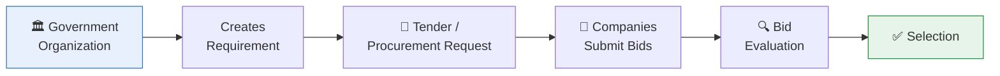
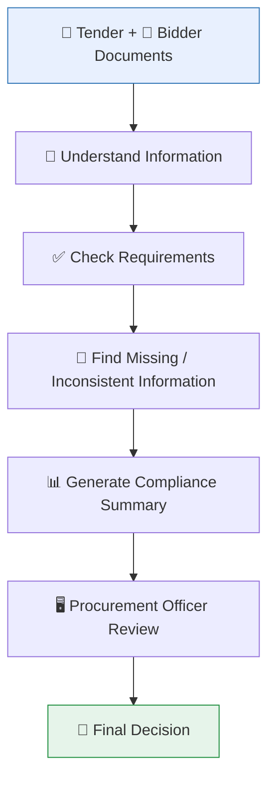

# 📖 SIH26100 — Complete Problem Understanding
### The Domain & Theory Guide for BidVerify AI

*No prior knowledge of government procurement, GeM, or bidding is assumed. Every term is explained before it's used.*

 

> 💡 **How to use this file:** This is the *theory* document — it explains **why** the problem exists and **what** we're building, in plain language. For **how** the system is built, see [`architecture.md`](./architecture.md) and [`database.md`](./database.md). For **workflow diagrams**, see [`flow-diagram.md`](./flow-diagram.md).

 

## 📑 Table of Contents

<table>
<tr>
<td valign="top" width="33%">

**Understanding the Domain**
1. [Problem Overview](#1-problem-statement-overview)
2. [What is Government Procurement?](#2-what-is-government-procurement)
3. [What is GeM?](#3-what-is-gem)
4. [What is a Tender?](#4-what-is-a-tender)
5. [What is a Bid?](#5-what-is-a-bid)
6. [What is Bid Compliance?](#6-what-is-bid-compliance)
7. [Why This Problem Exists](#7-why-does-this-problem-exist)

</td>
<td valign="top" width="33%">

**The People & The Plan**
8. [Current vs Proposed Workflow](#8-current-workflow-vs-proposed-workflow)
9. [Stakeholders](#9-stakeholders)
10. [Government Context](#10-government-and-organizational-context)
11. [Key Requirements](#11-key-requirements-expected-from-the-solution)
12. [Types of Compliance](#12-types-of-compliance)
13. [Real-World Example](#13-simple-real-world-example)

</td>
<td valign="top" width="33%">

**Our Approach**
14. [What Makes It Hard](#14-what-makes-this-problem-challenging)
15. [Key Principles](#15-key-project-principles)
16. [Solution at a Glance](#16-proposed-solution-at-a-high-level)
17. [Expected Benefits](#17-expected-benefits)
18. [Expected Impact](#18-expected-impact)
19. [Limitations](#19-limitations-and-real-world-constraints)
20. [Future Scope](#20-potential-future-scope)
21. [Research Checklist](#21-research-areas-for-the-team)
22. [Key Takeaways](#22-key-takeaways)

</td>
</tr>
</table>

 

---

## 1. Problem Statement Overview

<table>
<tr><td><b>Problem Statement ID</b></td><td>SIH26100</td></tr>
<tr><td><b>Full Title</b></td><td>AI-Powered Integrated Bid Compliance Verification Platform for GeM Procurement</td></tr>
<tr><td><b>Organization</b></td><td>Ministry of Petroleum & Natural Gas</td></tr>
<tr><td><b>Department</b></td><td>Chennai Petroleum Corporation Limited (CPCL)</td></tr>
<tr><td><b>Category</b></td><td>Software</td></tr>
<tr><td><b>Theme</b></td><td>Smart Automation</td></tr>
</table>

### 🎯 One-line explanation
> Build a tool that helps a government procurement officer quickly check whether a company that submitted a bid actually meets all the required rules — instead of checking everything by hand.

### 🗣️ Simple explanation
When a government organization wants to buy something, companies compete for the contract by submitting "bids." Each bid comes with a stack of documents proving the company is eligible — registration certificates, tax documents, experience proof, and so on. Someone has to read all of this and decide: does this company qualify or not? Today, that someone is a human, reading everything manually. Our project builds an AI-assisted system that reads these documents first, checks them against the tender's rules, and hands the procurement officer a clear, evidence-backed summary — so the officer can decide faster and with more confidence.

### 🌍 Real-world explanation
Think of it like applying for a home loan. The bank doesn't just take your word that you earn enough money — you submit salary slips, bank statements, and ID proof, and a loan officer checks each document against the bank's rules (minimum income, valid ID, no existing defaults). Government procurement works the same way, except the "loan officer" is a procurement officer, the "applicant" is a bidding company, and the "rules" come from the tender document plus various government regulations. Our system is like giving that loan officer a smart assistant who has already read every document and flagged anything worth a closer look.

 

---

## 2. What is Government Procurement?

Government procurement is simply **the process by which a government organization buys goods or services** — anything from office chairs to industrial machinery to IT software.

> ❓ **Why can't the government just pick any company it likes?**
> Because it's spending public money (tax money), the process must be fair, transparent, and open to competition. Laws and rules require the government to:
> - Give every eligible company a fair chance to compete.
> - Verify that the winning company can actually deliver what it promises (financially stable, technically capable, legally registered).
> - Keep a clear record of why a company was selected or rejected, in case of audits or disputes.

This is why procurement isn't just "pick the cheapest offer" — it's **"pick the cheapest offer among companies that are proven eligible and compliant."**

 

---

## 3. What is GeM?

**GeM (Government e-Marketplace)** is the official online platform the Government of India uses for procurement. Instead of every government office running its own separate paper-based tender process, GeM provides one common digital marketplace.

| Role | Who They Are |
|:---|:---|
| 🛒 **Buyers** | Government ministries, departments, and public sector companies (like CPCL) who want to purchase something |
| 🏭 **Sellers** | Companies and vendors who register on the platform to sell goods or services to the government |

**Procurement workflow on GeM (simplified):**
`Buyer publishes need` → `Registered sellers submit bids` → `Buyer's team evaluates against requirements` → `Winner selected & awarded`

> ⚠️ **Note:** This section describes GeM's role at a conceptual level for team understanding. It does not claim access to any specific GeM API, database, or internal system — see [Section 19](#19-limitations-and-real-world-constraints) for why this distinction matters.

 

---

## 4. What is a Tender?

A **tender** is the formal document a buyer publishes describing exactly what it wants to purchase and what rules a bidder must satisfy to be considered.

A tender typically describes:

| Component | What It Covers |
|:---|:---|
| 🎫 **Eligibility requirements** | Who is even allowed to bid (e.g., minimum years in business, minimum turnover) |
| 🔧 **Technical requirements** | What the product/service must be capable of (e.g., machine capacity, quality standard) |
| 💰 **Financial requirements** | Proof the bidder is financially sound (e.g., minimum turnover, bank guarantee) |
| 📄 **Required documents** | The paperwork bidders must submit as proof |
| 📋 **Conditions** | Additional rules like delivery timelines, penalties, or local-content requirements |

> 📦 **Fictional Tender Example**
> **Supply of Industrial Pumps for CPCL Refinery Unit**
> - Bidder must have minimum 3 years of experience in industrial pump supply.
> - Bidder must have minimum annual turnover of ₹5 Crore.
> - Bidder must hold a valid GST registration.
> - Bidder must submit OEM (Original Equipment Manufacturer) authorization if not the manufacturer itself.
> - Required certification: ISO 9001 (quality management).

 

---

## 5. What is a Bid?

A **bid** is what a company submits when it wants to compete for a tender. It's essentially: *"Here is proof that I meet your requirements, and here is my price."*

> 🏢 **Example:** Company XYZ submits:
> - ✅ Registration documents (proving the company legally exists)
> - ✅ GST details (tax registration proof)
> - ✅ PAN details (tax identity proof)
> - ✅ Financial information (turnover, balance sheet)
> - ✅ Certificates (quality, safety, or industry-specific)
> - ✅ Technical documents (product specifications, capability proof)
> - ✅ Authorization documents (e.g., OEM authorization letter if reselling)

All of these documents need to be **verified** — checked to confirm they are genuine, current (not expired), and actually satisfy what the tender asked for.

 

---

## 6. What is Bid Compliance?

**Bid compliance** means checking whether the evidence a bidder submitted actually satisfies each requirement stated in the tender.

**Tender Requirement** &nbsp; ⚖️ &nbsp; **Bidder Evidence**

| # | Scenario | Tender Requirement | Bidder Evidence | Result |
|:---:|:---|:---|:---|:---:|
| 1 | Straightforward match | Minimum annual turnover ≥ ₹5 Crore | Annual turnover = ₹7 Crore | ✅ **Compliant** |
| 2 | Missing information | Valid GST registration required | No GST document submitted | ⚠️ **Needs Review** |

Not every gap is automatically a rejection — sometimes a document was simply not uploaded correctly, or a mismatch is a genuine clerical difference. This is why the system flags such cases as **"needs review"** rather than auto-rejecting, and leaves the final call to the human procurement officer.

 

---

## 7. Why Does This Problem Exist?

<table>
<tr><td width="30%">📚 <b>Document Overload</b></td><td>A single tender can involve dozens of bidders, each submitting many documents — quickly adding up to hundreds of pages per tender.</td></tr>
<tr><td>🖐️ <b>Manual Verification</b></td><td>Every document currently has to be read and checked by a human being, which is slow and mentally tiring at scale.</td></tr>
<tr><td>🗂️ <b>Multiple Information Sources</b></td><td>Requirements come from several different places, making it hard to check everything consistently.</td></tr>
<tr><td>🔀 <b>Cross-Document Inconsistency</b></td><td>Different documents from the same bidder don't always perfectly match (see example below).</td></tr>
<tr><td>📅 <b>Expired Documents</b></td><td>A certificate that looks valid at a glance might have actually expired last month.</td></tr>
<tr><td>❓ <b>Missing Documents</b></td><td>A bidder may have simply forgotten to attach a required document.</td></tr>
<tr><td>🎯 <b>Tender-Specific Requirements</b></td><td>Every tender can have its own unique rules on top of standard ones.</td></tr>
<tr><td>⏱️ <b>Time Consumption</b></td><td>All of the above, done manually, takes considerable time.</td></tr>
<tr><td>😓 <b>Human Error</b></td><td>Under time pressure and repetitive work, even careful reviewers can miss something.</td></tr>
<tr><td>🧾 <b>Auditability Challenges</b></td><td>Manual, note-based reviews make it harder to reconstruct decisions later.</td></tr>
</table>

> 🔀 **Cross-Document Inconsistency Example**
> - Document A: Company Name = `ABC Technologies Pvt Ltd`
> - Document B: Company Name = `ABC Technology Pvt Ltd`
>
> This might be a harmless typo, or it might indicate two different legal entities. A human reviewer must catch this — and at high volume, small inconsistencies like this are easy to miss.

 

---

## 8. Current Workflow vs Proposed Workflow

<table>
<tr>
<th width="50%">🐢 Current Workflow</th>
<th width="50%">🚀 Proposed Workflow</th>
</tr>
<tr>
<td>

1. Tender received
2. Manual reading of tender & bid documents
3. Manual verification against requirements
4. Multiple manual cross-checks
5. Manual notes on findings
6. Decision support based on personal notes

</td>
<td>

1. Tender + Bidder Documents received
2. AI-assisted extraction of information
3. Structured information generated automatically
4. Automated compliance checks
5. Evidence-based results generated automatically
6. Clear dashboard showing results & evidence
7. **Human officer makes the final decision**

</td>
</tr>
</table>

 

---

## 9. Stakeholders

### 🎯 Primary Stakeholders
- **Procurement Officers** — the people who evaluate bids and need faster, clearer information.
- **Government Buyers / Procurement Departments** (e.g., CPCL's procurement division) — the organizations running the tender.
- **Bid Evaluation Teams** — teams or committees who formally review and finalize evaluation decisions.

### 🤝 Secondary Stakeholders
- **Bidders / Sellers** — companies submitting bids, who benefit from clearer, more consistent evaluation.
- **MSMEs** (Micro, Small & Medium Enterprises) — smaller companies who may especially benefit from clearer compliance feedback.
- **OEMs** (Original Equipment Manufacturers) — manufacturers whose authorization letters are often part of bid documents.
- **Government Organizations** more broadly, who benefit from faster, more transparent procurement.

### ⚖️ Regulatory / Verification Ecosystem

These are the different registration and compliance systems that a bidder's eligibility can relate to — described here **conceptually**, to help the team understand what a bidder's documents might reference:

| System | What It Relates To |
|:---|:---|
| Udyam/MSME | Classifying a business as micro, small, or medium-sized |
| GST-related sources | Goods and Services Tax registration and filing status |
| PAN / Income Tax | Tax identity and compliance |
| MCA-related sources | Company registration (Ministry of Corporate Affairs) |
| EPFO | Employee provident fund compliance |
| ESIC | Employee state insurance compliance |
| Startup India | Recognition system for registered startups |
| NSIC | Support body for MSMEs in procurement participation |
| DigiLocker | Storing and sharing verified digital documents |
| BIS/DPIIT | Product standards and industrial policy |
| Make in India | Local manufacturing content policy |

> 🚫 **Important:** This document does **not** claim that public APIs exist for any of the above sources, or that our prototype has real access to them. They are described here purely so the team understands *what kind of information* a compliance check might conceptually need to reference. See [Section 19](#19-limitations-and-real-world-constraints).

 

---

## 10. Government and Organizational Context

| Why It Matters | Explanation |
|:---|:---|
| 💰 Compliance | Public money is involved, so every award must be justifiable and defensible |
| 🔎 Transparency | Bidders and the public need confidence that selection is fair, not arbitrary |
| 📏 Standardized verification | Consistent checks mean similar bidders are judged the same way |
| 🧾 Auditability | Decisions may be reviewed by internal audit, CAG, or in a dispute — evidence protects everyone |
| 👤 Human decision | A human officer, accountable for the decision, must remain in control |

> 🧠 **This is why the system is a Decision Support System, not a fully autonomous decision-maker.**

 

---

## 11. Key Requirements Expected from the Solution

| # | Capability |
|:---:|:---|
| 1 | Multi-source verification |
| 2 | Statutory registration checks |
| 3 | GST-related verification |
| 4 | PAN / Income Tax-related verification |
| 5 | Make in India / local content checks |
| 6 | EPFO/ESIC checks |
| 7 | Startup India / NSIC / OEM checks |
| 8 | Document verification |
| 9 | Blacklisting/debarment checks |
| 10 | Tender-specific compliance |
| 11 | Missing/inconsistent information detection |
| 12 | Compliance score |
| 13 | Risk level |
| 14 | Recommendation (not a final decision) |
| 15 | Audit trail |
| 16 | **Human final decision** |

 

---

## 12. Types of Compliance

| Type | Example |
|:---|:---|
| ⚖️ **Statutory Compliance** | Does the bidder meet legally required registrations (e.g., active GST registration)? |
| 💰 **Financial Compliance** | Minimum turnover — does the bidder's submitted turnover meet the tender's threshold? |
| 🔧 **Technical Compliance** | Does the offered product/service match the tender's technical specification? |
| 📄 **Document Compliance** | Was the required certificate actually included, and is it current? |
| 🎫 **Eligibility Compliance** | Minimum years of experience — does the bidder's history meet the requirement? |
| 🎯 **Tender-Specific Compliance** | Unique conditions added on top of the general categories above |

 

---

## 13. Simple Real-World Example

> **Tender:** Government organization wants to purchase industrial equipment.
> **Requirements:** Valid GST · Min. turnover ₹5 Crore · 3 years experience · Valid OEM authorization · Valid certificate

| Requirement | Bidder Evidence | Result |
|:---|:---|:---:|
| Valid GST registration | GST certificate submitted, appears active | ✅ **PASS** |
| Minimum turnover ₹5 Crore | Financial statement shows ₹7 Crore | ✅ **PASS** |
| 3 years relevant experience | Experience letters show 2.5 years | ❌ **FAIL** |
| Valid OEM authorization | Authorization submitted, expiry unclear from scan | ⚠️ **NEEDS REVIEW** |
| Required certificate valid | Certificate submitted, expiry date has passed | ❌ **FAIL** |

> 💡 **Why "NEEDS REVIEW" matters:** Not every uncertain case is a clean pass or fail. An unclear scan, a borderline date, or an ambiguous document shouldn't be silently auto-rejected or auto-approved — it should be surfaced to a human who can make an informed judgment call, possibly by requesting clarification from the bidder.

 

---

## 14. What Makes This Problem Challenging?

`Unstructured documents` &nbsp;·&nbsp; `Different document formats` &nbsp;·&nbsp; `Scanned documents` &nbsp;·&nbsp; `Inconsistent data` &nbsp;·&nbsp; `Tender-specific rules` &nbsp;·&nbsp; `Multiple verification sources` &nbsp;·&nbsp; `Data accuracy` &nbsp;·&nbsp; `False positives` &nbsp;·&nbsp; `Explainability` &nbsp;·&nbsp; `Privacy and security` &nbsp;·&nbsp; `Restricted/authorized access to external systems`

 

---

## 15. Key Project Principles

| Principle | Meaning |
|:---|:---|
| 👤 **Human-in-the-loop** | The system supports the officer's judgment; it never makes the final call alone |
| 🔍 **Explainability** | Every result comes with a clear reason and supporting evidence |
| 🧾 **Evidence-based verification** | Conclusions are always tied back to a specific document or data point |
| 🚫 **No blind AI decisions** | AI is used to *read and extract*, not to *decide and disqualify* on its own |
| 🎯 **Deterministic checks where possible** | Clear rules (e.g., turnover threshold) use a predictable rule engine, not AI guesswork |
| 🔒 **Privacy and security** | Sensitive bidder data is handled carefully and only for its intended purpose |
| 📜 **Auditability** | Every check, result, and officer decision is recorded for later review |
| 🧩 **Modular integrations** | External sources connect via an adapter layer, so more can be added later |

 

---

## 16. Proposed Solution at a High Level

 

---

## 17. Expected Benefits

<table>
<tr><td width="25%">👤 <b>Procurement Officers</b></td><td>Reduced manual effort · Faster initial verification · Consistent checks</td></tr>
<tr><td>🏛️ <b>Government Organizations</b></td><td>Better transparency · Easier evidence tracing · Improved auditability</td></tr>
<tr><td>🏢 <b>Bidders</b></td><td>Early identification of missing information · Consistent, fair evaluation</td></tr>
<tr><td>🌐 <b>Procurement Ecosystem</b></td><td>A repeatable, standardized approach to compliance checking</td></tr>
</table>

> ⚠️ Specific numeric improvements (e.g., "50% faster") are **not** claimed here, as these should be validated through real pilot testing, not assumed in advance.

 

---

## 18. Expected Impact

`Faster evaluation support` &nbsp;·&nbsp; `Reduced repetitive work` &nbsp;·&nbsp; `Improved standardization` &nbsp;·&nbsp; `Better risk visibility` &nbsp;·&nbsp; `Improved traceability` &nbsp;·&nbsp; `Potential scalability across procurement organizations`

> ⚠️ **Important:** Actual performance improvements should be validated through real-world pilots and measurement, not assumed from the design alone.

 

---

## 19. Limitations and Real-World Constraints

> ⚠️ **This section is important** for setting honest expectations with hackathon judges and the team itself.

| Constraint | Why It Matters |
|:---|:---|
| 🔐 Government data access may require authorization | Many verification sources are not freely/publicly accessible |
| 🚫 No confirmed public APIs | Where no public API exists, the prototype must not claim real-time access |
| 🤖 AI can make extraction mistakes | Auto-extracted information should always be treated as a draft |
| 📷 OCR can make errors | Especially on low-quality scans or handwritten text |
| 🎯 Different tenders have different rules | No single fixed rule-set covers every case without configuration |
| ⚠️ False positives can harm legitimate bidders | The system must flag uncertainty rather than make confident wrong calls |
| 🔒 Sensitive data requires protection | Bidder financial and business information must be handled securely |
| 👤 Human review remains necessary | This is a decision-support tool, not a replacement for the officer |

 

---

## 20. Potential Future Scope

- 🔐 Authorized government portal integrations (once appropriate access/agreements exist)
- 📚 More compliance sources beyond the initial prototype set
- 🌐 Multilingual document processing for regional-language tenders and bids
- 🕵️ Advanced anomaly/fraud detection in submitted documents
- 📈 Historical compliance analytics across past tenders
- 🔗 Cross-tender intelligence (recognizing a bidder's pattern across multiple tenders)
- 🔄 A system for managing rule/policy updates over time
- 🛡️ Better document fraud detection
- 🏢 Enterprise-wide deployment across multiple departments/CPSEs

 

---

## 21. Research Areas for the Team

<table>
<tr>
<td valign="top" width="33%">

**🌐 Domain Research**
- [ ] GeM procurement workflow
- [ ] Tender structure
- [ ] Bid evaluation process
- [ ] Public procurement concepts

</td>
<td valign="top" width="33%">

**⚖️ Compliance Research**
- [ ] GST concepts
- [ ] MSME/Udyam
- [ ] PAN
- [ ] OEM authorization
- [ ] EPFO/ESIC
- [ ] Startup India
- [ ] NSIC
- [ ] Blacklisting/debarment concepts

</td>
<td valign="top" width="33%">

**🛠️ Solution Research**
- [ ] Document verification
- [ ] Information extraction
- [ ] Cross-document consistency
- [ ] Rule-based compliance
- [ ] Audit trails
- [ ] Human-in-the-loop systems

</td>
</tr>
</table>

 

---

## 22. Key Takeaways

<table>
<tr><td width="25%">❓ <b>What is the problem?</b></td><td>Government procurement officers must manually verify large volumes of bid documents against complex, multi-source eligibility rules, which is slow, inconsistent, and hard to audit.</td></tr>
<tr><td>❗ <b>Why does it matter?</b></td><td>Public money and fairness are at stake — slow or inconsistent verification delays procurement and risks unfair or incorrect outcomes.</td></tr>
<tr><td>👥 <b>Who benefits?</b></td><td>Procurement officers, government organizations, and honest bidders (especially MSMEs) who currently lose out to avoidable, unclear compliance mistakes.</td></tr>
<tr><td>💡 <b>What is our solution?</b></td><td>An AI-assisted platform that reads tender and bidder documents, extracts structured information, checks it against compliance rules, and presents clear, evidence-backed results to a human officer.</td></tr>
<tr><td>✅ <b>What should AI do?</b></td><td>Read documents, extract structured information, run rule-based checks, and explain its findings with evidence.</td></tr>
<tr><td>🚫 <b>What should AI NOT do?</b></td><td>Make the final qualify/disqualify decision, silently guess when uncertain, or claim access to data sources it doesn't actually have authorized access to.</td></tr>
</table>

 

---

**Next:** Continue to [`architecture.md`](./architecture.md) to see how this is actually built ⚙️

