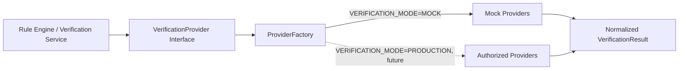

# mock_api.md — Mock Verification Provider API
## BidVerify AI

> ⚠️ **THIS IS SYNTHETIC DEMO DATA. IT IS NOT A REAL GOVERNMENT API.**
> Every endpoint, request, and response in this document is fictional and built for hackathon demonstration purposes only. No response here reflects real government data or a real integration.

---

## 1. Architecture



The calling code never talks to a mock provider directly — it always goes through `ProviderFactory.getProvider(check_type)`, which returns whichever implementation matches the current `VERIFICATION_MODE`.

## 2. Provider Interface

```python
class VerificationProvider(ABC):
    @abstractmethod
    def verify(self, identifier: str, context: dict) -> VerificationResult:
        ...
```

## 3. Factory

```python
class ProviderFactory:
    _providers = {
        "GST": GSTMockProvider,
        "UDYAM": UdyamMockProvider,
        "PAN": PANMockProvider,
        "MCA": MCAMockProvider,
        "EPFO": EPFOMockProvider,
        "ESIC": ESICMockProvider,
    }

    @classmethod
    def get_provider(cls, check_type: str) -> VerificationProvider:
        # Future: read VERIFICATION_MODE and return an Authorized* class instead
        return cls._providers[check_type]()
```

## 4. Mock Provider Implementation Concept

Each mock provider holds a small in-memory/JSON dataset of synthetic companies and returns a deterministic response based on the identifier passed in — so demos are repeatable.

```python
class GSTMockProvider(VerificationProvider):
    _dataset = {
        "22DEMO0001A1Z5": {"status": "ACTIVE", "name": "TechNova Pvt Ltd"},
        "22DEMO0002B1Z5": {"status": "CANCELLED", "name": "GreenBuild Industries"},
    }

    def verify(self, identifier, context):
        record = self._dataset.get(identifier)
        if not record:
            return VerificationResult(status="NOT_VERIFIED", source="GST_MOCK", is_mock=True)
        return VerificationResult(status="VERIFIED" if record["status"] == "ACTIVE" else "NON_COMPLIANT",
                                    source="GST_MOCK", is_mock=True, remarks=f"Registered name: {record['name']}")
```

---

## 5. Endpoints

All endpoints are prefixed `/mock/` and require the same JWT auth as the rest of the API (a mock provider is not a public/anonymous endpoint).

| Method | Endpoint | Purpose |
|:---|:---|:---|
| POST | `/mock/gst/verify` | Verify GST registration status |
| POST | `/mock/udyam/verify` | Verify Udyam/MSME registration |
| POST | `/mock/pan/verify` | Verify PAN format/consistency |
| POST | `/mock/mca/verify` | Verify company registration (MCA-style) |
| POST | `/mock/epfo/verify` | Verify EPFO compliance (synthetic) |
| POST | `/mock/esic/verify` | Verify ESIC compliance (synthetic) |

---

## 6. Request / Response Schemas

### `POST /mock/gst/verify`

**Request:**
```json
{
  "gstin": "22DEMO0001A1Z5",
  "declared_company_name": "TechNova Pvt Ltd"
}
```

**Success Response (200):**
```json
{
  "verification_id": "ver_8f3a2b",
  "source": "GST_MOCK",
  "check_type": "GST_REGISTRATION",
  "identifier": "22DEMO0001A1Z5",
  "status": "VERIFIED",
  "confidence": 1.0,
  "evidence": "Registered name matches: TechNova Pvt Ltd",
  "checked_at": "2026-01-01T10:00:00Z",
  "is_mock": true,
  "remarks": "SYNTHETIC DEMO DATA — not a real GST record"
}
```

**Not Found (200, status=NOT_VERIFIED):**
```json
{
  "verification_id": "ver_9c1d4e",
  "source": "GST_MOCK",
  "check_type": "GST_REGISTRATION",
  "identifier": "22UNKNOWN000Z9",
  "status": "NOT_VERIFIED",
  "confidence": 0.0,
  "evidence": null,
  "checked_at": "2026-01-01T10:01:00Z",
  "is_mock": true,
  "remarks": "No matching synthetic record found"
}
```

**Mismatch (200, status=NEEDS_REVIEW):**
```json
{
  "status": "NEEDS_REVIEW",
  "confidence": 0.62,
  "remarks": "GSTIN found, but declared company name 'Tech Nova Private Ltd' does not exactly match registered name 'TechNova Pvt Ltd' — possible typo, flagged for human review.",
  "is_mock": true
}
```

**Invalid Input (422):**
```json
{
  "error": "Invalid GSTIN format",
  "code": "VALIDATION_ERROR",
  "field": "gstin"
}
```

**Provider Unavailable (503):**
```json
{
  "error": "GST_MOCK provider temporarily unavailable",
  "code": "SOURCE_UNAVAILABLE",
  "status": "SOURCE_UNAVAILABLE",
  "is_mock": true
}
```

### `POST /mock/udyam/verify`

**Request:** `{ "udyam_number": "UDYAM-XX-00-0000000", "declared_enterprise_name": "GreenBuild Industries" }`

**Success Response:**
```json
{
  "source": "UDYAM_MOCK",
  "check_type": "MSME_REGISTRATION",
  "status": "VERIFIED",
  "confidence": 1.0,
  "evidence": "Enterprise type: Small; Registered name matches.",
  "is_mock": true,
  "remarks": "SYNTHETIC DEMO DATA"
}
```

### `POST /mock/pan/verify`

**Request:** `{ "pan": "ABCDE1234F", "declared_company_name": "Alpha Systems Pvt Ltd" }`

> Note: PAN verification in the mock provider only checks **format validity** (regex: `[A-Z]{5}[0-9]{4}[A-Z]{1}`) and cross-document name consistency — it does not and cannot confirm real tax-identity status. This mirrors the honest constraint documented in the project's research: no assumed public PAN verification API exists for third parties.

**Success Response:**
```json
{
  "source": "PAN_MOCK",
  "check_type": "PAN_FORMAT_VALIDATION",
  "status": "VERIFIED",
  "confidence": 0.95,
  "evidence": "Format valid; consistent with declared company name across documents.",
  "is_mock": true
}
```

### `POST /mock/mca/verify`

**Request:** `{ "cin": "U72900DL2020PTC123456", "declared_company_name": "Alpha Systems Pvt Ltd" }`

**Success Response:**
```json
{
  "source": "MCA_MOCK",
  "check_type": "COMPANY_REGISTRATION",
  "status": "VERIFIED",
  "confidence": 1.0,
  "evidence": "Company status: Active",
  "is_mock": true
}
```

### `POST /mock/epfo/verify`

**Request:** `{ "epfo_establishment_code": "DEMO-EPFO-001" }`

**Success Response:**
```json
{
  "source": "EPFO_MOCK",
  "check_type": "EPFO_COMPLIANCE",
  "status": "VERIFIED",
  "confidence": 0.9,
  "evidence": "Synthetic compliance record: contributions up to date",
  "is_mock": true,
  "remarks": "No general public API exists for this check in production — see note below"
}
```

### `POST /mock/esic/verify`

**Request:** `{ "esic_code": "DEMO-ESIC-001" }`

**Success Response:** Same shape as EPFO, `source: "ESIC_MOCK"`.

---

## 7. Standard Error Format

All error responses (regardless of provider) share one shape:

```json
{
  "error": "Human-readable message",
  "code": "VALIDATION_ERROR | NOT_FOUND | SOURCE_UNAVAILABLE | INTERNAL_ERROR",
  "field": "optional, name of the invalid field"
}
```

## 8. Failure Case Matrix

| Case | HTTP Status | `status` field | Notes |
|:---|:---:|:---|:---|
| Success | 200 | `VERIFIED` | Full match |
| Not Found | 200 | `NOT_VERIFIED` | Identifier not in synthetic dataset |
| Mismatch | 200 | `NEEDS_REVIEW` | Identifier found, but declared info conflicts |
| Invalid Input | 422 | — | Malformed identifier (regex fails) |
| Provider Unavailable | 503 | `SOURCE_UNAVAILABLE` | Simulated outage, used to test resilience |

## 9. Authentication

Mock endpoints require the same JWT bearer token as all other backend routes — they are **not** public. This is intentional: it forces the frontend/backend integration to always go through the real auth path, even in mock mode, so switching to production providers later requires zero auth-layer changes.

## 10. How the Backend Calls Providers

```python
provider = ProviderFactory.get_provider("GST")
result = provider.verify(identifier=bidder.gstin, context={"declared_name": bidder.company_name})
verification_service.store_result(bid_id, result)
```

The calling `verification_service` never imports `GSTMockProvider` directly — only the `ProviderFactory` and the `VerificationProvider` interface. This is what makes provider replacement possible without touching this code.

## 11. How Results Are Normalized

Every provider — regardless of internal implementation — returns the same `VerificationResult` shape (see `Architecture.md` § 11 for the full field list: `verification_id`, `source`, `check_type`, `identifier`, `status`, `confidence`, `evidence`, `checked_at`, `remarks`, `is_mock`). This is enforced by the abstract base class, not by convention.

## 12. How Evidence Is Attached

After a `VerificationResult` is returned, the `evidence/service.py` module (Phase 14) creates a linked `Evidence` row with `result_type="verification"`, `result_id=<result.id>`, `document_ref` set to the mock source name (e.g., `"GST_MOCK synthetic record"`), and **`is_synthetic=true`** — always, for any mock-derived evidence, with no exceptions.

## 13. Per-Source Reality Check (why these are mocks, not shortcuts)

| Source | Why It's Mocked in the MVP |
|:---|:---|
| GST | Basic registration lookup has public tools, but no confirmed open bulk API suitable for automated third-party integration; return-filing status specifically requires GSP authorization |
| Udyam | Official portal offers a public certificate print/verify lookup, not a confirmed open bulk API |
| PAN | No assumed public verification API for third parties; format + consistency checks only |
| MCA | Public company-master search exists for basic lookups; full API integration requires authorization |
| EPFO | No general public third-party compliance-lookup API assumed |
| ESIC | No general public third-party compliance-lookup API assumed |

## 14. How to Replace Mock Providers with Authorized Providers (Future)

1. Obtain official authorization/credentials from the relevant authority for the specific source.
2. Implement `<Source>AuthorizedProvider(VerificationProvider)` with the same `verify()` signature.
3. Register it in `ProviderFactory` under a `PRODUCTION` branch keyed by `VERIFICATION_MODE`.
4. No change required to `verification_service.py`, the Rule Engine, the database schema, or the frontend — they all consume the same normalized `VerificationResult` shape.
5. Set `is_mock=False` on all results from the new provider.

This is the entire point of the adapter architecture: **the swap is additive, not a rewrite.**
