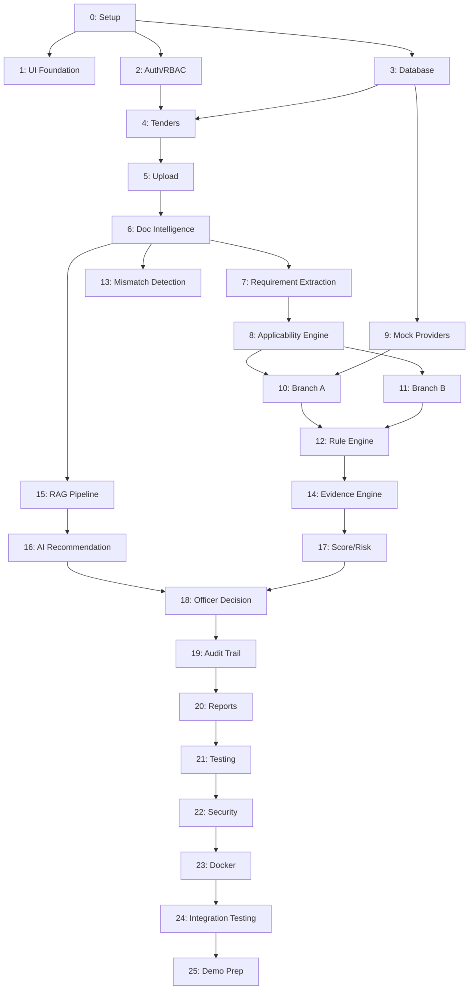

# phases.md — Development Roadmap
## BidVerify AI — 25-Phase Execution Plan

> Each phase lists: Objective · Prerequisites · What to Build · Backend/Frontend/AI/DB/API work · Files to create · Test cases · Definition of Done · What's next · Common mistakes. Dependencies are noted where a phase cannot start before another finishes.

---

## 🤖 Ready-to-Use AI Prompt (use this for EVERY phase)

Copy this template, fill in the `[PHASE NAME]` and paste the phase's own detail block beneath it, then give it to your AI coding assistant (Claude Code, Copilot, Cursor, etc.) to keep output clean and consistent phase-to-phase:

```
You are helping build BidVerify AI, an SIH26100 hackathon project.
Core architectural rule (never violate this): AI/RAG components may only
retrieve, interpret, and explain. Only the deterministic Rule Engine may
output a compliance verdict (COMPLIANT/NON_COMPLIANT/NEEDS_REVIEW/
NOT_APPLICABLE/PENDING_VERIFICATION). The Procurement Officer always
makes the final decision — no code path may auto-finalize a bid.

We are working on: [PHASE NAME] (Phase N of 25)

Objective: [paste objective from phases.md]
Prerequisites completed: [list prior phases already done]
Scope for this phase ONLY — do not implement future phases early.

Requirements for this phase:
[paste "What to Build" + Backend/Frontend/AI/DB/API details from phases.md]

Rules:
1. Keep all mock/synthetic data clearly labeled (is_mock=true, "DEMO DATA" in UI).
2. Follow the existing module structure in Architecture.md § 5 — do not invent
   a different folder layout.
3. Write code with clear docstrings/comments explaining WHY, not just what.
4. Include basic error handling — no silent failures.
5. After writing code, list the test cases from phases.md and confirm each
   is covered.
6. Do NOT add libraries beyond the specified tech stack unless you explicitly
   flag it as a suggestion and explain why.
7. End your response with a short checklist matching this phase's
   "Definition of Done" so we can verify completeness before moving on.

Keep the code and explanation clean, minimal, and directly tied to this
phase's scope — no speculative extra features.
```

> Reuse this exact template for all 25 phases — just swap the bracketed sections. This keeps every phase's AI-generated output consistently scoped and prevents "scope creep" where the AI tries to build phase 10 while you're still on phase 4.

---

## Phase 0 — Project Setup & Repository Structure

**Objective:** Establish the repo skeleton so every later phase has a home.
**Prerequisites:** None.
**What to build:** Folder structure per `README.md` (`frontend/`, `backend/`, `ai/`, `mock-providers/`, `database/`, `docs/`, `tests/`, `docker/`, `scripts/`).
**Backend work:** Initialize FastAPI app skeleton, `requirements.txt`.
**Frontend work:** Initialize React + Vite/CRA app, install Redux Toolkit + Tailwind.
**DB work:** Create empty PostgreSQL database, install Alembic for migrations.
**Files/modules:** `docker-compose.yml`, `.env.example`, `backend/main.py`, `frontend/src/App.jsx`.
**Test cases:** Backend `/health` endpoint returns 200; frontend renders a placeholder page.
**Definition of Done:** `docker-compose up` starts frontend + backend + DB without errors.
**After this phase:** Move to Phase 1.
**Common mistakes:** Committing `.env` with real secrets; skipping `.gitignore`.

## Phase 1 — UI/UX Foundation

**Objective:** Build the shell (sidebar, top bar, routing, design tokens) before any real feature.
**Prerequisites:** Phase 0.
**What to build:** Sidebar nav, top bar, Tailwind config with `design.md` color tokens, empty page routes.
**Frontend work:** `components/Sidebar.jsx`, `components/TopBar.jsx`, React Router setup.
**Files:** `frontend/src/layouts/AppShell.jsx`, `tailwind.config.js`.
**Test cases:** All sidebar links navigate to correct (empty) pages.
**Definition of Done:** Full app shell matches `design.md` navigation spec.
**After this phase:** Phase 2.
**Common mistakes:** Hardcoding colors instead of using design tokens — makes later theming painful.

## Phase 2 — Authentication & RBAC

**Objective:** Secure login before any real data exists.
**Prerequisites:** Phase 0.
**Backend work:** `auth/` module — JWT issuing, password hashing, login/logout endpoints. `users/` module with `Role` model.
**Frontend work:** Login page, auth token storage (Redux slice), protected route wrapper.
**DB work:** `users`, `roles` tables (see `database.md`).
**API work:** `POST /auth/login`, `POST /auth/logout`, `GET /auth/me`.
**Files:** `backend/auth/router.py`, `service.py`, `schemas.py`.
**Test cases:** Login with valid/invalid credentials; expired token rejected; role-restricted route blocks wrong role.
**Definition of Done:** A seeded Procurement Officer account can log in and reach the dashboard shell.
**After this phase:** Phase 3.
**Common mistakes:** Storing JWT in localStorage without XSS mitigation considerations; not hashing passwords.

## Phase 3 — PostgreSQL Database

**Objective:** Stand up the full schema before feature work needs it.
**Prerequisites:** Phase 0.
**DB work:** Create all tables from `database.md` via Alembic migrations.
**Files:** `backend/database/models.py`, `backend/alembic/versions/*.py`.
**Test cases:** Migrations run cleanly on empty DB; foreign key constraints enforced (inserting orphan row fails).
**Definition of Done:** `alembic upgrade head` builds the complete schema matching the ER diagram.
**After this phase:** Phase 4.
**Common mistakes:** Skipping indexes now and forgetting later; not using UUID defaults.

## Phase 4 — Tender Management

**Objective:** CRUD for tenders — the entry point of the whole workflow.
**Prerequisites:** Phases 2, 3.
**Backend work:** `tenders/` module — create/list/get tender endpoints.
**Frontend work:** Tenders list page (TanStack Table), Tender detail page shell.
**API work:** `POST /tenders`, `GET /tenders`, `GET /tenders/{id}`.
**Test cases:** Create tender → appears in list; get non-existent tender → 404.
**Definition of Done:** Officer can create and view a tender end-to-end through the UI.
**After this phase:** Phase 5.
**Common mistakes:** No pagination on tender list — breaks at scale.

## Phase 5 — Bid & Document Upload

**Objective:** Allow tender and bid documents to be uploaded and stored.
**Prerequisites:** Phase 4.
**Backend work:** `documents/` module — file upload endpoint, validation (type, size limit).
**DB work:** `tender_documents`, `bid_documents` tables.
**API work:** `POST /tenders/{id}/documents`, `POST /bids/{id}/documents`.
**Test cases:** Reject oversized file; reject disallowed file type; valid PDF stored and metadata row created.
**Definition of Done:** A PDF can be uploaded against a tender and a bid, both retrievable.
**After this phase:** Phase 6.
**Common mistakes:** Storing files inside the database instead of file storage (see `database.md` § 5).

## Phase 6 — Document Intelligence

**Objective:** Turn uploaded PDFs into clean text.
**Prerequisites:** Phase 5.
**Backend/AI work:** `extraction/` module — PyMuPDF/pdfplumber for native PDFs, Tesseract OCR fallback for scans.
**DB work:** `document_pages`, `extracted_content` tables populated.
**Files:** `ai/extraction/pdf_extractor.py`, `ai/extraction/ocr_extractor.py`.
**Test cases:** Native-text PDF extracts correctly; scanned PDF triggers OCR path; confidence score recorded.
**Definition of Done:** Any uploaded document produces `extracted_content` rows with text and confidence scores.
**After this phase:** Phase 7.
**Common mistakes:** Not handling OCR failures gracefully (should flag `NEEDS_REVIEW`, not crash).

## Phase 7 — Requirement Extraction

**Objective:** Turn tender text into structured `TenderRequirement` rows.
**Prerequisites:** Phase 6.
**AI work:** `requirements/` module using RAG (see Phase 15 for full RAG pipeline — this phase can start with simpler regex/NLP extraction and upgrade later).
**DB work:** `tender_requirements` populated.
**Test cases:** Sample tender text produces correctly categorized requirements (financial, statutory, technical).
**Definition of Done:** Uploading a sample tender auto-generates a requirement list an officer can view.
**After this phase:** Phase 8.
**Common mistakes:** Over-fitting extraction logic to one sample tender's exact wording.

## Phase 8 — Applicability Engine

**Objective:** Decide which requirements actually need verification.
**Prerequisites:** Phase 7.
**Backend work:** `applicability/` module — rule-based classifier producing the Applicability Matrix.
**DB work:** `verification_checks` table (`is_applicable` flag).
**Test cases:** Two different sample tenders produce two different checklists.
**Definition of Done:** Applicability Matrix visibly differs based on tender content, displayed in UI.
**After this phase:** Phase 9.
**Common mistakes:** Defaulting to "run everything" when unsure — defeats the purpose of this phase.

## Phase 9 — Mock Verification Providers

**Objective:** Build the adapter architecture and mock data sources.
**Prerequisites:** Phase 3.
**Backend work:** `verification/providers/` — `VerificationProvider` interface, `GSTMockProvider`, `UdyamMockProvider`, `PANMockProvider`, `MCAMockProvider`, `EPFOMockProvider`, `ESICMockProvider`, `ProviderFactory`.
**Files:** See `mock_api.md` for full endpoint/schema detail.
**Test cases:** Each mock provider returns success/not-found/mismatch/invalid-input/unavailable cases correctly.
**Definition of Done:** All 6 mock providers callable via the Factory, all responses tagged `is_mock=true`.
**After this phase:** Phase 10.
**Common mistakes:** Hardcoding provider selection instead of using the Factory — blocks future swap to real providers.

## Phase 10 — Branch A: Bidder Verification

**Objective:** Wire Applicability Matrix → mock providers → stored results.
**Prerequisites:** Phases 8, 9.
**Backend work:** `verification/service.py` orchestrates calls per applicable bidder-level check.
**DB work:** `verification_results` populated.
**Test cases:** Bidder with valid mock GST → `VERIFIED`; bidder with mismatched name → `NEEDS_REVIEW`.
**Definition of Done:** Opening a bid shows real Branch A results sourced from mock providers.
**After this phase:** Phase 12 (can run parallel to Phase 11).
**Common mistakes:** Conflating bidder-level results with bid-level results in the same table (see `database.md` § 5).

## Phase 11 — Branch B: Bid Compliance

**Objective:** Match tender-specific requirements against bid documents.
**Prerequisites:** Phase 8.
**Backend work:** `compliance/branch_b_service.py` — matches extracted bid facts against requirements.
**Test cases:** Turnover requirement correctly compared; missing required document correctly flagged.
**Definition of Done:** Opening a bid shows real Branch B results.
**After this phase:** Phase 12.
**Common mistakes:** Writing ad-hoc comparison logic instead of routing through the shared Rule Engine (built in Phase 12) — causes duplicated, inconsistent logic later.

## Phase 12 — Deterministic Compliance Rule Engine

**Objective:** Centralize the actual pass/fail logic.
**Prerequisites:** Phases 10, 11.
**Backend work:** `compliance/rule_engine.py` — pure, deterministic functions per rule type (numeric, date, presence, string-match).
**DB work:** `compliance_results` populated with one of the 5 outcome states.
**Test cases:** Unit tests per rule type; same input always produces same output (determinism check).
**Definition of Done:** Both branches route their raw facts through this single engine — no branch computes its own verdict independently.
**After this phase:** Phase 13.
**Common mistakes:** Letting the LLM (built in Phase 15/16) influence this engine's output directly — violates the core architectural rule.

## Phase 13 — Cross-Document Mismatch Detection

**Objective:** Catch inconsistent bidder info across documents.
**Prerequisites:** Phase 6.
**Backend/AI work:** RapidFuzz-based comparison of company name/registration number across all bid documents.
**Test cases:** Identical names → no flag; "ABC Pvt Ltd" vs "ABC Private Limited" → flagged for review, not auto-rejected.
**Definition of Done:** Mismatches appear as `NEEDS_REVIEW` findings with both conflicting values shown.
**After this phase:** Phase 14.
**Common mistakes:** Setting fuzzy-match threshold too loose (false negatives) or too strict (false positives on legitimate abbreviations).

## Phase 14 — Evidence Engine

**Objective:** Link every result to its source.
**Prerequisites:** Phases 10, 11, 12.
**Backend work:** `evidence/service.py` — given a result, resolve document + page + extracted text.
**DB work:** `evidence` table populated, `is_synthetic` flag always set correctly.
**Test cases:** Every `compliance_result` and `verification_result` has at least one linked `evidence` row.
**Definition of Done:** Evidence Viewer UI can open any result and see its source.
**After this phase:** Phase 17 (Score/Risk needs evidence-linked results).
**Common mistakes:** Allowing a result to be stored without evidence — breaks the evidence-first UX principle.

## Phase 15 — RAG Pipeline

**Objective:** Ground AI interpretation in real retrieved text.
**Prerequisites:** Phase 6.
**AI work:** `ai/rag/` — `DocumentChunker`, Sentence-Transformer embeddings, FAISS/ChromaDB vector store, `RAGRetriever`.
**Test cases:** Query for a known clause returns the correct chunk in top-3 results.
**Definition of Done:** Given a tender document, retrieval returns relevant passages for a test query.
**After this phase:** Phase 16.
**Common mistakes:** Indexing overly large chunks (hurts retrieval precision) or overly small chunks (loses context).

## Phase 16 — AI Recommendation System

**Objective:** Generate cited, plain-language recommendations.
**Prerequisites:** Phase 15, Phase 14.
**AI work:** `ai/rag/llm_interpreter.py` — `explainFinding()`, `interpretRequirement()`. Both must cite retrieved passages, never freeform.
**DB work:** `recommendations` table populated.
**Test cases:** Recommendation text always includes at least one citation; recommendation never contains a compliance verdict word (`COMPLIANT`/`NON_COMPLIANT`) as its own conclusion — those come only from the Rule Engine.
**Definition of Done:** AI Recommendation panel shows real, cited summaries in the UI.
**After this phase:** Phase 17.
**Common mistakes:** Letting the LLM's phrasing imply a decision ("this bidder should be approved") — recommendation language must stay advisory ("consider reviewing...").

## Phase 17 — Compliance Score and Risk Engine

**Objective:** Summarize all results into one score + risk level.
**Prerequisites:** Phase 14.
**Backend work:** `compliance/scoring.py` — weighted scoring (mandatory > optional), configurable weights.
**Scoring methodology (Recommended Implementation, configurable):**
- Each applicable mandatory requirement: weight = 3. Optional: weight = 1.
- `score = (sum of weights of PASSED requirements) / (sum of weights of all APPLICABLE requirements) × 100`
- Missing evidence on a mandatory requirement → treated as NON_COMPLIANT for scoring purposes, not silently excluded.
- Risk bands: 0–39 Critical, 40–59 High, 60–79 Medium, 80–100 Low (configurable thresholds — not fixed in source PPT).
**DB work:** `risk_assessments` populated.
**Test cases:** All-pass tender → score 100/Low risk; one failed mandatory requirement → score drops proportionally to its weight, not just by "one point."
**Definition of Done:** Score and risk visibly update as verification results change.
**After this phase:** Phase 18.
**Common mistakes:** Using unweighted averages — makes one trivial optional check equal in impact to a critical mandatory one.

## Phase 18 — Officer Review and Final Decision

**Objective:** Give the officer the actual decision controls.
**Prerequisites:** Phases 14, 16, 17.
**Frontend work:** Bid Verification screen per `design.md` — decision bar (Approve/Reject/Seek Clarification).
**API work:** `POST /bids/{id}/decision`.
**Test cases:** Decision cannot be submitted without at least viewing the evidence panel once (Recommended Implementation — UX safeguard); decision is immutable once recorded (or requires explicit override with audit note).
**Definition of Done:** A full bid can be reviewed and decided end-to-end through the UI.
**After this phase:** Phase 19.
**Common mistakes:** Allowing any automated process to call the decision endpoint — must be an explicit officer action only.

## Phase 19 — Audit Trail

**Objective:** Make every action traceable.
**Prerequisites:** Phase 18.
**Backend work:** `audit/` module — middleware or service-layer hooks writing `audit_logs` on every state change.
**Frontend work:** Audit Timeline UI.
**Test cases:** Every write to `bids.status`, `verification_results`, `compliance_results` produces a matching audit entry.
**Definition of Done:** Full timeline visible for any bid, matching every action taken.
**After this phase:** Phase 20.
**Common mistakes:** Logging only officer actions and missing system-generated events (verification runs, score updates).

## Phase 20 — Reports and Analytics

**Objective:** Cross-tender visibility (Dashboard KPIs).
**Prerequisites:** Phase 19.
**Backend work:** `reports/` module — aggregate queries.
**Frontend work:** Dashboard KPI cards per `design.md`.
**Test cases:** KPI counts match underlying data after seeding test tenders/bids.
**Definition of Done:** Dashboard shows live, accurate counts.
**After this phase:** Phase 21.
**Common mistakes:** N+1 query patterns on aggregate endpoints — use proper SQL aggregation, not per-row loops.

## Phase 21 — Testing

**Objective:** Systematic test coverage across the stack.
**Prerequisites:** All feature phases (4–20) substantially complete.
**Work:** Backend `pytest` suite per module; frontend component tests; at least one full end-to-end scenario test (upload tender → upload bid → verify → decide).
**Definition of Done:** CI-runnable test suite passes; critical paths (Rule Engine, Evidence linkage, Decision flow) have explicit unit tests.
**After this phase:** Phase 22.
**Common mistakes:** Only testing happy paths — must also test NEEDS_REVIEW and SOURCE_UNAVAILABLE cases.

## Phase 22 — Security Hardening

**Objective:** Close obvious gaps before demo/deployment.
**Prerequisites:** Phase 21.
**Work:** Confirm JWT expiry handling, RBAC enforcement on every endpoint, input validation on all forms, secrets fully in environment variables, CORS restricted, masking applied to sensitive identifiers in UI/logs.
**Definition of Done:** No hardcoded secrets in repo; RBAC verified by attempting cross-role access and confirming rejection.
**After this phase:** Phase 23.
**Common mistakes:** Leaving debug mode / verbose error responses enabled.

## Phase 23 — Dockerization

**Objective:** One-command environment for demo and grading.
**Prerequisites:** Phase 22.
**Work:** `Dockerfile` for frontend and backend, complete `docker-compose.yml` wiring DB + backend + frontend.
**Definition of Done:** `docker-compose up --build` produces a fully working app from a clean machine.
**After this phase:** Phase 24.
**Common mistakes:** Forgetting to run migrations automatically on container startup.

## Phase 24 — Integration Testing

**Objective:** Confirm the whole system works together, not just in isolation.
**Prerequisites:** Phase 23.
**Work:** Run the full demo workflow (see `README.md` § Demo Workflow) against the Dockerized stack; fix any integration gaps found.
**Definition of Done:** The exact demo script runs cleanly, twice in a row, with no manual intervention.
**After this phase:** Phase 25.
**Common mistakes:** Testing only on the developer's machine, not a clean environment (misses missing-dependency bugs).

## Phase 25 — SIH Demo Preparation

**Objective:** Package everything for the actual presentation.
**Prerequisites:** Phase 24.
**Work:** Seed realistic (synthetic) demo data — 2–3 sample tenders with different requirement combinations, 3–5 sample bids including at least one with a deliberate mismatch/missing document to show the system catching it. Rehearse the exact click-path.
**Definition of Done:** A 5-minute demo can be run live, showing: tender upload → applicability matrix → Branch A/B results → evidence viewer → score/risk → AI recommendation → officer decision → audit trail.
**Common mistakes:** Demo data that's "too clean" — always include at least one flagged/NEEDS_REVIEW case, since that's what best shows the system actually working, not just rubber-stamping everything as compliant.

---

## Phase Dependency Summary


