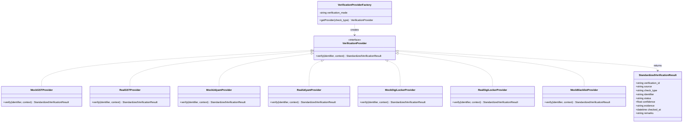
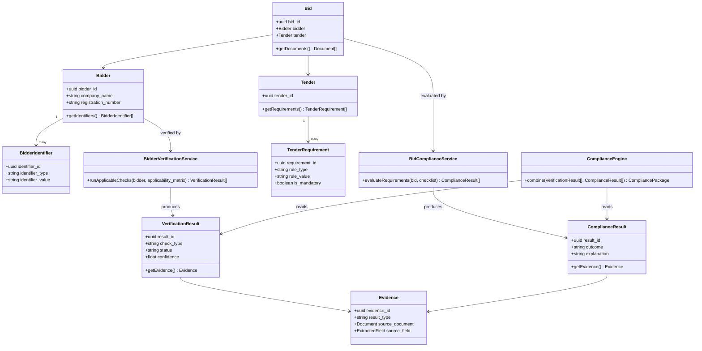
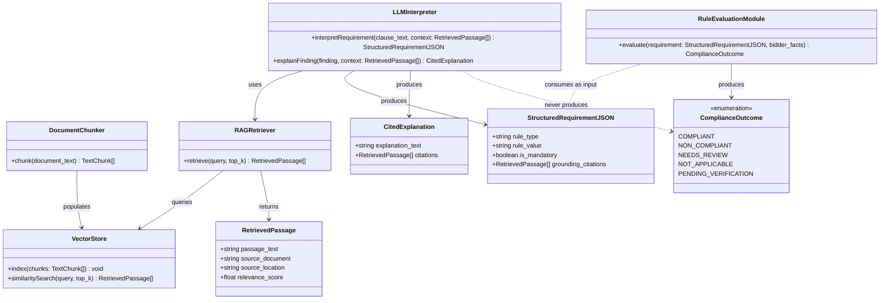
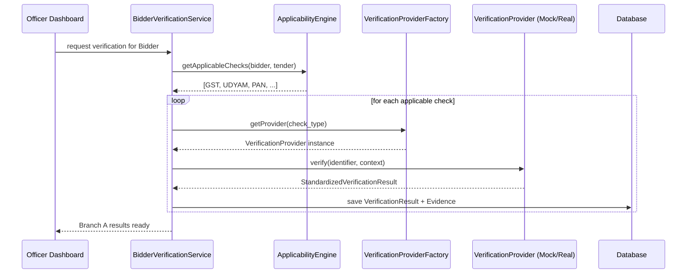
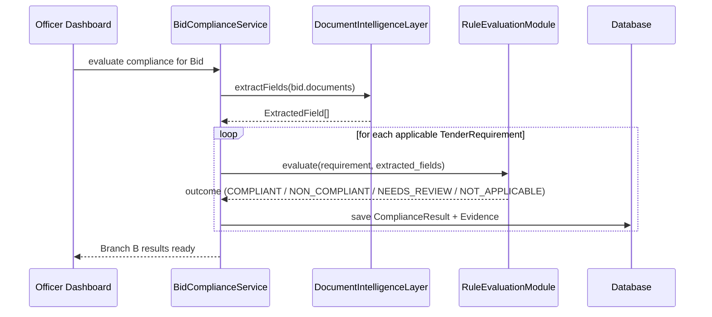
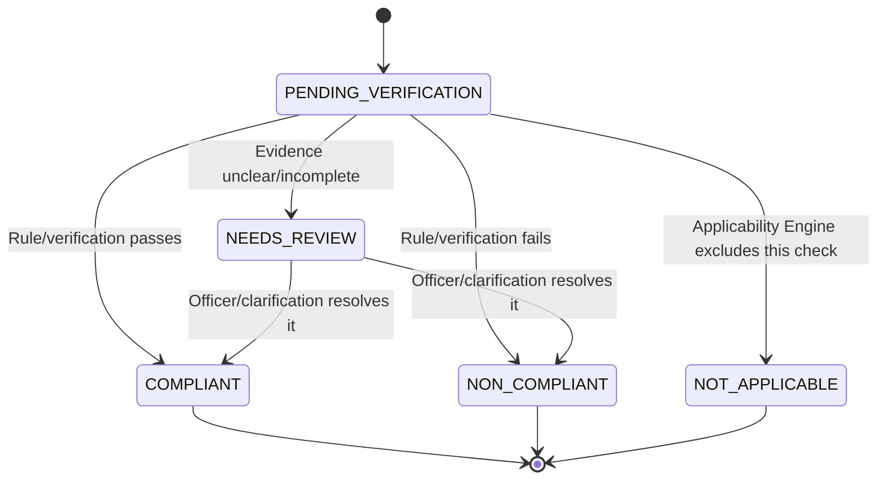

<div align="center">

# 📐 UML Diagrams — BidVerify AI
### Class & Sequence Diagrams for the Adapter Pattern and Compliance Flow

[]()
[]()
[]()

</div>

<br>

> 💡 These diagrams show the **software structure** implied by [`architecture.md`](./architecture.md) and [`database.md`](./database.md) — useful when the team actually starts writing code. Class/method names here are illustrative starting points, not a fixed contract; adjust to your chosen language/framework.

<br>

## 📑 Contents

1. [Verification Adapter — Class Diagram](#1-verification-adapter--class-diagram)
2. [Bidder vs. Bid Verification — Class Diagram](#2-bidder-vs-bid-verification--class-diagram)
3. [🆕 RAG Layer — Class Diagram](#3-rag-layer--class-diagram)
4. [Sequence: Running a Bidder-Level Check (Branch A)](#4-sequence-running-a-bidder-level-check-branch-a)
5. [Sequence: Evaluating Tender-Specific Compliance (Branch B)](#5-sequence-evaluating-tender-specific-compliance-branch-b)
6. [🆕 Sequence: RAG-Grounded Tender Interpretation](#6-sequence-rag-grounded-tender-interpretation)
7. [Sequence: End-to-End Bid Review](#7-sequence-end-to-end-bid-review)
8. [State Diagram: Compliance Result Lifecycle](#8-state-diagram-compliance-result-lifecycle)

<br>

---

## 1. Verification Adapter — Class Diagram

Shows the **Adapter Pattern** at the core of the Verification Adapter Layer ([`architecture.md` § 8](./architecture.md#8-verification-adapter-layer)) — how mock and future-real providers implement one shared interface.



**Key idea:** `VerificationProviderFactory` is the *only* place in the codebase that decides mock vs. real, based on the `VERIFICATION_MODE` configuration — every caller elsewhere just holds a `VerificationProvider` reference and never knows or cares which concrete class it got.

<br>

---

## 2. Bidder vs. Bid Verification — Class Diagram

Shows the structural separation between **Branch A** and **Branch B**, matching the `VerificationResult` / `ComplianceResult` split in [`database.md`](./database.md#5-the-most-important-distinction-bidder-verification-vs-bid-compliance).



<br>

---

## 3. RAG Layer — Class Diagram

Shows the retrieval-augmented generation components from [`architecture.md` § 7](./architecture.md#7-rag-retrieval-augmented-generation-layer). Notice `RAGRetriever` and `LLMInterpreter` only ever produce a `RetrievedPassage[]` or a `StructuredRequirementJSON` — neither class has a method that outputs a compliance verdict. That output only ever reaches `RuleEvaluationModule`, which is a completely separate class with no dependency on the LLM.



**Key idea — the boundary that matters:** `LLMInterpreter` has no method returning `ComplianceOutcome`, and `RuleEvaluationModule` has no dependency on `LLMInterpreter` at runtime — it only consumes the *data* (`StructuredRequirementJSON`) the RAG layer already produced. This is not a naming convention; it's a hard class-level separation that makes it structurally impossible for a hallucinated LLM response to become a stored compliance verdict.

<br>

---

## 4. Sequence: Running a Bidder-Level Check (Branch A)



<br>

---

## 5. Sequence: Evaluating Tender-Specific Compliance (Branch B)



<br>

---

## 6. Sequence: RAG-Grounded Tender Interpretation

Shows how a tender clause becomes a `StructuredRequirementJSON` **grounded in retrieved text**, and separately, how an officer's "why was this flagged?" question gets a cited answer — both without ever touching the compliance-decision path.

```mermaid
sequenceDiagram
    participant TU as TenderUnderstandingLayer
    participant DC as DocumentChunker
    participant VS as VectorStore
    participant RAG as RAGRetriever
    participant LLM as LLMInterpreter
    participant AE as ApplicabilityEngine
    participant Off as Procurement Officer
    participant EV as EvidenceLayer

    Note over TU,VS: Indexing (once per tender)
    TU->>DC: chunk(tender_text + rule_excerpts)
    DC->>VS: index(chunks)

    Note over TU,AE: Requirement extraction
    TU->>RAG: retrieve("eligibility clause", top_k=5)
    RAG->>VS: similaritySearch(query, top_k)
    VS-->>RAG: RetrievedPassage[]
    RAG-->>TU: RetrievedPassage[]
    TU->>LLM: interpretRequirement(clause_text, RetrievedPassage[])
    LLM-->>TU: StructuredRequirementJSON (with citations)
    TU->>AE: submit StructuredRequirementJSON

    Note over Off,EV: Later — officer asks "why flagged?"
    Off->>LLM: explainFinding(finding_id)
    LLM->>RAG: retrieve(finding context, top_k=3)
    RAG-->>LLM: RetrievedPassage[]
    LLM-->>Off: CitedExplanation (text + source passages)
    LLM->>EV: store CitedExplanation as Evidence
```

<br>

---

## 7. Sequence: End-to-End Bid Review

```mermaid
sequenceDiagram
    participant Off as Procurement Officer
    participant Dash as Officer Dashboard
    participant RAG as RAG Layer
    participant AE as ApplicabilityEngine
    participant BVS as BidderVerificationService
    participant BCS as BidComplianceService
    participant CE as ComplianceEngine
    participant Risk as RiskScoringLayer
    participant AI as AIRecommendationLayer
    participant DB as Database (incl. AuditLog)

    Off->>Dash: Open Bid for Review
    Dash->>RAG: interpret tender requirements (grounded)
    RAG-->>Dash: StructuredRequirementJSON[] + citations
    Dash->>AE: getApplicabilityMatrix(tender, StructuredRequirementJSON[])
    AE-->>Dash: checklist
    Dash->>BVS: run Branch A checks
    BVS-->>Dash: VerificationResult[]
    Dash->>BCS: run Branch B checks
    BCS-->>Dash: ComplianceResult[]
    Dash->>CE: combine(VerificationResult[], ComplianceResult[])
    CE-->>Dash: CompliancePackage
    Dash->>Risk: score(CompliancePackage)
    Risk-->>Dash: score + risk_level
    Dash->>AI: summarize(CompliancePackage, score, risk_level)
    AI->>RAG: retrieve supporting citations for summary
    RAG-->>AI: RetrievedPassage[]
    AI-->>Dash: recommendation text + citations
    Dash-->>Off: Show full findings + evidence + recommendation
    Off->>Dash: Record Final Decision
    Dash->>DB: save FinalDecision
    Dash->>DB: write AuditLog entries
```

<br>

---

## 8. State Diagram: Compliance Result Lifecycle

Shows the possible states of a single `ComplianceResult` (Branch B) or `VerificationResult` (Branch A) — reinforcing why the system uses more than a binary pass/fail (see [`architecture.md` § 9](./architecture.md#9-compliance-engine)). Note that `RAGRetriever`/`LLMInterpreter` play no role in this diagram at all — they finish their work (producing `StructuredRequirementJSON`) *before* this state machine even starts.



