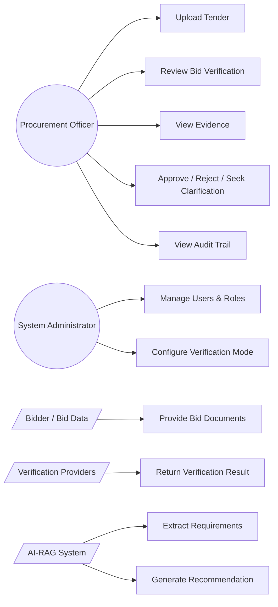
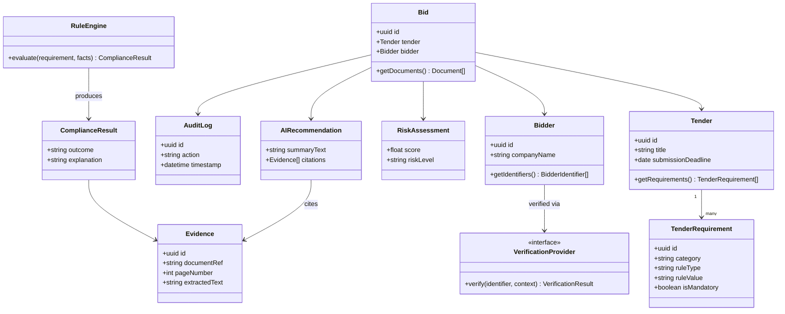
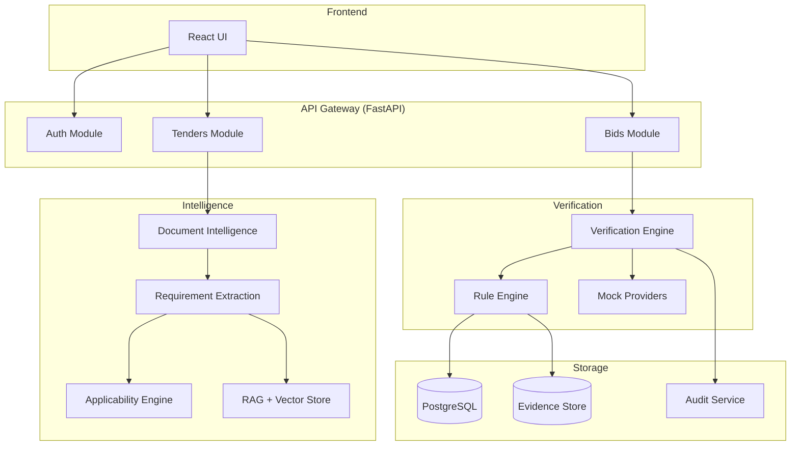
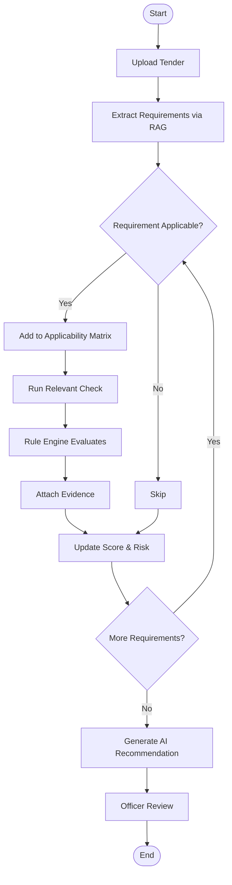

# uml_diagram.md — UML Diagrams
## BidVerify AI

## 1. Use Case Diagram



## 2. Class Diagram



## 3. Component Diagram



## 4. Sequence Diagram — Bid Verification End-to-End

```mermaid
sequenceDiagram
    participant Off as Procurement Officer
    participant UI as Frontend
    participant API as FastAPI
    participant APPE as ApplicabilityEngine
    participant VE as VerificationEngine (Branch A)
    participant BC as BidComplianceService (Branch B)
    participant RE as RuleEngine
    participant EV as EvidenceEngine
    participant AI as AIRecommendation

    Off->>UI: Open Bid
    UI->>API: GET /bids/{id}
    API->>APPE: getApplicabilityMatrix(tender)
    APPE-->>API: checklist
    API->>VE: runBidderVerification(bidder, checklist)
    VE-->>API: VerificationResults
    API->>BC: runBidCompliance(bid, checklist)
    BC-->>API: ComplianceResults
    API->>RE: evaluate(all results)
    RE-->>API: Final outcomes + score + risk
    API->>EV: attachEvidence(outcomes)
    EV-->>API: Evidence-linked results
    API->>AI: generateRecommendation(outcomes)
    AI-->>API: Recommendation + citations
    API-->>UI: Full bid review payload
    UI-->>Off: Display results
    Off->>UI: Approve / Reject / Seek Clarification
    UI->>API: POST /bids/{id}/decision
    API->>API: Write AuditLog
```

## 5. Activity Diagram — Applicability-First Verification


